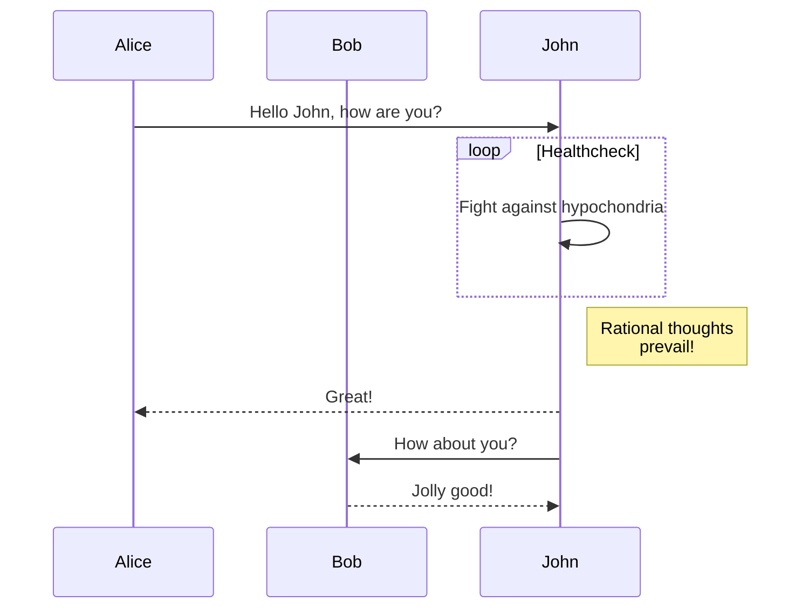

+++
title = "Markdown Syntax Test"
date = "2023-01-01T12:30:00"
description = "This article tests Zola's support for various Markdown syntax features"

[taxonomies]
tags = ["markdown"]
+++

# Markdown Syntax Test

This article is used to test Zola's support for various Markdown syntax features.

## 1. Basic Text Formatting

### 1.1 Paragraphs and Line Breaks

This is the first paragraph.

This is the second paragraph, with an empty line between it and the first paragraph.

This line ends with two spaces,  
so this text should display on a new line.

### 1.2 Emphasis

*This is italic text*
_This is also italic text_

**This is bold text**
__This is also bold text__

***This is bold italic text***
___This is also bold italic text___

~~This is strikethrough text~~

==This is highlighted text== (supported by some Markdown implementations)

## 2. Headings

Above we've already shown level 1 and level 2 headings, below are other heading levels:

### This is a level 3 heading

#### This is a level 4 heading

##### This is a level 5 heading

###### This is a level 6 heading

## 3. Lists

### 3.1 Unordered Lists

* Item 1
* Item 2
  * Sub-item 2.1
  * Sub-item 2.2
* Item 3

- Another unordered list style
- Using minus signs
  - Nested item
    - Deeper nested item

+ Third unordered list style
+ Using plus signs

### 3.2 Ordered Lists

1. First item
2. Second item
   1. Sub-item 2.1
   2. Sub-item 2.2
3. Third item

### 3.3 Task Lists

- [x] Completed task
- [ ] Incomplete task
- [x] Another completed task
  - [ ] Nested incomplete task
  - [x] Nested completed task

## 4. Links

### 4.1 Inline Links

[Zola Website](https://www.getzola.org/)

[Link with title](https://www.getzola.org/ "Zola Static Site Generator")

### 4.2 Reference Links

[Zola Documentation][zola-docs]

[zola-docs]: https://www.getzola.org/documentation/getting-started/overview/ "Zola Documentation"

### 4.3 Automatic Links

<https://www.getzola.org/>

<mail@example.com>

## 5. Images

### 5.1 Inline Images


### 5.2 Reference Images

![Reference Image][zola-logo]

[zola-logo]: https://www.getzola.org/img/zola.svg "Zola Logo"

## 6. Blockquotes

> This is a blockquote.
>
> This is the second paragraph in the blockquote.
>
> > This is a nested blockquote.
> >
> > Second paragraph of the nested blockquote.
>
> Back to the first level blockquote.

## 7. Code

### 7.1 Inline Code

This is text containing `inline code`.

### 7.2 Code Blocks

```
This is a regular code block
without specifying a language
```

```rust
// This is a Rust code block
fn main() {
    println!("Hello, World!");
}
```

```python
# This is a Python code block
def hello():
    print("Hello, World!")
```

```javascript
// This is a JavaScript code block
function hello() {
    console.log("Hello, World!");
}
```

## 8. Horizontal Rules

Below are three ways to create horizontal rules:

---

***

___

## 9. Tables

| Header 1 | Header 2 | Header 3 |
|----------|:--------:|---------:|
| Left-aligned | Center-aligned | Right-aligned |
| Cell | Cell | Cell |
| Long text | Long text | Long text |

Simplified table:

Header 1 | Header 2
---------|----------
Cell | Cell
Cell | Cell

## 10. Footnotes

Here is a footnote reference[^1].

[^1]: This is the footnote content.

Here is another footnote[^note].

[^note]: This is a labeled footnote.

## 11. Definition Lists

Term 1
: Definition 1

Term 2
: Definition 2a
: Definition 2b

## 12. Math Formulas

### 12.1 Inline Formulas

Einstein's equation: $E = mc^2$

### 12.2 Block Formulas

$$
\frac{d}{dx}e^x = e^x
$$

$$
\begin{aligned}
\nabla \times \vec{\mathbf{B}} -\, \frac1c\, \frac{\partial\vec{\mathbf{E}}}{\partial t} & = \frac{4\pi}{c}\vec{\mathbf{j}} \\
\nabla \cdot \vec{\mathbf{E}} & = 4 \pi \rho \\
\nabla \times \vec{\mathbf{E}}\, +\, \frac1c\, \frac{\partial\vec{\mathbf{B}}}{\partial t} & = \vec{\mathbf{0}} \\
\nabla \cdot \vec{\mathbf{B}} & = 0
\end{aligned}
$$

## 13. HTML Inline

<div style="color: red;">
  This is a red text block using HTML tags.
</div>

<details>
  <summary>Click to expand details</summary>
  This is the detailed content shown when expanded.
</details>

## 14. Emoji

:smile: :heart: :thumbsup: :rocket:

## 15. Superscript and Subscript

Superscript: x^2^
Subscript: H~2~O

## 16. Abbreviations

HTML is a markup language.

*[HTML]: Hypertext Markup Language

## 17. Admonitions

> [!NOTE]
> This is a note.

> [!WARNING]
> This is a warning message.

> [!TIP]
> This is a tip.

## 18. Diagrams (Mermaid)




## 19. Summary

This article tests various Markdown syntax features to check Zola's support for these features. If some features don't render correctly, additional plugins or configuration may be needed.
