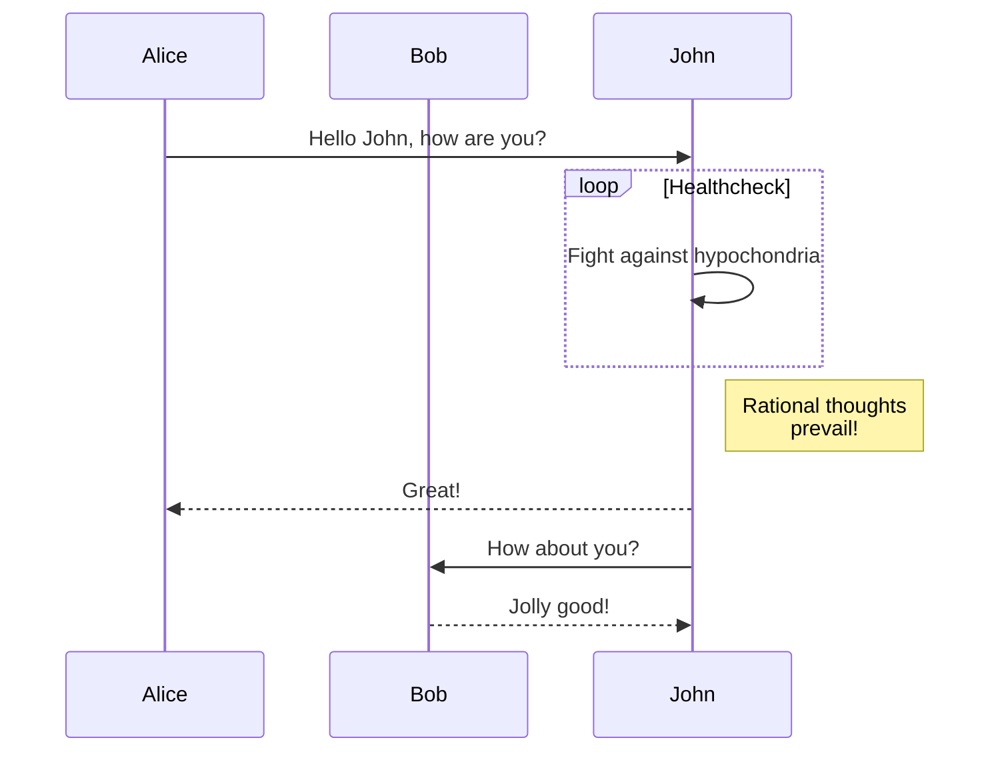

+++
title = "Markdown Syntax Test"
date = "2023-01-01T12:30:00"
description = "This article tests Zola's support for various Markdown syntax features"
+++

# Markdown Syntax Test

This article is used to test Zola's support for various Markdown syntax features.

## 1. Basic Text Formatting

### 1.1 Paragraphs and Line Breaks

This is the first paragraph.

This is the second paragraph, with an empty line between it and the first paragraph.

This line ends with two spaces,  
so this text should display on a new line.

### 1.2 Emphasis

*This is italic text*
_This is also italic text_

**This is bold text**
__This is also bold text__

***This is bold italic text***
___This is also bold italic text___

~~This is strikethrough text~~

==This is highlighted text== (supported by some Markdown implementations)

## 2. Headings

Above we've already shown level 1 and level 2 headings, below are other heading levels:

### This is a level 3 heading

#### This is a level 4 heading

##### This is a level 5 heading

###### This is a level 6 heading

## 3. Lists

### 3.1 Unordered Lists

* Item 1
* Item 2
  * Sub-item 2.1
  * Sub-item 2.2
* Item 3

- Another unordered list style
- Using minus signs
  - Nested item
    - Deeper nested item

+ Third unordered list style
+ Using plus signs

### 3.2 Ordered Lists

1. First item
2. Second item
   1. Sub-item 2.1
   2. Sub-item 2.2
3. Third item

### 3.3 Task Lists

- [x] Completed task
- [ ] Incomplete task
- [x] Another completed task
  - [ ] Nested incomplete task
  - [x] Nested completed task

## 4. Links

### 4.1 Inline Links

[Zola Website](https://www.getzola.org/)

[Link with title](https://www.getzola.org/ "Zola Static Site Generator")

### 4.2 Reference Links

[Zola Documentation][zola-docs]

[zola-docs]: https://www.getzola.org/documentation/getting-started/overview/ "Zola Documentation"

### 4.3 Automatic Links

<https://www.getzola.org/>

<mail@example.com>

## 5. Images

### 5.1 Inline Images


### 5.2 Reference Images

![Reference Image][zola-logo]

[zola-logo]: https://www.getzola.org/img/zola.svg "Zola Logo"

## 6. Blockquotes

> This is a blockquote.
>
> This is the second paragraph in the blockquote.
>
> > This is a nested blockquote.
> >
> > Second paragraph of the nested blockquote.
>
> Back to the first level blockquote.

## 7. Code

### 7.1 Inline Code

This is text containing `inline code`.

### 7.2 Code Blocks

```
This is a regular code block
without specifying a language
```

```rust
// This is a Rust code block
fn main() {
    println!("Hello, World!");
}
```

```python
# This is a Python code block
def hello():
    print("Hello, World!")
```

```javascript
// This is a JavaScript code block
function hello() {
    console.log("Hello, World!");
}
```

## 8. Horizontal Rules

Below are three ways to create horizontal rules:

---

***

___

## 9. Tables

| Header 1 | Header 2 | Header 3 |
|----------|:--------:|---------:|
| Left-aligned | Center-aligned | Right-aligned |
| Cell | Cell | Cell |
| Long text | Long text | Long text |

Simplified table:

Header 1 | Header 2
---------|----------
Cell | Cell
Cell | Cell

## 10. Footnotes

Here is a footnote reference[^1].

[^1]: This is the footnote content.

Here is another footnote[^note].

[^note]: This is a labeled footnote.

## 11. Definition Lists

Term 1
: Definition 1

Term 2
: Definition 2a
: Definition 2b

## 12. Math Formulas

### 12.1 Inline Formulas

Einstein's equation: $E = mc^2$

### 12.2 Block Formulas

$$
\frac{d}{dx}e^x = e^x
$$

$$
\begin{aligned}
\nabla \times \vec{\mathbf{B}} -\, \frac1c\, \frac{\partial\vec{\mathbf{E}}}{\partial t} & = \frac{4\pi}{c}\vec{\mathbf{j}} \\
\nabla \cdot \vec{\mathbf{E}} & = 4 \pi \rho \\
\nabla \times \vec{\mathbf{E}}\, +\, \frac1c\, \frac{\partial\vec{\mathbf{B}}}{\partial t} & = \vec{\mathbf{0}} \\
\nabla \cdot \vec{\mathbf{B}} & = 0
\end{aligned}
$$

## 13. HTML Inline

<div style="color: red;">
  This is a red text block using HTML tags.
</div>

<details>
  <summary>Click to expand details</summary>
  This is the detailed content shown when expanded.
</details>

## 14. Emoji

:smile: :heart: :thumbsup: :rocket:

## 15. Superscript and Subscript

Superscript: x^2^
Subscript: H~2~O

## 16. Abbreviations

HTML is a markup language.

*[HTML]: Hypertext Markup Language

## 17. Admonitions

> [!NOTE]
> This is a note.

> [!WARNING]
> This is a warning message.

> [!TIP]
> This is a tip.

## 18. Diagrams (Mermaid)




## 19. Code Diffs with diff2html

### 19.1 Standard Diff Format

Here is an example of traditional diff code block:

```diff
- This line is removed
+ This line is added
  This line is unchanged
```

### 19.2 Interactive Diff Viewer

Below is an example of an interactive diff viewer using diff2html:

<div id="example-diff" class="diff-container"></div>

<script>
// Initialize diff viewer once DOM is fully loaded
document.addEventListener('DOMContentLoaded', function() {
    var diffStr = `diff --git a/src/main.rs b/src/main.rs
index 123456..789abc 100644
--- a/src/main.rs
+++ b/src/main.rs
@@ -1,10 +1,15 @@
 fn main() {
-    println!("Hello, World!");
+    println!("Hello, Zola!");
+    
+    // Add new greeting function
+    greet("Welcome to our blog");
 }
 
-fn calculate_sum(a: i32, b: i32) -> i32 {
-    a + b
+fn greet(message: &str) {
+    println!("{}", message);
 }
 
-// TODO: Add more functions here
+fn calculate_sum(a: i32, b: i32) -> i32 {
+    // Add debug info
+    println!("Calculating sum of {} and {}", a, b);
+    a + b
+}`;

    // Generate diff2html output using the simple configuration
    var diff2htmlUi = new Diff2HtmlUI(
        document.getElementById("example-diff"), 
        diffStr, 
        {
            drawFileList: true,
            matching: 'lines',
            outputFormat: 'side-by-side',
            highlight: false // Disable built-in highlighting
        }
    );
    diff2htmlUi.draw();
    
    // Apply custom syntax highlighting after a short delay
    setTimeout(function() {
        // Find all code blocks in the diff
        var codeContainers = document.querySelectorAll('#example-diff .d2h-code-line-ctn');
        
        // Apply syntax highlighting to each code block
        codeContainers.forEach(function(container) {
            var html = container.innerHTML;
            
            // Skip if already highlighted
            if (html.includes('class="keyword"') || html.includes('class="comment"')) {
                return;
            }
            
            // Keywords
            html = html.replace(/\b(fn|let|mut|if|else|return|struct|enum|impl|pub|use|mod|match|for|while)\b/g, 
                '<span class="keyword">$1</span>');
            
            // Comments
            html = html.replace(/(\/\/.+)$/g, '<span class="comment">$1</span>');
            
            // Strings
            html = html.replace(/"([^"\\]*(\\.[^"\\]*)*)"/g, '<span class="string">"$1"</span>');
            
            // Function names
            html = html.replace(/\bfn\s+([a-zA-Z0-9_]+)/g, 'fn <span class="function">$1</span>');
            
            // Update the HTML
            container.innerHTML = html;
        });
    }, 100);
});
</script>

This interactive viewer supports:
- Side-by-side or line-by-line view
- File list navigation
- Syntax highlighting
- Collapsible sections

### 19.3 多文件 Diff 示例

下面是一个包含多个文件的差异视图示例：

<div id="multi-file-diff" class="diff-container"></div>

<script>
document.addEventListener('DOMContentLoaded', function() {
    var multiFileDiffStr = `diff --git a/src/lib.rs b/src/lib.rs
index abcd123..efgh456 100644
--- a/src/lib.rs
+++ b/src/lib.rs
@@ -1,15 +1,20 @@
 //! 项目核心库
 
-/// 计算两个数的和
-pub fn add(a: i32, b: i32) -> i32 {
-    a + b
+/// 计算两个数的和并返回结果
+/// 
+/// # 参数
+/// * a - 第一个加数
+/// * b - 第二个加数
+pub fn add(a: i32, b: i32) -> i32 {
+    // 打印调试信息
+    println!("计算: {} + {}", a, b);
+    a + b
 }
 
 /// 计算两个数的差
 pub fn subtract(a: i32, b: i32) -> i32 {
-    a - b
+    a.checked_sub(b).unwrap_or(0)
 }
 
-/// 计算两个数的积
-pub fn multiply(a: i32, b: i32) -> i32 {
-    a * b
+/// 乘以一个数
+pub fn double(a: i32) -> i32 {
+    a * 2
 }
diff --git a/src/main.rs b/src/main.rs
index 123456..789abc 100644
--- a/src/main.rs
+++ b/src/main.rs
@@ -1,5 +1,10 @@
+use mylib::{add, double};
+
 fn main() {
-    println!("Hello, World!");
+    println!("Hello, Rust!");
+    
+    let result = add(5, 3);
+    println!("5 + 3 = {}", result);
+    
+    println!("Double of 10 is {}", double(10));
 }
-
-// 未使用的函数
diff --git a/Cargo.toml b/Cargo.toml
index 111222..333444 100644
--- a/Cargo.toml
+++ b/Cargo.toml
@@ -1,7 +1,12 @@
 [package]
-name = "example"
-version = "0.1.0"
+name = "mylib"
+version = "0.2.0"
 authors = ["Example Author <author@example.com>"]
 edition = "2021"
+description = "An example library with basic math functions"
+license = "MIT"
 
 [dependencies]
+log = "0.4"
+serde = { version = "1.0", features = ["derive"] }
+thiserror = "1.0"
`;

    // 初始化多文件diff查看器
    var multiFileDiffUi = new Diff2HtmlUI(
        document.getElementById("multi-file-diff"),
        multiFileDiffStr,
        {
            drawFileList: true,
            matching: 'lines',
            outputFormat: 'side-by-side',
            highlight: false
        }
    );
    multiFileDiffUi.draw();
    
    // 对每个文件应用自定义语法高亮
    setTimeout(function() {
        var codeContainers = document.querySelectorAll('#multi-file-diff .d2h-code-line-ctn');
        
        codeContainers.forEach(function(container) {
            var html = container.innerHTML;
            
            // 跳过已高亮的内容
            if (html.includes('class="keyword"') || html.includes('class="comment"')) {
                return;
            }
            
            // Rust 关键字
            html = html.replace(/\b(fn|let|use|pub|struct|enum|impl|mut|if|else|return|match|for|while|loop|continue|break)\b/g, 
                '<span class="keyword">$1</span>');
            
            // 注释
            html = html.replace(/(\/\/.*?$|\/\/!.*?$)/g, '<span class="comment">$1</span>');
            
            // 字符串
            html = html.replace(/"([^"\\]*(\\.[^"\\]*)*)"/g, '<span class="string">"$1"</span>');
            
            // 数字
            html = html.replace(/\b(\d+(\.\d+)?)\b/g, '<span class="number">$1</span>');
            
            // 函数名称
            html = html.replace(/\bfn\s+([a-zA-Z0-9_]+)/g, 'fn <span class="function">$1</span>');
            
            // 文档注释中的特殊标记
            html = html.replace(/(#\s*\w+)/g, '<span class="type">$1</span>');
            
            // 更新HTML
            container.innerHTML = html;
        });
    }, 100);
});
</script>

这个多文件差异查看器展示了:
- 三个文件的变更: `src/lib.rs`, `src/main.rs` 和 `Cargo.toml`
- 文件列表导航
- 删除和添加的行以不同颜色显示
- 语法高亮支持

### 19.4 使用短代码的多文件 Diff

下面使用`diff_viewer`短代码展示多文件差异：


diff --git a/src/utils/formatter.js b/src/utils/formatter.js
index aabbcc..ddeeff 100644
--- a/src/utils/formatter.js
+++ b/src/utils/formatter.js
@@ -1,12 +1,17 @@
 // 格式化工具函数
 
-function formatDate(date) {
+/**
+ * 格式化日期为本地字符串
+ * @param {Date} date - 要格式化的日期
+ * @param {Object} options - 格式化选项
+ * @returns {string} 格式化后的日期字符串
+ */
+export function formatDate(date, options = {}) {
   if (!date) {
     return '';
   }
-  return date.toLocaleDateString();
+  const format = options.format || 'long';
+  return date.toLocaleDateString(options.locale, { dateStyle: format });
 }
 
-function formatCurrency(amount) {
-  return '$' + amount.toFixed(2);
-}
+export const formatCurrency = (amount, currency = 'USD') => 
+  new Intl.NumberFormat('en-US', { style: 'currency', currency }).format(amount);
diff --git a/src/components/DateDisplay.jsx b/src/components/DateDisplay.jsx
index 112233..445566 100644
--- a/src/components/DateDisplay.jsx
+++ b/src/components/DateDisplay.jsx
@@ -1,11 +1,20 @@
-import React from 'react';
+import React, { useState, useEffect } from 'react';
+import { formatDate } from '../utils/formatter';
 
-const DateDisplay = ({ date }) => {
-  const formattedDate = date.toLocaleDateString();
+const DateDisplay = ({ date, format = 'long', locale = 'en-US' }) => {
+  const [formattedDate, setFormattedDate] = useState('');
+  
+  useEffect(() => {
+    if (date) {
+      setFormattedDate(formatDate(date, { format, locale }));
+    }
+  }, [date, format, locale]);
   
   return (
-    <span className="date-display">
-      {formattedDate}
+    <span className="date-display" title={date.toISOString()}>
+      {formattedDate || '无日期'}
     </span>
   );
 };
+
+export default DateDisplay;


这个使用短代码的多文件diff示例展示了:
- JavaScript和JSX文件的语法高亮
- 多文件差异对比
- 使用短代码的简洁语法

## 19.5 增强交互功能的 Diff 查看器

下面是一个带有视图切换功能的增强diff查看器示例：

<div id="enhanced-diff" class="diff-container"></div>
<div class="diff-view-controls">
  <button id="enhanced-diff-split" class="active">并排视图</button>
  <button id="enhanced-diff-unified">统一视图</button>
  <button id="enhanced-diff-toggle-files">文件列表</button>
</div>

<script>
document.addEventListener('DOMContentLoaded', function() {
    var diffStr = `diff --git a/README.md b/README.md
index 1234567..abcdefg 100644
--- a/README.md
+++ b/README.md
@@ -1,10 +1,12 @@
-# 示例项目
+# 高级示例项目
 
-这是一个简单的示例项目。
+这是一个高级示例项目，展示了多种功能。
 
 ## 特性
 
-- 简单易用
-- 轻量级
+- 简单直观的API
+- 轻量级设计
+- 完整的文档
+- 自动化测试
 
-## 安装
+## 快速开始
diff --git a/src/index.js b/src/index.js
index aaaa111..bbbb222 100644
--- a/src/index.js
+++ b/src/index.js
@@ -1,8 +1,16 @@
-// 入口文件
-const app = require('./app');
+/**
+ * 应用程序入口点
+ * 配置服务器并启动应用程序
+ */
+import express from 'express';
+import { createServer } from 'http';
+import { config } from './config';
+import { setupRoutes } from './routes';
 
-const PORT = process.env.PORT || 3000;
+const app = express();
+setupRoutes(app);
 
-app.listen(PORT, () => {
-  console.log(\`服务器运行在 http://localhost:\${PORT}\`);
+const PORT = config.port || 3000;
+createServer(app).listen(PORT, () => {
+  console.log("🚀 服务器已启动: http://localhost:" + PORT);
 });`;

    // 初始化增强diff查看器
    var enhancedDiffUI = new Diff2HtmlUI(
        document.getElementById("enhanced-diff"),
        diffStr,
        {
            drawFileList: true,
            matching: 'lines',
            outputFormat: 'side-by-side',
            highlight: false
        }
    );
    enhancedDiffUI.draw();
    
    // 应用自定义语法高亮
    setTimeout(function() {
        applyCustomHighlighting('enhanced-diff');
    }, 100);
    
    // 设置视图控制按钮事件
    document.getElementById('enhanced-diff-split').addEventListener('click', function() {
        this.classList.add('active');
        document.getElementById('enhanced-diff-unified').classList.remove('active');
        enhancedDiffUI.draw('side-by-side');
        setTimeout(function() {
            applyCustomHighlighting('enhanced-diff');
        }, 100);
    });
    
    document.getElementById('enhanced-diff-unified').addEventListener('click', function() {
        this.classList.add('active');
        document.getElementById('enhanced-diff-split').classList.remove('active');
        enhancedDiffUI.draw('line-by-line');
        setTimeout(function() {
            applyCustomHighlighting('enhanced-diff');
        }, 100);
    });
    
    document.getElementById('enhanced-diff-toggle-files').addEventListener('click', function() {
        var fileList = document.querySelector('#enhanced-diff .d2h-file-list-wrapper');
        if (fileList) {
            fileList.style.display = fileList.style.display === 'none' ? 'block' : 'none';
        }
    });
    
    // 自定义语法高亮函数
    function applyCustomHighlighting(containerId) {
        var codeContainers = document.querySelectorAll('#' + containerId + ' .d2h-code-line-ctn');
        
        codeContainers.forEach(function(container) {
            var html = container.innerHTML;
            
            // 跳过已高亮的内容
            if (html.includes('class="keyword"') || html.includes('class="comment"')) {
                return;
            }
            
            // 检测当前文件类型
            var fileElem = container.closest('.d2h-file-wrapper');
            var fileName = fileElem ? fileElem.querySelector('.d2h-file-name').textContent.trim() : '';
            var fileExt = fileName.split('.').pop().toLowerCase();
            
            if (fileExt === 'md' || fileExt === 'markdown') {
                // Markdown语法
                html = html.replace(/^(\s*#+\s+.*?)$/gm, '<span class="function">$1</span>');
                html = html.replace(/(\*\*.*?\*\*)/g, '<span class="keyword">$1</span>');
                html = html.replace(/(\*.*?\*)/g, '<span class="string">$1</span>');
                html = html.replace(/^(\s*-\s+.*?)$/gm, '<span class="comment">$1</span>');
            }
            else if (fileExt === 'js' || fileExt === 'jsx') {
                // JavaScript关键字
                html = html.replace(/\b(function|const|let|var|if|else|return|class|interface|extends|implements|import|export|from|for|while|do|switch|case|default|try|catch|finally|throw|async|await|new|this|typeof|instanceof)\b/g, 
                    '<span class="keyword">$1</span>');
                
                // 注释
                html = html.replace(/(\/\/.*?)$/g, '<span class="comment">$1</span>');
                html = html.replace(/(\/\*\*[\s\S]*?\*\/)/g, '<span class="comment">$1</span>');
                
                // 字符串
                html = html.replace(/(['"`])(?:\\\1|.)*?\1/g, '<span class="string">$&</span>');
                
                // 数字
                html = html.replace(/\b(\d+(\.\d+)?)\b/g, '<span class="number">$1</span>');
                
                // 函数名称
                html = html.replace(/\b(function\s+)([a-zA-Z0-9_]+)/g, '$1<span class="function">$2</span>');
                html = html.replace(/\b([a-zA-Z0-9_]+)(\s*\()/g, '<span class="function">$1</span>$2');
                
                // 模板字符串内的变量
                html = html.replace(/(\${.*?})/g, '<span class="type">$1</span>');
            }
            
            // 更新HTML
            container.innerHTML = html;
        });
    }
});
</script>

这个增强的diff查看器包含：
- 并排/统一视图切换
- 文件列表显示/隐藏切换
- 基于文件类型的智能语法高亮
- 自适应深色/浅色主题
- 改进的视觉样式和交互

## 20. Summary

This article tests various Markdown syntax features to check Zola's support for these features. If some features don't render correctly, additional plugins or configuration may be needed.
