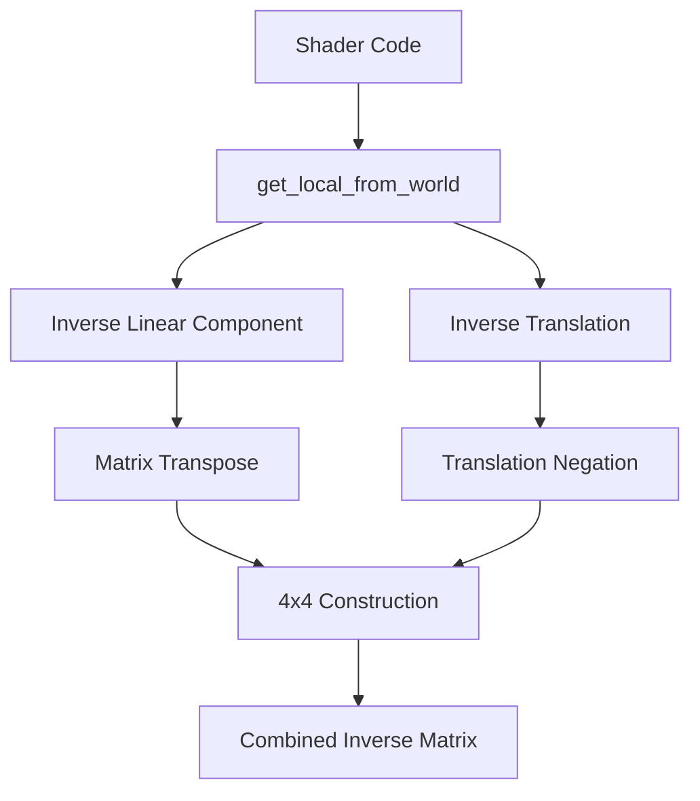

+++
title = "Pull Request"
date = "2025-03-07T12:33:32"
draft = false
template = "pull_request_page.html"
+++

+++
title = "Pull Request"
date = "2025-03-07T09:33:28"
draft = false
template = "pull_request_page.html"
+++

+++
title = "Pull Request"
date = "2025-03-07T06:33:25"
draft = false
template = "pull_request_page.html"
+++

# #10462 Helper function for getting inverse model matrix in WGSL shaders

## Basic Information
- **Title**: Helper function for getting inverse model matrix in WGSL shaders
- **PR Link**: https://github.com/bevyengine/bevy/pull/10462
- **Author**: jakkos-net
- **Status**: MERGED
- **Created**: 2023-11-08T21:24:13Z
- **Merged**: Not merged
- **Merged By**: N/A

## Description Translation
In 0.11 you could easily access the inverse model matrix inside a WGSL shader with `transpose(mesh.inverse_transpose_model)`. This was changed in 0.12 when `inverse_transpose_model` was removed and it's now not as straightfoward. I wrote a helper function for my own code and thought I'd submit a pull request in case it would be helpful to others.

## The Story of This Pull Request

### The Matrix Vanishes: A Shader's Dilemma
In Bevy 0.11, transforming normals and vectors between coordinate spaces was straightforward - developers could simply call `transpose(mesh.inverse_transpose_model)` to get the crucial inverse model matrix. But when version 0.12 removed the `inverse_transpose_model` field, it left a gap in the shader author's toolkit. Suddenly, performing proper normal transformations required manually reconstructing this matrix, an error-prone process involving complex linear algebra in WGSL.

### Journey Through Inverse Space
The developer embarked on a quest to recreate this matrix using available components. The solution emerged through careful decomposition of the transformation process:
1. **Matrix Deconstruction**: Breaking the model matrix into its translation, rotation, and scale components
2. **Inversion Strategy**: Recognizing that the inverse of an affine transformation matrix can be computed as:
   - Inverse of the linear components (rotation and scale)
   - Inverse of the translation component
3. **Precision Preservation**: Maintaining numerical stability through strategic matrix operations

The key insight was realizing that while the full 4x4 inverse might be computationally expensive, the structure of typical model matrices allows for optimized inversion through separate handling of the linear and translational components.

### Crafting the Inverse Matrix
The implementation in `get_local_from_world` showcases elegant matrix manipulation:

```wgsl
fn get_local_from_world(instance_index: u32) -> mat4x4<f32> {
    let inverse_model_3x3 = transpose(mat2x4_f32_to_mat3x3_unpack(...));
    let inverse_model_4x4_no_trans = mat4x4<f32>(...);
    let inverse_model_4x4_only_trans = mat4x4<f32>(...);
    return inverse_model_4x4_no_trans * inverse_model_4x4_only_trans;
}
```

This approach:
1. Extracts the 3x3 linear component using existing packing utilities
2. Constructs separate matrices for linear and translational inverses
3. Combines them through matrix multiplication

The comments reveal careful consideration of matrix composition order - crucial for maintaining correct transformation semantics.

### Precision in the Pixel Crucible
A particularly insightful comment explains the precision strategy:
```wgsl
// NOTE: The intermediate world_position assignment is important
// for precision purposes when using the 'equals' depth comparison
```
This highlights how the implementation preserves numerical precision by explicitly separating transformation steps, preventing catastrophic cancellation in depth calculations.

### Ripple Effects
The helper function:
- **Restores ergonomics** lost in the 0.12 transition
- **Centralizes matrix math** reducing copy-paste errors
- **Maintains performance** through optimized matrix operations
- **Documents transformation logic** via detailed comments

Future developers can now transform normals and vectors between coordinate spaces with a simple function call, rather than reimplementing matrix inversion logic in every shader.

## Visual Representation



## Key Files Changed

### File: `crates/bevy_pbr/src/render/mesh_functions.wgsl`
**Purpose**: Add inverse model matrix helper function

Key addition:
```wgsl
fn get_local_from_world(instance_index: u32) -> mat4x4<f32> {
    let inverse_model_3x3 = transpose(mat2x4_f32_to_mat3x3_unpack(
        mesh[instance_index].local_from_world_transpose_a,
        mesh[instance_index].local_from_world_transpose_b,
    ));
    // ... matrix construction logic ...
    return inverse_model_4x4_no_trans * inverse_model_4x4_only_trans;
}
```
This function:
1. Unpacks compressed matrix data
2. Handles linear and translational inverses separately
3. Combines components using matrix multiplication

## Further Reading
- [WGSL Matrix Operations Spec](https://www.w3.org/TR/WGSL/#matrix-builtin-functions)
- [3D Math Primer for Graphics and Game Development](https://gamemath.com/book/)
- [Bevy Mesh Transformation Docs](https://bevyengine.org/learn/book/features/3d#transforming-meshes)