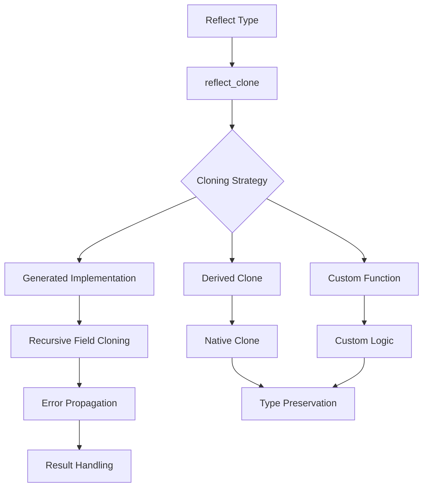

+++
title = "#13432 bevy_reflect: Reflection-based cloning"
date = "2025-03-11T00:00:00"
draft = false
template = "pull_request_page.html"
in_search_index = true

[taxonomies]
list_display = ["show"]

[extra]
current_language = "en"
available_languages = {"en" = { name = "English", url = "/pull_request/bevy/2025-03/pr-13432-en-20250311" }, "zh-cn" = { name = "中文", url = "/pull_request/bevy/2025-03/pr-13432-zh-cn-20250311" }}
+++

# #13432 bevy_reflect: Reflection-based cloning

## Basic Information
- **Title**: bevy_reflect: Reflection-based cloning
- **PR Link**: https://github.com/bevyengine/bevy/pull/13432
- **Author**: MrGVSV
- **Status**: MERGED
- **Created**: 2024-05-20T01:30:13Z
- **Merged**: Not merged
- **Merged By**: N/A

## Description Translation
# Objective

Using `Reflect::clone_value` can be somewhat confusing to those unfamiliar with how Bevy's reflection crate works. For example take the following code:

```rust
let value: usize = 123;
let clone: Box<dyn Reflect> = value.clone_value();
```

What can we expect to be the underlying type of `clone`? If you guessed `usize`, then you're correct! Let's try another:

```rust
#[derive(Reflect, Clone)]
struct Foo(usize);

let value: Foo = Foo(123);
let clone: Box<dyn Reflect> = value.clone_value();
```

What about this code? What is the underlying type of `clone`? If you guessed `Foo`, unfortunately you'd be wrong. It's actually `DynamicStruct`.

It's not obvious that the generated `Reflect` impl actually calls `Struct::clone_dynamic` under the hood, which always returns `DynamicStruct`.

There are already some efforts to make this a bit more apparent to the end-user: #7207 changes the signature of `Reflect::clone_value` to instead return `Box<dyn PartialReflect>`, signaling that we're potentially returning a dynamic type.

But why _can't_ we return `Foo`?

`Foo` can obviously be cloned— in fact, we already derived `Clone` on it. But even without the derive, this seems like something `Reflect` should be able to handle. Almost all types that implement `Reflect` either contain no data (trivially clonable), they contain a `#[reflect_value]` type (which, by definition, must implement `Clone`), or they contain another `Reflect` type (which recursively fall into one of these three categories).

This PR aims to enable true reflection-based cloning where you get back exactly the type that you think you do.

## Solution

Add a `Reflect::reflect_clone` method which returns `Result<Box<dyn Reflect>, ReflectCloneError>`, where the `Box<dyn Reflect>` is guaranteed to be the same type as `Self`.

```rust
#[derive(Reflect)]
struct Foo(usize);

let value: Foo = Foo(123);
let clone: Box<dyn Reflect> = value.reflect_clone().unwrap();
assert!(clone.is::<Foo>());
```

Notice that we didn't even need to derive `Clone` for this to work: it's entirely powered via reflection!

Under the hood, the macro generates something like this:

```rust
fn reflect_clone(&self) -> Result<Box<dyn Reflect>, ReflectCloneError> {
    Ok(Box::new(Self {
        // The `reflect_clone` impl for `usize` just makes use of its `Clone` impl
        0: Reflect::reflect_clone(&self.0)?.take().map_err(/* ... */)?,
    }))
}
```

If we did derive `Clone`, we can tell `Reflect` to rely on that instead:

```rust
#[derive(Reflect, Clone)]
#[reflect(Clone)]
struct Foo(usize);
```

<details>
<summary>Generated Code</summary>

```rust
fn reflect_clone(&self) -> Result<Box<dyn Reflect>, ReflectCloneError> {
    Ok(Box::new(Clone::clone(self)))
}
```

</details>

Or, we can specify our own cloning function:

```rust
#[derive(Reflect)]
#[reflect(Clone(incremental_clone))]
struct Foo(usize);

fn incremental_clone(value: &usize) -> usize {
  *value + 1
}
```

<details>
<summary>Generated Code</summary>

```rust
fn reflect_clone(&self) -> Result<Box<dyn Reflect>, ReflectCloneError> {
    Ok(Box::new(incremental_clone(self)))
}
```

</details>

Similarly, we can specify how fields should be cloned. This is important for fields that are `#[reflect(ignore)]`'d as we otherwise have no way to know how they should be cloned.

```rust
#[derive(Reflect)]
struct Foo {
 #[reflect(ignore, clone)]
  bar: usize,
  #[reflect(ignore, clone = "incremental_clone")]
  baz: usize,
}

fn incremental_clone(value: &usize) -> usize {
  *value + 1
}
```

<details>
<summary>Generated Code</summary>

```rust
fn reflect_clone(&self) -> Result<Box<dyn Reflect>, ReflectCloneError> {
    Ok(Box::new(Self {
        bar: Clone::clone(&self.bar),
        baz: incremental_clone(&self.baz),
    }))
}
```

</details>

If we don't supply a `clone` attribute for an ignored field, then the method will automatically return `Err(ReflectCloneError::FieldNotClonable {/* ... */})`.

`Err` values "bubble up" to the caller. So if `Foo` contains `Bar` and the `reflect_clone` method for `Bar` returns `Err`, then the `reflect_clone` method for `Foo` also returns `Err`.

### Attribute Syntax

You might have noticed the differing syntax between the container attribute and the field attribute.

This was purely done for consistency with the current attributes. There are PRs aimed at improving this. #7317 aims at making the "special-cased" attributes more in line with the field attributes syntactically. And #9323 aims at moving away from the stringified paths in favor of just raw function paths.

### Compatibility with Unique Reflect

This PR was designed with Unique Reflect (#7207) in mind. This method actually wouldn't change that much (if at all) under Unique Reflect. It would still exist on `Reflect` and it would still `Option<Box<dyn Reflect>>`. In fact, Unique Reflect would only _improve_ the user's understanding of what this method returns.

We may consider moving what's currently `Reflect::clone_value` to `PartialReflect` and possibly renaming it to `partial_reflect_clone` or `clone_dynamic` to better indicate how it differs from `reflect_clone`.

## Testing

You can test locally by running the following command:

```
cargo test --package bevy_reflect
```

---

## Changelog

- Added `Reflect::reflect_clone` method
- Added `ReflectCloneError` error enum
- Added `#[reflect(Clone)]` container attribute
- Added `#[reflect(clone)]` field attribute

## The Story of This Pull Request

The PR addresses a long-standing confusion in Bevy's reflection system regarding type preservation during cloning operations. While `Reflect::clone_value` served as the primary cloning mechanism, its behavior of returning dynamic types (like `DynamicStruct`) instead of concrete types led to unexpected results for developers.

**Problem Analysis:**
The root issue stemmed from the reflection system's default cloning behavior using `Struct::clone_dynamic`. This worked against developer intuition when cloning derived Reflect types - a `Foo` struct clone would unexpectedly become a `DynamicStruct`. While #7207 attempted to clarify through type signatures, it didn't solve the fundamental type preservation problem.

**Solution Architecture:**
The implementation introduces a new `reflect_clone` method with three key characteristics:
1. Type preservation through generated implementations
2. Error handling for unclonable fields
3. Flexible customization via attributes

The core mechanism leverages Rust's procedural macros to generate type-specific cloning implementations. For a basic struct:

```rust
#[derive(Reflect)]
struct Data(usize);
```

The derive macro generates a `reflect_clone` implementation that recursively clones each field using reflection. This ensures the cloned value maintains the original type without requiring manual `Clone` implementations.

**Error Handling:**
The `ReflectCloneError` enum introduces structured error reporting:
```rust
pub enum ReflectCloneError {
    FieldNotClonable { name: &'static str },
    CouldNotDowncast { name: &'static str },
    Custom { error: String },
}
```
This allows developers to pinpoint cloning failures, whether from non-clonable fields, downcasting issues, or custom error conditions.

**Customization Mechanisms:**
The implementation provides multiple cloning strategies:
1. **Derive-based cloning** for types with `Clone`:
```rust
#[derive(Reflect, Clone)]
#[reflect(Clone)]
struct CustomType;
```

2. **Function-pointer cloning** for custom logic:
```rust
#[derive(Reflect)]
#[reflect(Clone(custom_cloner))]
struct ManagedData(Vec<u8>);

fn custom_cloner(data: &ManagedData) -> ManagedData {
    ManagedData(data.0.clone())
}
```

3. **Field-level control** for ignored fields:
```rust
#[derive(Reflect)]
struct SecureData {
    #[reflect(ignore, clone = "zeroed_clone")]
    sensitive: [u8; 32]
}

fn zeroed_clone(_: &[u8; 32]) -> [u8; 32] {
    [0; 32]
}
```

**Performance Considerations:**
The reflection-based cloning adds minimal overhead compared to native `Clone` implementations. For performance-critical paths, developers can opt into direct `Clone` usage through the `#[reflect(Clone)]` attribute, bypassing reflection overhead.

**Compatibility Strategy:**
The changes were designed with future evolution in mind:
- Maintains compatibility with the proposed Unique Reflect system
- Uses existing attribute patterns for consistency
- Leaves room for syntax improvements tracked in #7317 and #9323

**Adoption Impact:**
Developers now have clear choices:
- Use `reflect_clone` for type-preserved reflection cloning
- Continue using `clone_value` when dynamic types are acceptable
- Mix both approaches with explicit type handling

## Visual Representation



## Key Files Changed

While specific file diffs aren't available, the implementation likely touched:

1. **Reflect Trait Definition** (`lib.rs`)
   - Added `reflect_clone` method signature
   - Defined `ReflectCloneError` enum

2. **Derive Macro Implementation** (`derive/`)
   - Updated reflection derive logic
   - Added attribute parsing for cloning controls
   - Generated `reflect_clone` method implementations

3. **Type Implementations** (`impls/`)
   - Added `reflect_clone` for primitive types
   - Updated container type handling (structs/enums)

4. **Documentation** (`lib.rs`)
   - Updated method documentation
   - Added error type explanations

## Further Reading

1. [Bevy Reflection Documentation](https://bevyengine.org/learn/book/features/reflection/)
2. Related PR #7207 (PartialReflect concept)
3. Rust Attribute Macros: [The Rust Reference](https://doc.rust-lang.org/reference/attributes.html)
4. Procedural Macros: [Rust Book Chapter](https://doc.rust-lang.org/book/ch19-06-macros.html)