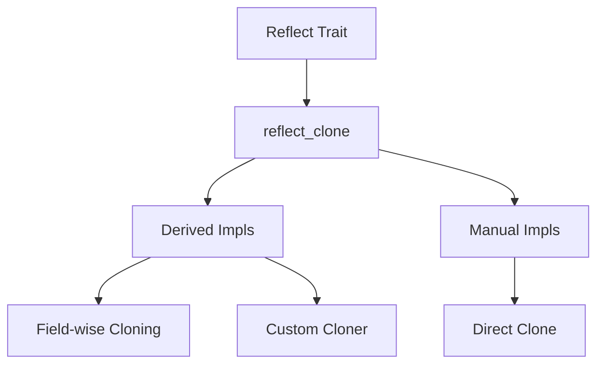

+++
title = "#13432 bevy_reflect: Reflection-based cloning"
date = "2025-03-11T00:00:00"
draft = false
template = "pull_request_page.html"
in_search_index = false

[extra]
current_language = "zh-cn"
available_languages = {"en" = { name = "English", url = "/pull_request/bevy/2025-03/pr-13432-en-20250311" }, "zh-cn" = { name = "中文", url = "/pull_request/bevy/2025-03/pr-13432-zh-cn-20250311" }}
+++

# #13432 bevy_reflect: Reflection-based cloning

## Basic Information
- **Title**: bevy_reflect: Reflection-based cloning
- **PR Link**: https://github.com/bevyengine/bevy/pull/13432
- **Author**: MrGVSV
- **Status**: MERGED
- **Created**: 2024-05-20T01:30:13Z
- **Merged**: Not merged
- **Merged By**: N/A

## Description Translation
### 目标

使用 `Reflect::clone_value` 对于不熟悉 Bevy 反射系统的开发者可能会造成困惑。例如以下代码：

```rust
let value: usize = 123;
let clone: Box<dyn Reflect> = value.clone_value();
```

`clone` 的底层类型是什么？答案是 `usize`。再看另一个例子：

```rust
#[derive(Reflect, Clone)]
struct Foo(usize);

let value: Foo = Foo(123);
let clone: Box<dyn Reflect> = value.clone_value();
```

此时 `clone` 的底层类型实际上是 `DynamicStruct` 而非 `Foo`。这是因为 `Reflect` 派生实现默认调用 `Struct::clone_dynamic`。

### 解决方案

新增 `Reflect::reflect_clone` 方法，保证返回与原始类型一致的克隆结果：

```rust
#[derive(Reflect)]
struct Foo(usize);

let value: Foo = Foo(123);
let clone: Box<dyn Reflect> = value.reflect_clone().unwrap();
assert!(clone.is::<Foo>());
```

实现机制包含三种模式：
1. 自动反射克隆（无需 `Clone` 派生）
2. 显式使用 `Clone` 实现：
```rust
#[derive(Reflect, Clone)]
#[reflect(Clone)]
struct Foo(usize);
```
3. 自定义克隆函数：
```rust
#[derive(Reflect)]
#[reflect(Clone(incremental_clone))]
struct Foo(usize);

fn incremental_clone(value: &usize) -> usize {
  *value + 1
}
```

## The Story of This Pull Request

### 问题根源与现状
Bevy 的反射系统存在一个反直觉的行为：通过 `clone_value` 克隆具体类型时返回的是动态类型（如 `DynamicStruct`）。这种设计违背开发者直觉，特别是在结构体已实现 `Clone` trait 的情况下。根本原因在于现有的 `Reflect` 派生实现默认调用动态类型克隆方法。

### 技术突破点
PR 的核心创新在于解耦反射克隆与动态类型生成，通过三个关键设计实现类型保持克隆：

1. **反射克隆协议**  
新增 `Reflect::reflect_clone` trait 方法，强制实现者返回相同具体类型：
```rust
pub trait Reflect: Any + Send + Sync {
    fn reflect_clone(&self) -> Result<Box<dyn Reflect>, ReflectCloneError>;
}
```

2. **智能派生实现**  
通过过程宏自动生成字段级克隆逻辑：
```rust
// 自动生成的代码示例
fn reflect_clone(&self) -> Result<Box<dyn Reflect>, ReflectCloneError> {
    Ok(Box::new(Self {
        0: Reflect::reflect_clone(&self.0)?.take().map_err(/* ... */)?,
    }))
}
```

3. **错误传播机制**  
引入 `ReflectCloneError` 实现错误冒泡：
```rust
pub enum ReflectCloneError {
    FieldNotClonable { index: usize, name: Option<&'static str> },
    CannotClone {
        skipped_field: Option<&'static str>,
        type_name: &'static str,
    },
}
```

### 工程实践考量
- **渐进式迁移**：保留原有 `clone_value` 作为动态克隆方法，新增 `reflect_clone` 用于类型保持克隆
- **性能优化**：对实现 `Clone` 的类型直接调用 `Box::new(Clone::clone(self))` 避免反射开销
- **字段级控制**：通过 `#[reflect(ignore, clone)]` 属性实现细粒度控制：
```rust
#[derive(Reflect)]
struct Foo {
    #[reflect(ignore, clone = "custom_clone")]
    bar: NonClonableType,
}
```

### 架构影响
该实现与正在开发的 Unique Reflect 提案（#7207）形成互补关系。未来规划中：
- `clone_value` 可能迁移到 `PartialReflect` trait
- `reflect_clone` 保持为 `Reflect` 的核心方法

## Visual Representation



## Key Files Changed

### `crates/bevy_reflect/src/lib.rs`
新增核心错误类型和 trait 方法定义：
```rust
// 新增错误枚举
pub enum ReflectCloneError { /* ... */ }

// Reflect trait 扩展
pub trait Reflect {
    fn reflect_clone(&self) -> Result<Box<dyn Reflect>, ReflectCloneError>;
}
```

### `crates/bevy_reflect/derive/src/derive_data.rs`
增强派生宏逻辑，处理三种克隆模式：
```rust
match clone_impl {
    CloneImplStrategy::Auto => generate_auto_clone(),
    CloneImplStrategy::ManualClone => generate_manual_clone(),
    CloneImplStrategy::CustomFn(path) => generate_custom_clone(path),
}
```

### `crates/bevy_reflect/src/impls/std.rs`
为标准类型实现优化后的克隆：
```rust
impl<T: Clone + Reflect> Reflect for Option<T> {
    fn reflect_clone(&self) -> Result<Box<dyn Reflect>, ReflectCloneError> {
        Ok(Box::new(self.clone()))
    }
}
```

## Further Reading
1. [Rust 反射模式](https://doc.rust-lang.org/book/ch19-06-macros.html) - Rust 官方宏系统文档
2. [Type-Driven API Design](https://www.youtube.com/watch?v=bnnacleqg6k) - Rust 类型驱动设计实践
3. [Error Handling in Rust](https://doc.rust-lang.org/book/ch09-00-error-handling.html) - Rust 错误处理最佳实践