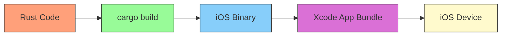

+++
title = "#14780 Link iOS example with `rustc`, and avoid C trampoline"
date = "2025-03-17T00:00:00"
draft = false
template = "pull_request_page.html"
in_search_index = true

[taxonomies]
list_display = ["show"]

[extra]
current_language = "en"
available_languages = {"en" = { name = "English", url = "/pull_request/bevy/2025-03/pr-14780-en-20250317" }, "zh-cn" = { name = "中文", url = "/pull_request/bevy/2025-03/pr-14780-zh-cn-20250317" }}
+++

# #14780 Link iOS example with `rustc`, and avoid C trampoline

## Basic Information
- **Title**: Link iOS example with `rustc`, and avoid C trampoline
- **PR Link**: https://github.com/bevyengine/bevy/pull/14780
- **Author**: madsmtm
- **Status**: MERGED
- **Created**: 2024-08-16T13:42:07Z
- **Merged**: 2024-08-19T15:40:57Z
- **Merged By**: cart

## Description Translation

# Objective

On iOS:
- Allow `std` to do its runtime initialization.
- Avoid requiring the user to specify linked libraries and framework in Xcode.
- Reduce the amount of work that `#[bevy_main]` does
  - In the future we may also be able to eliminate the need for it on Android, cc @daxpedda.

## Solution

We previously:
- Exposed an `extern "C" fn main_rs` entry point.
- Ran Cargo in a separate Xcode target as an external build system.
- Imported that as a dependency of `bevy_mobile_example.app`.
- Compiled a trampoline C file with Xcode that called `main_rs`.
- Linked that via. Xcode.

All of this is unnecessary; `rustc` is well capable of creating iOS executables, the trick is just to place it at the correct location for Xcode to understand it, namely `$TARGET_BUILD_DIR/$EXECUTABLE_PATH` (places it in `bevy_mobile_example.app/bevy_mobile_example`).

Note: We might want to wait with the changes to `#[bevy_main]` until the problem is resolved on Android too, to make the migration easier.

## Testing

Open the Xcode project, and build for an iOS target.

---

## Migration Guide

**If you have been building your application for iOS:**

Previously, the `#[bevy_main]` attribute created a `main_rs` entry point that most Xcode templates were using to run your Rust code from C. This was found to be unnecessary, as you can simply let Rust build your application as a binary, and run that directly.

You have two options for dealing with this:

If you've added further C code and Xcode customizations, or it makes sense for your use-case to continue link with Xcode, you can revert to the old behaviour by adding `#[no_mangle] extern "C" main_rs() { main() }` to your `main.rs`. Note that the old approach of linking a static library prevents the Rust standard library from doing runtime initialization, so certain functionality provided by `std` might be unavailable (stack overflow handlers, stdout/stderr flushing and other such functionality provided by the initialization routines).

The other, preferred option is to remove your "compile" and "link" build phases, and instead replace it with a "run script" phase that invokes `cargo build --bin ...`, and moves the built binary to the Xcode path `$TARGET_BUILD_DIR/$EXECUTABLE_PATH`. An example of how to do this can be viewed at [INSERT LINK TO UPDATED EXAMPLE PROJECT].
To make the debugging experience in Xcode nicer after this, you might also want to consider either enabling `panic = "abort"` or to set a breakpoint on the `rust_panic` symbol.

## The Story of This Pull Request

The iOS example in Bevy faced unnecessary complexity in its build process. Previously, the setup required a C trampoline function and manual Xcode configuration to bridge between Objective-C and Rust. This approach introduced several pain points:

1. **Runtime Initialization Limitations**: The existing method of linking a static library prevented proper initialization of Rust's standard library, disabling critical features like stack overflow handlers and proper I/O flushing.

2. **Build Process Complexity**: Developers had to maintain:
   - Separate Xcode targets for Rust compilation
   - A C source file (`main.m`) acting as entry point
   - Manual linking of frameworks and libraries
   - Custom build phases in Xcode

The key insight driving this PR was recognizing that `rustc` could directly produce iOS executables compatible with Xcode's expected bundle structure. By outputting the binary to `$TARGET_BUILD_DIR/$EXECUTABLE_PATH`, we eliminate the need for C glue code while maintaining Xcode integration.

The implementation involved three main changes:

1. **Removing C Interop Code**
   ```rust
   // Before in lib.rs:
   #[no_mangle]
   pub extern "C" fn main_rs() {
       main()
   }
   
   // After: Direct main() definition
   fn main() {
       App::new().add_plugins(DefaultPlugins).run();
   }
   ```
   This change simplifies the entry point and removes FFI boilerplate.

2. **Xcode Project Restructuring**
   The `project.pbxproj` file saw significant simplification (-174/+19 lines), replacing compile/link phases with a single script:
   ```bash
   # build_rust_deps.sh
   cargo build --bin bevy_mobile_example --target aarch64-apple-ios
   cp target/aarch64-apple-ios/debug/bevy_mobile_example \
      "${TARGET_BUILD_DIR}/${EXECUTABLE_PATH}"
   ```
   This script handles Rust compilation and proper binary placement.

3. **Bevy Main Macro Simplification**
   The `#[bevy_main]` attribute macro was simplified by removing iOS-specific code generation (-9 lines), pushing platform-specific initialization responsibilities to the build system.

The migration guide provides two paths: either retain compatibility with C interop through manual FFI definitions, or fully adopt the streamlined Rust-centric approach. The latter is recommended for new projects, while the former maintains compatibility for projects with existing Objective-C/Swift integrations.

Key technical considerations included:
- Preserving Xcode's debugging capabilities through panic handling configuration
- Maintaining compatibility with iOS simulator and physical device targets
- Ensuring proper code signing by placing the binary in expected locations

This change reduces maintenance overhead while improving Rust standard library functionality. It also aligns iOS builds more closely with standard Rust tooling, making Bevy mobile development more accessible to Rust developers without Xcode expertise.

## Visual Representation



## Key Files Changed

1. `examples/mobile/bevy_mobile_example.xcodeproj/project.pbxproj`
   - Removed 174 lines of build phase configurations
   - Added 19 lines for simplified script phase
   - Key change: Replaced C compilation steps with Rust build script

2. `examples/mobile/build_rust_deps.sh`
   ```bash
   # Before: Complex library handling
   lipo -create ... # Multiple architecture merging
   
   # After: Direct binary copy
   cargo build --bin bevy_mobile_example
   cp target/... "${TARGET_BUILD_DIR}/..."
   ```
   Simplified build process by leveraging cargo's native iOS support

3. `crates/bevy_derive/src/bevy_main.rs`
   - Removed 9 lines of iOS-specific code generation
   - No longer needs to generate `main_rs` FFI entry point

4. `examples/mobile/ios-src/main.m`
   - Entire 6-line C file deleted
   - Eliminated Objective-C to Rust bridge code

5. `examples/mobile/src/lib.rs`
   ```rust
   // Before: FFI wrapper
   #[no_mangle]
   pub extern "C" fn main_rs() { main() }
   
   // After: Direct main
   fn main() { /* app setup */ }
   ```
   Simplified entry point definition

## Further Reading

1. [Rust on iOS Documentation](https://doc.rust-lang.org/nightly/rustc/platform-support.html#apple-platforms)
2. [Xcode Build System Guide](https://developer.apple.com/documentation/xcode/build-settings-reference)
3. [Rust Panic Handling Strategies](https://doc.rust-lang.org/nomicon/panic-handling.html)
4. [Cargo Configuration for iOS Targets](https://doc.rust-lang.org/cargo/reference/config.html)