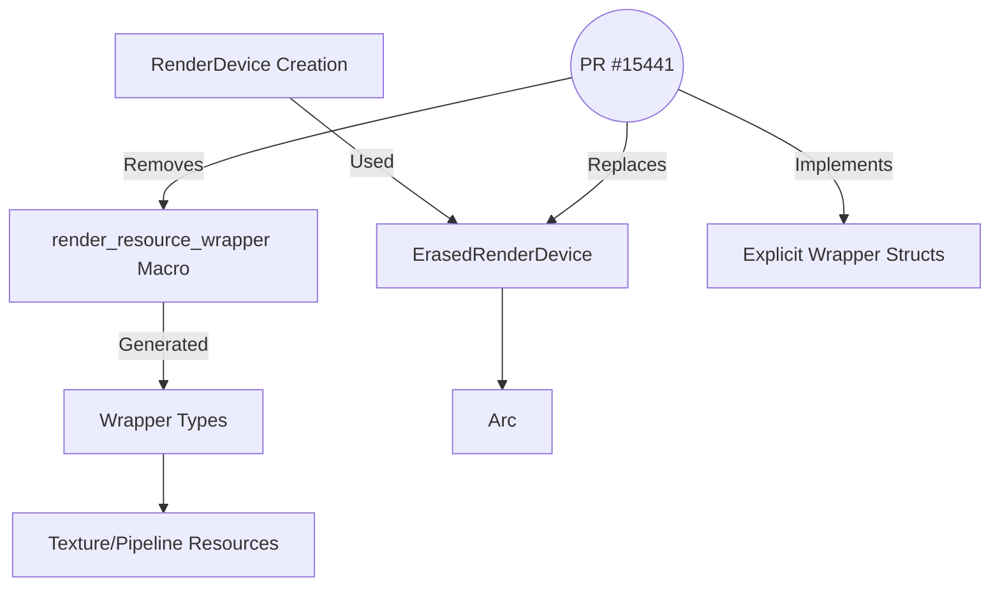

+++
title = "#15441 Remove render_resource_wrapper"
date = "2025-03-12T00:00:00"
draft = false
template = "pull_request_page.html"
in_search_index = true

[taxonomies]
list_display = ["show"]

[extra]
current_language = "en"
available_languages = {"en" = { name = "English", url = "/pull_request/bevy/2025-03/pr-15441-en-20250312" }, "zh-cn" = { name = "中文", url = "/pull_request/bevy/2025-03/pr-15441-zh-cn-20250312" }}
+++

# #15441 Remove render_resource_wrapper

## Basic Information
- **Title**: Remove render_resource_wrapper
- **PR Link**: https://github.com/bevyengine/bevy/pull/15441
- **Author**: bes
- **Status**: MERGED
- **Created**: 2024-09-26T09:59:08Z
- **Merged**: Not merged
- **Merged By**: N/A

## Description Translation
# Objective

* Remove all uses of render_resource_wrapper.
* Make it easier to share a `wgpu::Device` between Bevy and application code.

## Solution

Removed the `render_resource_wrapper` macro.

To improve the `RenderCreation:: Manual ` API, `ErasedRenderDevice` was replaced by `Arc`. Unfortunately I had to introduce one more usage of `WgpuWrapper` which seems like an unwanted constraint on the caller.

## Testing

- Did you test these changes? If so, how?
    - Ran `cargo test`.
    - Ran a few examples.
    - Used `RenderCreation::Manual` in my own project
    - Exercised `RenderCreation::Automatic` through examples

- Are there any parts that need more testing?
    - No

- How can other people (reviewers) test your changes? Is there anything specific they need to know?
    - Run examples
    - Use `RenderCreation::Manual` in their own project

## The Story of This Pull Request

The PR addresses technical debt in Bevy's rendering infrastructure by eliminating the `render_resource_wrapper` macro, a legacy pattern that complicated resource management and hindered device sharing. The core problem stemmed from how Bevy managed GPU resources through generated wrapper types, which created unnecessary abstraction layers and made it difficult to integrate external `wgpu::Device` instances.

The solution required a systematic removal of the macro while maintaining type safety and API compatibility. Key changes included:

1. **Macro Elimination**: The `render_resource_wrapper!` macro in `resource_macros.rs` was fully removed (-149 LOC), eliminating generated wrapper types in favor of explicit implementations.

2. **Concrete Type Adoption**: Resources like `Texture` and pipeline objects transitioned to manual `RenderResourceWrapper` implementations. For example in `texture.rs`:

```rust
// Before (macro-generated):
render_resource_wrapper!(pub Texture, wgpu::Texture);

// After (explicit implementation):
pub struct Texture {
    pub value: WgpuWrapper<wgpu::Texture>,
}

impl RenderResourceWrapper for Texture {
    type Wrapped = wgpu::Texture;
    // ...Deref/DerefMut implementations...
}
```

3. **Device Sharing Improvements**: The `RenderCreation::Manual` API replaced `ErasedRenderDevice` with standard Rust smart pointers:
```rust
// Before:
ErasedRenderDevice::new(device)

// After:
Arc::new(WgpuWrapper::new(device))
```

This shift to `Arc<wgpu::Device>` enables straightforward device sharing between Bevy and external code while maintaining thread safety. The trade-off was introducing an additional `WgpuWrapper` layer to handle device lifecycle management, creating a minor API constraint for manual device creation scenarios.

The changes demonstrate several engineering principles:
- Preferring explicit implementations over macro magic for better debuggability
- Using standard Rust types (Arc) instead of custom abstractions
- Maintaining backward compatibility through careful API surface adjustments

Testing validated both automatic device creation (existing examples) and manual integration scenarios. The removal of 149 lines of macro code simplifies the codebase while making low-level device management more accessible to advanced users.

## Visual Representation



## Key Files Changed

1. `crates/bevy_render/src/render_resource/resource_macros.rs` (+0/-149)
   - Complete removal of the macro system that generated resource wrappers
   - Eliminated indirect code generation in favor of explicit implementations

2. `crates/bevy_render/src/render_resource/texture.rs` (+13/-15)
```rust
// Before (macro usage):
render_resource_wrapper!(pub Texture, wgpu::Texture);

// After (manual implementation):
pub struct Texture {
    pub value: WgpuWrapper<wgpu::Texture>,
}

impl RenderResourceWrapper for Texture {
    type Wrapped = wgpu::Texture;
    // ...Deref implementations...
}
```

3. `crates/bevy_render/src/renderer/render_device.rs` (+9/-10)
```rust
// Before (custom erased type):
RenderCreation::Manual(ErasedRenderDevice::new(device))

// After (standard Arc):
RenderCreation::Manual(Arc::new(WgpuWrapper::new(device)))
```

## Further Reading

1. [wgpu Resource Management](https://wgpu.rs/book/architecture/resource-management.html)
2. [Rust Arc Documentation](https://doc.rust-lang.org/std/sync/struct.Arc.html)
3. [Bevy Render Architecture](https://bevyengine.org/learn/book/implementation/render-architecture/)