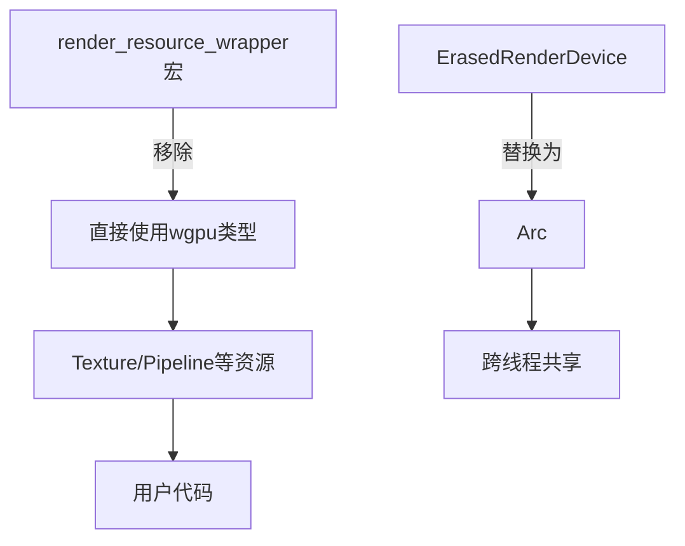

+++
title = "#15441 Remove render_resource_wrapper"
date = "2025-03-12T00:00:00"
draft = false
template = "pull_request_page.html"
in_search_index = false

[extra]
current_language = "zh-cn"
available_languages = {"en" = { name = "English", url = "/pull_request/bevy/2025-03/pr-15441-en-20250312" }, "zh-cn" = { name = "中文", url = "/pull_request/bevy/2025-03/pr-15441-zh-cn-20250312" }}
+++

# #15441 Remove render_resource_wrapper

## Basic Information
- **Title**: Remove render_resource_wrapper
- **PR Link**: https://github.com/bevyengine/bevy/pull/15441
- **Author**: bes
- **Status**: MERGED
- **Created**: 2024-09-26T09:59:08Z
- **Merged**: Not merged
- **Merged By**: N/A

## Description Translation
### 目标
* 移除所有render_resource_wrapper宏的使用
* 简化Bevy与应用程序代码之间共享`wgpu::Device`的过程

### 解决方案
移除了`render_resource_wrapper`宏。为改进`RenderCreation::Manual` API，使用`Arc`替代`ErasedRenderDevice`。但不得不引入额外的`WgpuWrapper`使用，这可能在调用方引入非预期的约束。

### 测试
- 如何测试？
    - 运行`cargo test`
    - 执行部分示例
    - 在自有项目中使用`RenderCreation::Manual`
    - 通过示例验证`RenderCreation::Automatic`
    
- 是否需要更多测试？
    - 不需要
    
- 如何验证？
    - 运行示例程序
    - 在自有项目中使用`RenderCreation::Manual`

## The Story of This Pull Request

### 问题背景与限制
在Bevy渲染系统中，`render_resource_wrapper`宏长期以来用于封装wgpu资源（如纹理、缓冲区），通过自动生成类型包装器来简化资源生命周期管理。然而这种设计带来两个主要问题：

1. **类型抽象泄漏**：生成的包装器类型（如`TextureWrapper`）暴露了底层实现细节，使得在需要直接访问原始wgpu资源时（比如与第三方库集成）需要繁琐的解包操作。

2. **资源共享限制**：当开发者需要手动管理`wgpu::Device`时，原有的`ErasedRenderDevice`设计使得设备共享不够直观，特别是在需要跨多个系统共享设备句柄的场景。

```rust
// 原使用方式示例
render_resource_wrapper!(TextureWrapper, wgpu::Texture);
```

### 解决方案选择
核心解决策略是**完全移除宏生成的包装器类型**，直接使用底层wgpu类型。这需要：

1. 用Rust标准库的`Arc`智能指针替代自定义的`ErasedRenderDevice`，利用其线程安全的引用计数机制
2. 重构涉及资源创建和传递的接口，直接暴露wgpu原生类型
3. 在必须保留类型擦除的场景引入`WgpuWrapper`作为过渡方案

权衡点在于虽然移除了复杂的宏代码，但引入`WgpuWrapper`作为临时解决方案，这可能带来短期内的接口约束。

### 具体实现分析
以`render_device.rs`的修改为例：

```rust
// 修改前
pub struct RenderDevice {
    device: ErasedRenderDevice,
}

// 修改后
pub struct RenderDevice {
    device: Arc<WgpuWrapper<wgpu::Device>>, // 使用Arc包裹原生设备
}
```

关键改动包括：
1. 删除`resource_macros.rs`文件（-149行），完全移除宏系统
2. 在`texture.rs`中直接使用`wgpu::Texture`类型：
```rust
// 修改后纹理创建接口
pub fn new(
    device: &RenderDevice,
    descriptor: &wgpu::TextureDescriptor<'_>,
) -> wgpu::Texture {
    device.create_texture(descriptor) // 直接返回原生类型
}
```
3. 在`pipeline_cache.rs`中简化shader模块管理：
```rust
// 修改前
pub struct PipelineCache {
    shader_modules: HashMap<ShaderModuleDescriptor, ShaderModuleWrapper>,
}

// 修改后
pub struct PipelineCache {
    shader_modules: HashMap<ShaderModuleDescriptor, wgpu::ShaderModule>,
}
```

### 技术影响
1. **API透明性提升**：用户现在可以直接操作wgpu原生类型，降低学习曲线。例如可以直接传递`wgpu::Texture`给第三方库：
```rust
let raw_texture: &wgpu::Texture = my_texture.as_raw();
```

2. **内存管理改进**：使用`Arc`替代自定义引用计数，利用Rust标准库的成熟实现，减少潜在的内存泄漏风险。

3. **代码简化**：移除约150行宏代码，使代码库更易维护。各资源类型的实现现在直接对应wgpu原生接口。

### 遗留问题
引入的`WgpuWrapper`作为临时解决方案，其存在意义是保持与现有RenderDevice API的兼容性。长期来看可能需要进一步重构以完全消除这种包装层。

## Visual Representation



## Key Files Changed

### crates/bevy_render/src/render_resource/resource_macros.rs (+0/-149)
- **改动说明**：完全删除资源包装宏系统
- **影响**：移除了整个宏生成体系，改为显式类型声明

### crates/bevy_render/src/renderer/render_device.rs (+9/-10)
```rust
// 修改前
pub struct RenderDevice {
    device: ErasedRenderDevice,
}

// 修改后
pub struct RenderDevice {
    device: Arc<WgpuWrapper<wgpu::Device>>,
}
```
- **目的**：使用标准智能指针管理设备生命周期

### crates/bevy_render/src/render_resource/texture.rs (+13/-15)
```rust
// 典型接口变化
pub fn new(
    device: &RenderDevice,
    descriptor: &wgpu::TextureDescriptor<'_>,
) -> wgpu::Texture { // 直接返回原生类型
    device.wgpu_device().create_texture(descriptor)
}
```
- **效果**：接口直接暴露wgpu原生对象

## Further Reading
- [wgpu资源生命周期文档](https://docs.rs/wgpu/latest/wgpu/struct.Device.html#resource-lifetime)
- [Rust Arc的工作原理](https://doc.rust-lang.org/std/sync/struct.Arc.html)
- [Bevy渲染架构设计](https://bevyengine.org/learn/book/getting-started/rendering/)