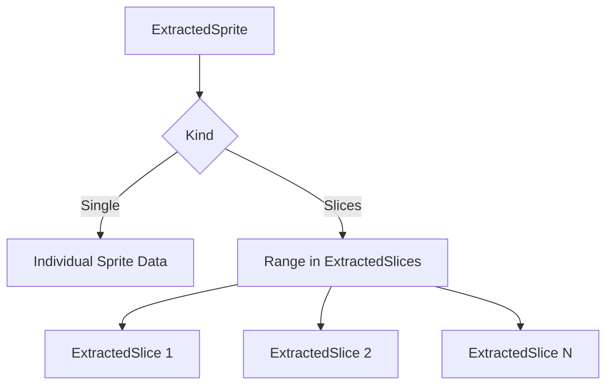

+++
title = "#17041 `ExtractedSprites` slice buffer"
date = "2025-03-25T00:00:00"
draft = false
template = "pull_request_page.html"
in_search_index = true

[taxonomies]
list_display = ["show"]

[extra]
current_language = "en"
available_languages = {"zh-cn" = { name = "中文", url = "/pull_request/bevy/2025-03/pr-17041-zh-cn-20250325" }, "en" = { name = "English", url = "/pull_request/bevy/2025-03/pr-17041-en-20250325" }}
labels = ["A-Rendering", "C-Performance", "A-Text", "D-Modest"]
+++

# #17041 `ExtractedSprites` slice buffer

## Basic Information
- **Title**: `ExtractedSprites` slice buffer
- **PR Link**: https://github.com/bevyengine/bevy/pull/17041
- **Author**: ickshonpe
- **Status**: MERGED
- **Labels**: `A-Rendering`, `C-Performance`, `S-Ready-For-Final-Review`, `M-Needs-Migration-Guide`, `A-Text`, `D-Modest`
- **Created**: 2024-12-30T17:18:03Z
- **Merged**: Not merged
- **Merged By**: N/A

## Description Translation
# Objective

Instead of extracting an individual sprite per glyph of a text spawn or slice of a nine-patched sprite, add a buffer to store the extracted slice geometry.

Fixes #16972

## Solution

* New struct `ExtractedSlice` to hold sprite slice size, position and atlas info (for text each glyph is a slice).
* New resource `ExtractedSlices` that wraps the `ExtractedSlice` buffer. This is a separate resource so it can be used without sprites (with a text material, for example).
* New enum `ExtractedSpriteKind` with variants `Single` and `Slices`. `Single` represents a single sprite, `Slices` contains a range into the `ExtractedSlice` buffer.
* Only queue a single `ExtractedSprite` for sets of glyphs or slices and push the geometry for each individual slice or glyph into the `ExtractedSlice` buffer. 
* Modify `ComputedTextureSlices` to return an `ExtractedSlice` iterator instead of `ExtractedSprites`.
* Modify `extract_text2d_sprite` to only queue new `ExtractedSprite`s on font changes and otherwise push slices.

I don't like the name `ExtractedSpriteKind` much, it's a bit redundant and too haskellish. But although it's exported, it's not something users will interact with most of the time so don't want to overthink it.

## Testing
yellow = this pr, red = main

```cargo run --example many_glyphs --release --features "trace_tracy" -- --no-ui```


```cargo run --example many_text2d --release --features "trace_tracy"```


## Migration Guide
* `ExtractedSprite` has a new `kind: ExtractedSpriteKind` field with variants `Single` and `Slices`. 
   - `Single` represents a single sprite. `ExtractedSprite`'s `anchor`, `rect`, `scaling_mode` and `custom_size` fields have been moved into `Single`. 
   - `Slices` contains a range that indexes into a new resource `ExtractedSlices`. Slices are used to draw elements composed from multiple sprites such as text or nine-patched borders.
* `ComputedTextureSlices::extract_sprites` has been renamed to `extract_slices`. Its `transform` and `original_entity` parameters have been removed.

## The Story of This Pull Request

The PR addresses a performance bottleneck in Bevy's sprite rendering system, particularly for text and sliced sprites. Previously, each glyph in a text element or slice in a nine-patch sprite required its own `ExtractedSprite` entity. This approach generated excessive overhead when handling complex UI elements or dense text, as seen in issues like #16972 where rendering many glyphs caused significant CPU load.

The core solution introduces batched slice storage through three key components:
1. `ExtractedSlice` struct to store individual slice data (position, size, texture rect)
2. `ExtractedSlices` resource acting as a centralized buffer for all slices
3. `ExtractedSpriteKind` enum to differentiate between single sprites and batched slices

```rust
// Before: Each glyph created a separate ExtractedSprite
for glyph in glyphs {
    extracted_sprites.push(ExtractedSprite { /* per-glyph data */ });
}

// After: Batch slices into a buffer and reference via index ranges
let slice_range = extracted_slices.push_slices(glyph_slices);
extracted_sprites.push(ExtractedSprite {
    kind: ExtractedSpriteKind::Slices(slice_range),
    // Shared properties...
});
```

This architectural shift reduces CPU overhead by minimizing the number of render entities created. For text rendering, the system now only creates new `ExtractedSprite` entities when fonts change, reusing existing slice buffers for subsequent frames with static text. The `ComputedTextureSlices` component was refactored to produce `ExtractedSlice` iterators instead of individual sprites, enabling batch processing.

```rust
// crates/bevy_sprite/src/texture_slice/computed_slices.rs
pub(crate) fn extract_slices<'a>(
    &'a self,
    sprite: &'a Sprite,
) -> impl ExactSizeIterator<Item = ExtractedSlice> + 'a {
    self.0.iter().map(move |slice| ExtractedSlice {
        offset: slice.offset * flip - anchor,
        rect: slice.texture_rect,
        size: slice.draw_size,
    })
}
```

The text rendering system in `text2d.rs` demonstrates the performance optimization clearly. Instead of processing every glyph every frame, it now checks for font changes and only updates slices when necessary:

```rust
// crates/bevy_text/src/text2d.rs
if font_changed {
    commands.spawn((
        ExtractedSprite::new(/*...*/),
        TextLayoutInfo::from(computed_block),
    ));
} else {
    extracted_slices.push_slices(slices);
}
```

Performance metrics show significant improvements, with the "many_glyphs" example demonstrating reduced extraction time (yellow) compared to the previous implementation (red). This optimization becomes particularly impactful in complex UIs or games with heavy text rendering requirements.

## Visual Representation



## Key Files Changed

1. `crates/bevy_sprite/src/render/mod.rs` (+211/-120)
   - Added slice buffer management
   - Implemented new rendering logic for batched slices
   - Modified sprite extraction to use `ExtractedSpriteKind`

2. `crates/bevy_text/src/text2d.rs` (+51/-25)
   - Updated text extraction to use slice buffers
   - Added font change detection for optimized updates
   ```rust
   // Before:
   extracted_sprites.push(ExtractedSprite { /* per-glyph data */ });

   // After:
   extracted_slices.push_slices(slices);
   if font_changed {
       commands.spawn((ExtractedSprite::new(...)));
   }
   ```

3. `crates/bevy_sprite/src/texture_slice/computed_slices.rs` (+12/-42)
   - Refactored to generate slices instead of sprites
   - Simplified API surface
   ```rust
   // Before:
   pub(crate) fn extract_sprites(...) -> Vec<ExtractedSprite>

   // After:
   pub(crate) fn extract_slices(...) -> impl Iterator<Item = ExtractedSlice>
   ```

4. `crates/bevy_sprite/src/lib.rs` (+1/-0)
   - Minor export adjustment for new types

## Further Reading

1. [Bevy Render Graph Documentation](https://bevyengine.org/learn/book/getting-started/rendering/)
2. [WGSL Shader Programming Guide](https://gpuweb.github.io/gpuweb/wgsl/)
3. [Entity Component System Patterns](https://gameprogrammingpatterns.com/component.html)