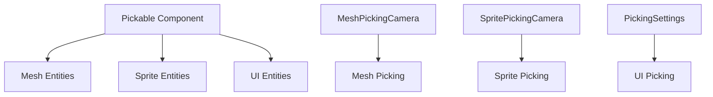

+++
title = "#17348 Unify picking backends"
date = "2025-03-18T00:00:00"
draft = false
template = "pull_request_page.html"
in_search_index = true

[taxonomies]
list_display = ["show"]

[extra]
current_language = "en"
available_languages = {"zh-cn" = { name = "中文", url = "/pull_request/bevy/2025-03/pr-17348-zh-cn-20250318" }, "en" = { name = "English", url = "/pull_request/bevy/2025-03/pr-17348-en-20250318" }}
+++

# #17348 Unify picking backends

## Basic Information
- **Title**: Unify picking backends
- **PR Link**: https://github.com/bevyengine/bevy/pull/17348
- **Author**: chompaa
- **Status**: MERGED
- **Created**: 2025-01-13T18:28:43Z
- **Merged**: Not merged
- **Merged By**: N/A

## Description Translation
# Objective

Currently, our picking backends are inconsistent:

- Mesh picking and sprite picking both have configurable opt in/out behavior. UI picking does not.
  - Sprite picking uses `SpritePickingCamera` and `Pickable` for control, but mesh picking uses `RayCastPickable`.
- `MeshPickingPlugin` is not a part of `DefaultPlugins`. `SpritePickingPlugin` and `UiPickingPlugin` are.

## Solution

- Add configurable opt in/out behavior to UI picking (defaults to opt out).
- Replace `RayCastPickable` with `MeshPickingCamera` and `Pickable`.
- Remove `SpritePickingPlugin` and `UiPickingPlugin` from `DefaultPlugins`.

## Testing

Ran some examples.

## Migration Guide

`UiPickingPlugin` and `SpritePickingPlugin` are no longer included in `DefaultPlugins`. They must be explicitly added.

`RayCastPickable` has been replaced in favor of the `MeshPickingCamera` and `Pickable` components. You should add them to cameras and entities, respectively, if you have `MeshPickingSettings::require_markers` set to `true`.

## The Story of This Pull Request

The PR addresses inconsistencies in Bevy's picking system across different renderable types. Prior to these changes, developers faced three main issues:

1. **Inconsistent Opt-In Behavior**: While mesh and sprite picking required explicit opt-in through components (`RayCastPickable` for meshes, `Pickable` for sprites), UI entities automatically participated in picking without configuration options.

2. **Divergent Component APIs**: The mesh picking system used `RayCastPickable` while sprites used `Pickable` with `SpritePickingCamera`, creating API fragmentation.

3. **Plugin Inconsistencies**: The default plugin setup included sprite and UI picking plugins but excluded mesh picking, creating unexpected behavior differences between entity types.

The solution standardized these systems through three key changes:

**1. UI Picking Configuration**
```rust
// Added to bevy_ui/src/picking_backend.rs
#[derive(Component, Default, Reflect)]
pub struct PickingSettings {
    pub require_markers: bool,
}
```
This brings UI picking in line with other systems by introducing opt-out behavior (default) with optional opt-in through marker components.

**2. Unified Component API**
```rust
// Replaced in mesh picking system
- RayCastPickable
+ Pickable // Standard component now used across all picking types
+ MeshPickingCamera // Camera marker component mirroring SpritePickingCamera
```
This creates symmetry between mesh and sprite picking systems while maintaining type-specific camera markers.

**3. Plugin Normalization**
```rust
// Removed from DefaultPlugins in respective crates
- .add_plugins(SpritePickingPlugin)
- .add_plugins(UiPickingPlugin)
```
This change requires explicit opting-in for all picking systems, making plugin dependencies more intentional.

The implementation required careful coordination across multiple crates:
- **bevy_ui** gained picking configuration parity
- **bevy_sprite** simplified its picking setup
- **bevy_picking** unified its core components
- Example code updated to demonstrate new patterns

Key technical decisions included:
- Maintaining backward compatibility through default opt-out behavior
- Preserving type-specific camera markers for render backend independence
- Leveraging Bevy's component system for declarative configuration

The changes improve developer experience by:
1. Reducing cognitive load through consistent APIs
2. Preventing unexpected picking behavior in UI
3. Making plugin dependencies explicit
4. Enabling unified migration patterns

Migration challenges were mitigated by:
- Clear documentation in the migration guide
- Maintaining existing component functionality during transition
- Using familiar patterns from sprite picking for mesh updates

## Visual Representation



## Key Files Changed

1. `crates/bevy_ui/src/picking_backend.rs` (+57/-5)
```rust
// Added picking configuration
#[derive(Component, Default, Reflect)]
pub struct PickingSettings {
    pub require_markers: bool,
}

// Updated picking logic to check for markers
if settings.require_markers && !entity.has::<Pickable>() {
    return None;
}
```

2. `crates/bevy_sprite/src/lib.rs` (+8/-25)
```rust
// Before:
app.add_plugins(SpritePickingPlugin);

// After:
// Plugin registration removed from defaults
```

3. `crates/bevy_picking/src/mesh_picking/mod.rs` (+15/-14)
```rust
// Component replacement
- RayCastPickable
+ #[derive(Component)]
+ pub struct MeshPickingCamera;
```

4. `examples/ui/tab_navigation.rs` (+6/-1)
```rust
// Updated to explicitly add plugins
app.add_plugins(UiPickingPlugin)
   .add_plugins(SpritePickingPlugin);
```

## Further Reading

1. [Bevy Plugin System Documentation](https://bevyengine.org/learn/book/getting-started/plugins/)
2. [Entity Component System Overview](https://bevyengine.org/learn/book/getting-started/ecs/)
3. [Picking System Architecture](https://github.com/bevyengine/bevy/blob/main/examples/3d/picking.rs)