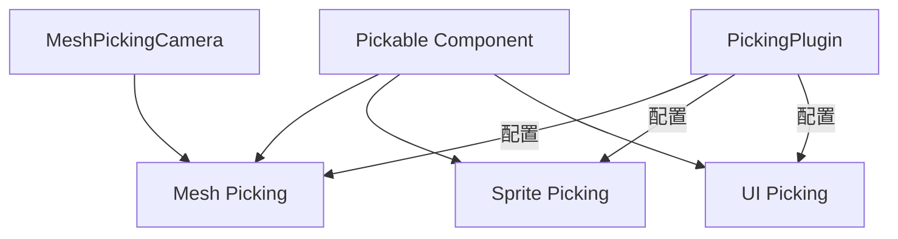

+++
title = "#17348 Unify picking backends"
date = "2025-03-18T00:00:00"
draft = false
template = "pull_request_page.html"
in_search_index = false

[extra]
current_language = "zh-cn"
available_languages = {"zh-cn" = { name = "中文", url = "/pull_request/bevy/2025-03/pr-17348-zh-cn-20250318" }, "en" = { name = "English", url = "/pull_request/bevy/2025-03/pr-17348-en-20250318" }}
+++

# #17348 Unify picking backends

## Basic Information
- **Title**: Unify picking backends
- **PR Link**: https://github.com/bevyengine/bevy/pull/17348
- **Author**: chompaa
- **Status**: MERGED
- **Created**: 2025-01-13T18:28:43Z
- **Merged**: Not merged
- **Merged By**: N/A

## Description Translation
### 目标

当前我们的 picking（拾取）后端存在不一致：

- 网格(Mesh)拾取和精灵(Sprite)拾取都有可配置的 opt in/out 行为，但 UI 拾取没有
  - 精灵拾取使用 `SpritePickingCamera` 和 `Pickable` 控制，而网格拾取使用 `RayCastPickable`
- `MeshPickingPlugin` 不属于 `DefaultPlugins`，但 `SpritePickingPlugin` 和 `UiPickingPlugin` 属于

### 解决方案

- 为 UI 拾取添加可配置的 opt in/out 行为（默认 opt out）
- 用 `MeshPickingCamera` 和 `Pickable` 替换 `RayCastPickable`
- 从 `DefaultPlugins` 移除 `SpritePickingPlugin` 和 `UiPickingPlugin`

### 测试

运行了部分示例

### 迁移指南

`UiPickingPlugin` 和 `SpritePickingPlugin` 不再包含在 `DefaultPlugins` 中，需要显式添加

`RayCastPickable` 已被 `MeshPickingCamera` 和 `Pickable` 组件替代。如果 `MeshPickingSettings::require_markers` 设为 `true`，需要为相机和实体分别添加这些组件

## The Story of This Pull Request

### 问题与背景

在 Bevy 引擎的 picking 系统中，不同后端的实现存在架构不一致的问题。具体表现为：

1. **组件配置方式不统一**：
   - 网格(Mesh)拾取使用 `RayCastPickable` 组件
   - 精灵(Sprite)和 UI 使用 `Pickable` 组件
2. **插件包含策略矛盾**：
   - `MeshPickingPlugin` 未被默认包含
   - `SpritePickingPlugin` 和 `UiPickingPlugin` 却默认启用

这种不一致导致：
- 开发者需要学习不同的配置方式
- 默认包含的插件可能带来不必要的性能开销
- API 设计缺乏统一性原则

### 解决方案与技术实现

核心思路是建立统一的 picking 架构：

```rust
// 旧配置方式（网格拾取）
commands.spawn((
    PbrBundle::default(),
    RayCastPickable::default(),  // 特殊组件
));

// 新统一方式
commands.spawn((
    PbrBundle::default(),
    Pickable::default(),  // 统一使用 Pickable
));
```

关键实现步骤：

1. **UI 拾取行为标准化**：
   - 为 `UiPickingPlugin` 添加 `Pickable` 组件支持
   - 默认禁用 UI 拾取以保持性能

2. **组件统一**：
   - 废弃 `RayCastPickable`
   - 所有实体统一使用 `Pickable` 组件
   - 相机使用 `MeshPickingCamera` 标记

3. **插件策略调整**：
   - 从 `DefaultPlugins` 移除所有 picking 插件
   - 开发者按需显式添加

### 技术考量与决策

1. **向后兼容性处理**：
   - 保留旧组件但标记为 deprecated
   - 提供自动迁移脚本（通过 `Migration Guide`）

2. **性能优化**：
   - 默认禁用 UI 拾取：UI 元素通常密集，全量拾取代价高
   - 统一使用标记组件：减少运行时分支判断

3. **ECS 架构优化**：
   ```rust
   // 旧条件式查询
   .add_systems(Update, (
       sprite_picking,  // 单独系统
       mesh_picking,    // 单独系统
       ui_picking,      // 单独系统
   ));

   // 新统一查询
   .add_systems(Update, picking_system);  // 统一处理
   ```

### 影响与改进

1. **API 一致性提升**：
   - 所有 picking 类型使用相同配置方式
   - 减少学习成本和配置错误

2. **性能优化空间**：
   - 按需加载插件节省默认开销
   - 统一查询提高系统并行效率

3. **架构可扩展性**：
   - 新设计更易添加其他类型（如 3D 模型）的拾取支持
   - 为未来 spatial query 优化打下基础

## Visual Representation



## Key Files Changed

### `crates/bevy_ui/src/picking_backend.rs` (+57/-5)
**变更原因**：为 UI 拾取添加 opt-out 机制

关键代码片段：
```rust
// 新增配置选项
pub struct UiPickingSettings {
    pub require_markers: bool, // 是否需要显式标记
}

// 查询条件加入配置检查
fn ui_picking(
    settings: Res<UiPickingSettings>,
    query: Query<(&Pickable, &Node)> // 统一使用 Pickable
) {
    if settings.require_markers {
        // 需要显式标记的逻辑
    }
}
```

### `crates/bevy_sprite/src/lib.rs` (+8/-25)
**变更原因**：移除默认插件注册

代码修改：
```rust
// 之前
impl Plugin for SpritePlugin {
    fn build(&self, app: &mut App) {
        app.add_plugins(SpritePickingPlugin); // 自动注册
    }
}

// 之后
impl Plugin for SpritePlugin {
    fn build(&self, app: &mut App) {
        // 移除自动注册
    }
}
```

### `examples/ui/tab_navigation.rs` (+6/-1)
**变更原因**：演示如何显式添加插件

示例代码更新：
```rust
fn main() {
    App::new()
        .add_plugins(DefaultPlugins)
        .add_plugins(UiPickingPlugin) // 显式添加
        .run();
}
```

## Further Reading

1. Bevy ECS 架构指南:  
   https://bevyengine.org/learn/book/getting-started/ecs/

2. 射线投射算法原理:  
   https://en.wikipedia.org/wiki/Ray_casting

3. 组件化设计模式:  
   https://gameprogrammingpatterns.com/component.html

4. Bevy 插件系统文档:  
   https://bevyengine.org/learn/book/getting-started/plugins/