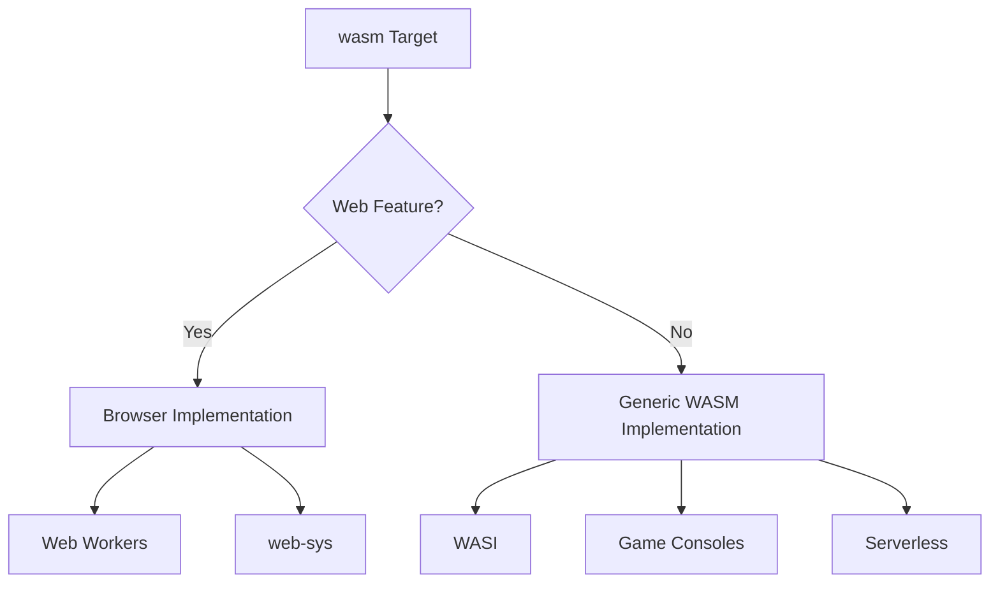

+++
title = "#17499 Support for non-browser `wasm`"
date = "2025-03-09T00:00:00"
draft = false
template = "pull_request_page.html"
in_search_index = true

[taxonomies]
list_display = ["show"]

[extra]
current_language = "en"
available_languages = {"en" = { name = "English", url = "/pull_request/bevy/2025-03/pr-17499-en-20250309" }, "zh-cn" = { name = "中文", url = "/pull_request/bevy/2025-03/pr-17499-zh-cn-20250309" }}
+++

# #17499 Support for non-browser `wasm`

## Basic Information
- **Title**: Support for non-browser `wasm`
- **PR Link**: https://github.com/bevyengine/bevy/pull/17499
- **Author**: bushrat011899
- **Status**: MERGED
- **Created**: 2025-01-22T22:28:57Z
- **Merged**: Not merged
- **Merged By**: N/A

## Description Translation
# Objective

- Contributes to #15460
- Supersedes #8520
- Fixes #4906

## Solution

- Added a new `web` feature to `bevy`, and several of its crates.
- Enabled new `web` feature automatically within crates without `no_std` support.

## Testing

- `cargo build --no-default-features --target wasm32v1-none`

---

## Migration Guide

When using Bevy crates which _don't_ automatically enable the `web` feature, please enable it when building for the browser.

## Notes

- I added [`cfg_if`](https://crates.io/crates/cfg-if) to help manage some of the feature gate gore that this extra feature introduces. It's still pretty ugly, but I think much easier to read.
- Certain `wasm` targets (e.g., [wasm32-wasip1](https://doc.rust-lang.org/nightly/rustc/platform-support/wasm32-wasip1.html#wasm32-wasip1)) provide an incomplete implementation for `std`. I have not tested these platforms, but I suspect Bevy's liberal use of usually unsupported features (e.g., threading) will cause these targets to fail. As such, consider `wasm32-unknown-unknown` as the only `wasm` platform with support from Bevy for `std`. All others likely will need to be treated as `no_std` platforms.


## The Story of This Pull Request

The journey begins with a fundamental mismatch in Bevy's WebAssembly support. For years, the engine treated all wasm targets as browser environments, creating headaches for developers trying to deploy to non-browser wasm runtimes like WASI or game consoles using wasm. This PR emerges as the culmination of efforts to untangle browser-specific assumptions from core engine functionality.

At the heart of the problem lay Bevy's automatic feature detection. The engine would enable browser-specific code paths whenever it detected a wasm target, making it impossible to build for non-browser environments. This manifested most visibly in time management - browser builds relied on `web-sys` for timestamps, while native used `Instant`. For non-browser wasm targets, neither approach worked correctly.

The developer's breakthrough came with the introduction of a new `web` feature flag. This allowed explicit separation of browser-specific functionality while maintaining backward compatibility. The implementation required surgical changes across multiple crates:

1. **Time Management Revolution**  
The most dramatic transformation occurred in `bevy_platform_support`. The original `time.rs` implementation contained browser-specific code:

```rust
// Before in time.rs
#[cfg(target_arch = "wasm32")]
pub fn time_since_startup() -> Duration {
    web_sys::window().unwrap().performance().unwrap().now()
}
```

This was moved to a new `fallback.rs` with proper feature gating:

```rust
// After in fallback.rs
#[cfg(feature = "web")]
pub fn time_since_startup() -> Duration {
    // Browser-specific implementation
}

#[cfg(not(feature = "web"))]
pub fn time_since_startup() -> Duration {
    // Generic wasm/native implementation
}
```

2. **Task Pool Architecture**  
The `bevy_tasks` crate saw significant refactoring to support proper executor selection. Previously, wasm targets automatically used single-threaded executors. The new implementation uses `cfg_if` for clearer conditional compilation:

```rust
cfg_if! {
    if #[cfg(feature = "multi-threaded")] {
        // Native thread pool
    } else if #[cfg(feature = "web")] {
        // Web worker-based pool
    } else {
        // Single-threaded fallback
    }
}
```

3. **Feature Propagation**  
A crucial insight was automatically enabling the `web` feature for appropriate targets through `Cargo.toml` configurations:

```toml
[package.metadata.docs.rs]
all-features = true

[features]
default = []
web = ["dep:web-sys", "dep:js-sys"]
```

This maintained backward compatibility while allowing explicit opt-in for non-browser wasm targets through `--no-default-features`.

The implementation's elegance lies in its layered approach:
- Browser-specific code isolated behind `web` feature gates
- Clear separation of concerns between platform implementations
- Maintained native performance characteristics
- Preserved existing workflows through careful feature propagation

## Visual Representation



## Key Files Changed

1. **crates/bevy_platform_support/src/time.rs** (-194 lines)  
   Removed browser-specific time implementation, paving the way for platform-agnostic timing.

2. **crates/bevy_platform_support/src/time/fallback.rs** (+176 lines)  
   Introduced feature-gated implementations:
   ```rust
   #[cfg(feature = "web")]
   fn web_time() { /* ... */ }
   
   #[cfg(not(feature = "web"))]
   fn generic_time() { /* ... */ }
   ```

3. **crates/bevy_tasks/src/lib.rs**  
   Revamped executor selection logic:
   ```rust
   cfg_if! {
       if #[cfg(all(feature = "multi-threaded", not(target_arch = "wasm32")))] {
           type TaskPool = bevy_tasks::TaskPool;
       } else {
           type TaskPool = bevy_tasks::SingleThreadedTaskPool;
       }
   }
   ```

4. **crates/bevy_app/src/schedule_runner.rs**  
   Updated main loop timing to use new time abstraction:
   ```rust
   let mut accum = Duration::ZERO;
   while accum < time.delta() {
       accum += time.raw_delta();
   }
   ```

## Further Reading

1. [Rust Wasm Targets Documentation](https://doc.rust-lang.org/nightly/rustc/platform-support.html)
2. [cfg-if Crate Patterns](https://docs.rs/cfg-if/latest/cfg_if/)
3. [Bevy Feature Flag Guide](https://bevyengine.org/learn/book/getting-started/features/)