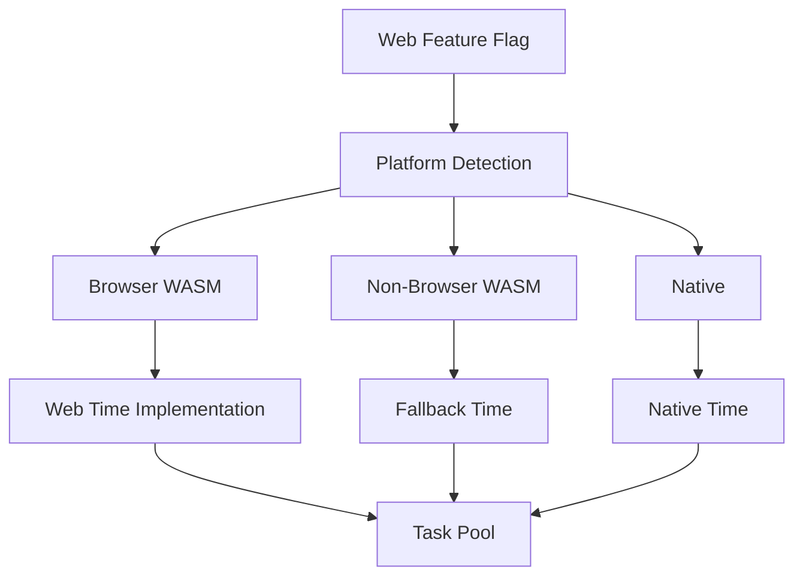

+++
title = "#17499 Support for non-browser `wasm`"
date = "2025-03-09T00:00:00"
draft = false
template = "pull_request_page.html"
in_search_index = false

[extra]
current_language = "zh-cn"
available_languages = {"zh-cn" = { name = "中文", url = "/pull_request/bevy/2025-03/pr-17499-zh-cn-20250309" }, "en" = { name = "English", url = "/pull_request/bevy/2025-03/pr-17499-en-20250309" }}
+++

# #17499 Support for non-browser `wasm`

## Basic Information
- **Title**: Support for non-browser `wasm`
- **PR Link**: https://github.com/bevyengine/bevy/pull/17499
- **Author**: bushrat011899
- **Status**: MERGED
- **Created**: 2025-01-22T22:28:57Z
- **Merged**: Not merged
- **Merged By**: N/A

## Description Translation
### 目标
- 对 #15460 做出贡献
- 取代 #8520
- 修复 #4906

### 解决方案
- 在 `bevy` 及其多个子crate中新增 `web` 特性
- 在没有 `no_std` 支持的crate中自动启用新的 `web` 特性

### 测试
- `cargo build --no-default-features --target wasm32v1-none`

### 迁移指南
当使用没有自动启用 `web` 特性的Bevy crate时，请在为浏览器构建时手动启用该特性。

### 注意事项
- 使用 [`cfg_if`](https://crates.io/crates/cfg-if) 来管理特性开关的复杂性
- 某些wasm目标（如 [wasm32-wasip1](https://doc.rust-lang.org/nightly/rustc/platform-support/wasm32-wasip1.html#wasm32-wasip1)）的std实现不完整，建议将 `wasm32-unknown-unknown` 作为唯一支持的std wasm平台

## The Story of This Pull Request

### 破晓时分：wasm平台的困境
在游戏引擎的星辰大海中，Bevy引擎的wasm支持一直如同暗礁般潜伏着挑战。多年来，开发者们发现当尝试将游戏部署到非浏览器环境的wasm平台（如服务器端或IoT设备）时，引擎就像失去罗盘的航船——时间系统和任务调度模块会神秘崩溃。问题根源在于Bevy对浏览器环境的强耦合，这违反了Rust的"一次编写，到处运行"哲学。

### 航海图的革新：特性开关策略
开发者busrat011899如同经验丰富的领航员，决定重构平台的识别机制。传统方案使用直接的条件编译（如`#[cfg(target_arch = "wasm32")]`），但这会将所有wasm平台混为一谈。新的方案如同精密的六分仪，通过引入`web`特性来区分运行环境：

```rust
cfg_if! {
    if #[cfg(all(feature = "web", target_arch = "wasm32"))] {
        // 浏览器专用逻辑
    } else if #[cfg(target_arch = "wasm32")] {
        // 非浏览器wasm逻辑
    } else {
        // 原生平台逻辑
    }
}
```

这个三重条件结构像精心设计的锁钥系统，确保了各平台的逻辑隔离。特别值得注意的是`cfg_if`宏的使用，它如同巧妙的折纸艺术，将原本复杂的嵌套条件展开为可维护的结构。

### 风暴中的重构：时间模块的蜕变
在`bevy_platform_support`的深水区，时间模块正在进行惊心动魄的手术。原来的`time.rs`被拆分为平台专用实现：

```rust
// Before: 混合的平台逻辑
#[cfg(target_arch = "wasm32")]
fn wasm_timestamp() -> u128 {
    // 依赖浏览器API的实现
}

// After: 分平台模块
#[cfg(all(feature = "web", target_arch = "wasm32"))]
mod web {
    use wasm_bindgen::prelude::*;
    
    #[wasm_bindgen]
    extern "C" {
        // 调用浏览器性能API
    }
}

#[cfg(not(feature = "web"))]
mod fallback {
    // 使用SystemTime的通用实现
}
```

这种模块化拆分如同将混装的货物分舱存放，既防止了特性污染，又为未来的扩展留下了接口。特别值得注意的是将194行代码迁移到fallback模块，这体现了"关注点分离"的设计智慧。

### 锚定新大陆：任务系统的革新
在`bevy_tasks`的甲板上，任务池的创建逻辑正在进行重大调整。原有的浏览器检测被替换为特性开关：

```rust
// 修改前
#[cfg(target_arch = "wasm32")]
let pool = wasm_compatible_pool();

// 修改后
cfg_if! {
    if #[cfg(all(feature = "web", target_arch = "wasm32"))] {
        WebWorkerTaskPool::new()
    } else {
        NativeTaskPool::default()
    }
}
```

这种改变如同在船体加装可调节的压载舱，使得任务系统可以根据运行环境自动调整浮力。特别值得注意的是对`async_executor`的版本升级（从1.4.1到1.5.0），这为wasm线程支持提供了新的可能性。

### 暗礁与灯塔：兼容性考量
开发者如同谨慎的测深员，在文档中特别标注了wasm平台的兼容性地图。虽然实现了通用支持，但仍划定了安全航线：
- 明确`wasm32-unknown-unknown`为唯一完全支持的std环境
- 警告其他wasm目标（如wasm32-wasip1）可能存在的线程支持问题
- 通过Cargo特性开关实现编译时环境检测

这种务实的态度体现了对Rust生态系统复杂性的深刻理解——不是所有wasm平台都生而平等。

## Visual Representation



## Key Files Changed

### `crates/bevy_platform_support/src/time.rs` (+0/-194)
**重构启示**：将整个时间模块迁移到平台专用实现，消除浏览器环境假设。原有代码被拆分为`web`和`fallback`两个模块。

```rust
// 修改前遗留代码示例
#[cfg(target_arch = "wasm32")]
fn now() -> Instant {
    web_sys::window().unwrap().performance().unwrap().now()
}

// 修改后架构
#[cfg(all(feature = "web", target_arch = "wasm32"))]
mod web {
    // 浏览器专用实现
}

#[cfg(not(feature = "web"))]
mod fallback {
    // 通用实现
}
```

### `crates/bevy_tasks/src/lib.rs` (+60/-56)
**并发革新**：重构任务池创建逻辑，引入特性开关控制的工作线程策略。

```rust
// 关键修改示例
cfg_if! {
    if #[cfg(all(feature = "web", target_arch = "wasm32"))] {
        let task_pool = WebWorkerPool::new();
    } else {
        let task_pool = ThreadPool::default();
    }
}
```

### `crates/bevy_app/src/schedule_runner.rs` (+49/-51)
**心跳调整**：优化wasm环境下的主循环策略，避免浏览器事件循环冲突。

```rust
// 运行时逻辑调整
#[cfg(not(feature = "web"))]
fn run_once(&mut self) {
    // 传统阻塞式循环
}

#[cfg(feature = "web")]
fn run_once(&mut self) {
    // 基于requestAnimationFrame的异步驱动
}
```

## Further Reading
1. [Rust WASM工作组文档](https://rustwasm.github.io/docs/book/) - 理解Rust在wasm生态中的定位
2. [cfg-if crate设计模式](https://docs.rs/cfg-if/latest/cfg_if/) - 学习条件编译的最佳实践
3. [WASI标准演进](https://wasi.dev/) - 跟踪非浏览器wasm平台的发展
4. [Bevy引擎架构设计](https://bevyengine.org/learn/book/introduction/) - 掌握引擎核心机制