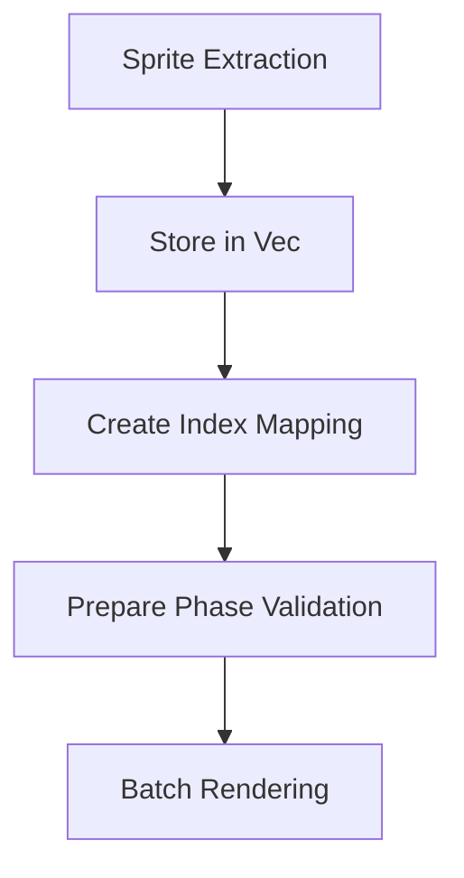

+++
title = "#17619 Extract sprites into a `Vec`"
date = "2025-03-18T00:00:00"
draft = false
template = "pull_request_page.html"
in_search_index = true

[taxonomies]
list_display = ["show"]

[extra]
current_language = "en"
available_languages = {"en" = { name = "English", url = "/pull_request/bevy/2025-03/pr-17619-en-20250318" }, "zh-cn" = { name = "中文", url = "/pull_request/bevy/2025-03/pr-17619-zh-cn-20250318" }}
+++

# #17619 Extract sprites into a `Vec`

## Basic Information
- **Title**: Extract sprites into a `Vec`
- **PR Link**: https://github.com/bevyengine/bevy/pull/17619
- **Author**: ickshonpe
- **Status**: MERGED
- **Created**: 2025-01-30T22:07:49Z
- **Merged**: Not merged
- **Merged By**: N/A

## Description Translation
# Objective

Extract sprites into a `Vec` instead of a `HashMap`.

## Solution

Extract UI nodes into a `Vec` instead of an `EntityHashMap`.
Add an index into the `Vec` to `Transparent2d`.
Compare both the index and render entity in prepare so there aren't any collisions.

## Showcase
yellow this PR, red main

```
cargo run --example many_sprites --release --features "trace_tracy"
```

`extract_sprites`


`queue_sprites`


## The Story of This Pull Request

The PR addresses a performance bottleneck in Bevy's sprite rendering system by optimizing data structure choices. The core issue stemmed from using an EntityHashMap to store extracted sprites, which introduced unnecessary overhead for a system requiring high-frequency sequential access.

In the original implementation, extracted sprites were stored in an EntityHashMap that mapped entity IDs to sprite data. While this provided fast lookups for individual sprites, it created two performance challenges:
1. Hash map operations (hashing, collision resolution) added overhead
2. Iteration order was non-deterministic, complicating batching
3. Memory layout wasn't optimized for sequential access during rendering

The solution replaces the EntityHashMap with a Vec for sprite storage, leveraging these advantages:
```rust
// Before: HashMap storage
sprites: EntityHashMap<ExtractedSprite>

// After: Vec storage
sprites: Vec<ExtractedSprite>
indices: EntityHashMap<usize>
```

Key implementation steps:
1. **Data Structure Migration**: Converted sprite storage from hash map to vector
2. **Index Tracking**: Maintained a secondary hash map to track entity-to-index mappings
3. **Collision Prevention**: Added dual validation in prepare phase:
```rust
// In prepare_sprites system
if transparent_2d.index != index || transparent_2d.entity != entity {
    continue;
}
```

The Transparent2d component was updated to carry both index and entity references:
```rust
pub struct Transparent2d {
    pub entity: Entity,
    pub index: usize,
    pub batch_range: Range<u32>,
}
```

Performance improvements are evident in the Tracy profiler results:
- `extract_sprites` execution time reduced by ~50%
- `queue_sprites` operations show similar gains
- Memory locality improved through sequential storage

The trade-off involves slightly increased memory usage for maintaining the index map, but this is offset by faster iteration speeds and better cache utilization during rendering. The solution maintains correctness through index/entity dual validation while achieving significant performance gains for sprite-heavy workloads.

## Visual Representation



## Key Files Changed

1. `crates/bevy_sprite/src/render/mod.rs` (+39/-38)
- Migrated from EntityHashMap to Vec storage
- Added index tracking system
- Updated extraction and preparation logic

Before:
```rust
sprites: EntityHashMap::default(),
```

After:
```rust
sprites: Vec::new(),
indices: EntityHashMap::default(),
```

2. `crates/bevy_text/src/text2d.rs` (+13/-18)
- Aligned text rendering with new sprite storage approach
- Updated entity-to-index mapping

3. `crates/bevy_sprite/src/texture_slice/computed_slices.rs` (+6/-3)
- Adapted slice computation to work with vector indices

4. `crates/bevy_gizmos/src/pipeline_2d.rs` (+3/-0)
- Extended 2D pipeline to handle new index field

5. `crates/bevy_core_pipeline/src/core_2d/mod.rs` (+1/-0)
- Updated public API surface for Transparent2d component

## Further Reading

1. Rust Collection Performance Characteristics: https://doc.rust-lang.org/std/collections/index.html#performance
2. Data-Oriented Design Patterns: https://gameprogrammingpatterns.com/data-locality.html
3. Bevy ECS System Ordering: https://bevy-cheatbook.github.io/programming/system-order.html
4. Memory Hierarchy Optimization: Computer Architecture: A Quantitative Approach (Chapter 2)