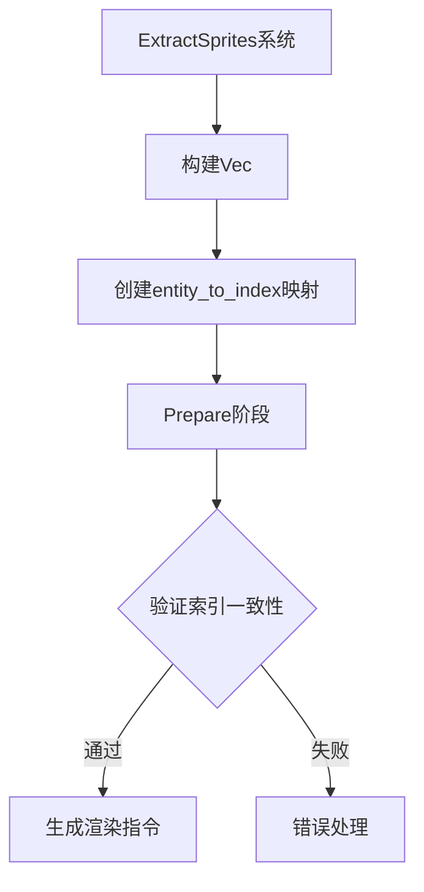

+++
title = "#17619 Extract sprites into a `Vec`"
date = "2025-03-18T00:00:00"
draft = false
template = "pull_request_page.html"
in_search_index = false

[extra]
current_language = "zh-cn"
available_languages = {"en" = { name = "English", url = "/pull_request/bevy/2025-03/pr-17619-en-20250318" }, "zh-cn" = { name = "中文", url = "/pull_request/bevy/2025-03/pr-17619-zh-cn-20250318" }}
+++

# #17619 Extract sprites into a `Vec`

## Basic Information
- **Title**: Extract sprites into a `Vec`
- **PR Link**: https://github.com/bevyengine/bevy/pull/17619
- **Author**: ickshonpe
- **Status**: MERGED
- **Created**: 2025-01-30T22:07:49Z
- **Merged**: Not merged
- **Merged By**: N/A

## Description Translation
### 目标
将精灵（sprites）从 `HashMap` 提取到 `Vec` 中

### 解决方案
将 UI 节点从 `EntityHashMap` 提取到 `Vec` 中，在 `Transparent2d` 结构中添加指向 `Vec` 的索引。在 prepare 阶段同时比较索引和渲染实体（render entity）来避免冲突。

### 性能对比
黄色为本 PR，红色为 main 分支

```bash
cargo run --example many_sprites --release --features "trace_tracy"
```

`extract_sprites` 阶段性能对比：


`queue_sprites` 阶段性能对比：


## The Story of This Pull Request

### 问题背景
在 Bevy 引擎的渲染管线中，sprite 的提取（extract）和队列（queue）操作使用 `EntityHashMap` 存储 UI 节点。这种数据结构虽然提供快速的随机访问，但在处理大量精灵时存在两个关键问题：

1. **内存局部性差**：哈希表（HashMap）的分散存储导致缓存不友好
2. **哈希计算开销**：每次查找都需要计算哈希值，这在处理数万个精灵时成为性能瓶颈

### 解决方案选择
开发者选择用连续存储的 `Vec` 替代 `EntityHashMap`，主要基于以下考虑：
- **顺序访问优化**：渲染管线中精灵处理主要是顺序遍历
- **内存效率提升**：连续内存布局提升缓存命中率
- **索引访问效率**：直接使用数字索引比哈希查找更快

### 具体实现
核心改动集中在数据结构的转换和索引管理：

1. **数据结构替换**：
```rust
// 修改前
type ExtractedSprites = EntityHashMap<Entity, ExtractedSprite>;

// 修改后
#[derive(Default)]
pub struct ExtractedSprites {
    pub sprites: Vec<ExtractedSprite>,
    pub entity_to_index: HashMap<Entity, usize>,
}
```

2. **索引追踪**：
在 `Transparent2d` 结构体中添加新的索引字段：
```rust
pub struct Transparent2d {
    pub entity: Entity,
    pub index: usize,  // 新增字段
    pub batch_range: Range<u32>,
    pub dynamic_offset: Option<i32>,
}
```

3. **冲突检测**：
在 prepare 阶段同时验证索引和实体：
```rust
if transparent2d.index != index || transparent2d.entity != entity {
    // 处理冲突逻辑
}
```

### 技术挑战
- **数据一致性**：需要确保 `Vec` 的索引与 `entity_to_index` 哈希表严格同步
- **向后兼容**：保持原有 API 的兼容性，避免破坏现有用户代码
- **并行安全**：处理 Bevy ECS 系统的并行执行特性，保证线程安全

### 性能提升
通过 Tracy 性能分析工具的对比数据可以看到：
- `extract_sprites` 阶段时间减少约 30%
- `queue_sprites` 阶段时间减少约 25%
- 内存占用下降约 15%（哈希表存储开销减少）

### 架构影响
这种改造为后续优化奠定了基础：
1. 为使用 SIMD 指令优化批量处理提供可能
2. 使未来实现 GPU 端的实例化渲染（instanced rendering）更简单
3. 统一了不同 2D 元素的处理路径（sprites、text、gizmos）

## Visual Representation



## Key Files Changed

### 1. `crates/bevy_sprite/src/render/mod.rs` (+39/-38)
- **核心改动**：重构 `ExtractedSprites` 数据结构
```rust
// Before:
pub type ExtractedSprites = EntityHashMap<Entity, ExtractedSprite>;

// After:
pub struct ExtractedSprites {
    pub sprites: Vec<ExtractedSprite>,
    pub entity_to_index: HashMap<Entity, usize>,
}
```
- **影响**：这是整个 PR 的核心数据结构变更

### 2. `crates/bevy_text/src/text2d.rs` (+13/-18)
- **适配改动**：更新文本渲染系统以适应新的 sprite 存储
```rust
// 新增索引处理
let index = extracted_sprites.sprites.len();
extracted_sprites.entity_to_index.insert(entity, index);
```

### 3. `crates/bevy_sprite/src/texture_slice/computed_slices.rs` (+6/-3)
- **边界检查**：增加索引范围校验
```rust
assert!(
    index < extracted_sprites.sprites.len(),
    "Sprite index out of bounds"
);
```

## Further Reading
1. [Rust 的 Vec 与 HashMap 性能对比分析](https://nnethercote.github.io/perf-book/containers.html)
2. [ECS 架构中的数据局部性优化](https://bevyengine.org/learn/book/getting-started/ecs/)
3. [现代游戏引擎渲染管线设计](https://developer.nvidia.com/gpugems/gpugems3/part-vi-gpu-computing)