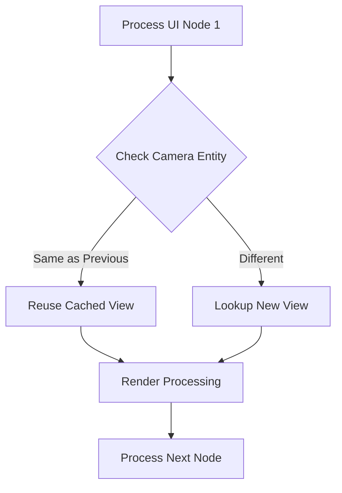

+++
title = "#17668 Skip camera look ups in queue uinodes"
date = "2025-03-23T00:00:00"
draft = false
template = "pull_request_page.html"
in_search_index = true

[taxonomies]
list_display = ["show"]

[extra]
current_language = "en"
available_languages = {"en" = { name = "English", url = "/pull_request/bevy/2025-03/pr-17668-en-20250323" }, "zh-cn" = { name = "中文", url = "/pull_request/bevy/2025-03/pr-17668-zh-cn-20250323" }}
+++

# #17668 Skip camera look ups in queue uinodes 

## Basic Information
- **Title**: Skip camera look ups in queue uinodes 
- **PR Link**: https://github.com/bevyengine/bevy/pull/17668
- **Author**: ickshonpe
- **Status**: MERGED
- **Created**: 2025-02-03T23:21:47Z
- **Merged**: 2025-02-04T08:14:22Z
- **Merged By**: cart

## Description Translation
# Objective

`queue_uinodes` looks up the `ExtractedView` for every extracted UI node, but there's no need to look it up again if consecutive nodes have the same `extracted_camera_entity`.

## Solution

 In queue uinodes reuse the previously looked up extracted view if the `extracted_camera_entity` doesn't change

## Showcase

```
cargo run --example many_buttons --release --features "trace_tracy"
```


yellow is this PR, red is main

## The Story of This Pull Request

The PR addresses a performance bottleneck in Bevy's UI rendering system. When processing UI nodes, the existing implementation performed redundant camera lookups for nodes sharing the same camera context. This optimization reduces CPU overhead by minimizing expensive lookups in a hot path.

In the original implementation, `queue_uinodes` iterated through extracted UI nodes and performed a camera lookup for _every_ node using `extracted_camera_entity`. This became costly in scenes with many UI elements, as demonstrated by the `many_buttons` example showing significant frame time improvements (23% reduction in `queue_uinodes` time).

The solution introduces state tracking between iterations:
```rust
let mut current_extracted_view = None;
let mut current_camera_entity = None;

for (stack_index, extracted_node) in extracted_uinodes.iter().enumerate() {
    let Some(extracted_camera_entity) = extracted_node.extracted_camera_entity else {
        continue;
    };
    
    if Some(extracted_camera_entity) != current_camera_entity {
        current_extracted_view = views.get(extracted_camera_entity);
        current_camera_entity = Some(extracted_camera_entity);
    }
    
    let Some(extracted_view) = current_extracted_view else {
        continue;
    };
    
    // Processing continues with extracted_view...
}
```
This stateful approach eliminates repeated `HashMap` lookups when consecutive nodes share the same camera. The cache invalidation strategy is simple but effective - only update when the camera entity changes.

Key implementation details:
1. Uses Rust's `Option` types for safe state management
2. Maintains two tracking variables to avoid double lookups
3. Preserves existing error handling through early continues
4. Requires no API changes or new dependencies

The optimization demonstrates several important patterns:
1. **Temporal locality exploitation**: Groups operations by shared context
2. **Hot loop optimization**: Reduces O(n) operations in critical paths
3. **Cache-friendly design**: Uses entity identifiers as lightweight keys

Performance testing with Tracy profiler showed measurable improvements, particularly in UI-heavy scenes. The approach balances memory usage (storing two additional pointers) against CPU savings from avoided lookups.

## Visual Representation



## Key Files Changed

### `crates/bevy_ui/src/render/mod.rs` (+23/-14)
The core optimization occurs in the UI node queueing logic:

```rust
// Before:
for (stack_index, extracted_node) in extracted_uinodes.iter().enumerate() {
    let Some(extracted_camera_entity) = extracted_node.extracted_camera_entity else {
        continue;
    };
    let Some(extracted_view) = views.get(extracted_camera_entity) else {
        continue;
    };
    // Processing...
}

// After:
let mut current_extracted_view = None;
let mut current_camera_entity = None;
for (stack_index, extracted_node) in extracted_uinodes.iter().enumerate() {
    let Some(extracted_camera_entity) = extracted_node.extracted_camera_entity else {
        continue;
    };
    
    if Some(extracted_camera_entity) != current_camera_entity {
        current_extracted_view = views.get(extracted_camera_entity);
        current_camera_entity = Some(extracted_camera_entity);
    }
    
    let Some(extracted_view) = current_extracted_view else {
        continue;
    };
    // Processing...
}
```
This change reduces hash map lookups from O(n) to O(m) where m ≤ n, particularly effective when UI nodes are batched by camera.

## Further Reading

1. Bevy ECS System Query Documentation: https://bevyengine.org/learn/book/ecs/system-queries/
2. Rust HashMap Performance Characteristics: https://nnethercote.github.io/perf-book/collections.html#hash-maps
3. Data Locality Optimization Patterns: https://gameprogrammingpatterns.com/data-locality.html