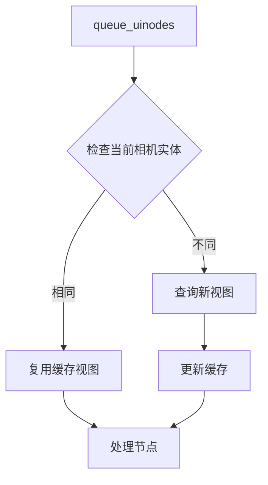

+++
title = "#17668 Skip camera look ups in queue uinodes"
date = "2025-03-23T00:00:00"
draft = false
template = "pull_request_page.html"
in_search_index = false

[extra]
current_language = "zh-cn"
available_languages = {"en" = { name = "English", url = "/pull_request/bevy/2025-03/pr-17668-en-20250323" }, "zh-cn" = { name = "中文", url = "/pull_request/bevy/2025-03/pr-17668-zh-cn-20250323" }}
+++

# #17668 Skip camera look ups in queue uinodes 

## Basic Information
- **Title**: Skip camera look ups in queue uinodes 
- **PR Link**: https://github.com/bevyengine/bevy/pull/17668
- **Author**: ickshonpe
- **Status**: MERGED
- **Created**: 2025-02-03T23:21:47Z
- **Merged**: 2025-02-04T09:12:15Z
- **Merged By**: cart

## Description Translation
# 目标

`queue_uinodes` 函数为每个提取的UI节点查找 `ExtractedView`，但当连续节点具有相同的 `extracted_camera_entity` 时，没有必要重复查找。

# 解决方案

在队列处理UI节点时，如果 `extracted_camera_entity` 没有变化，则复用之前查找到的提取视图（extracted view）

# 效果展示

```
cargo run --example many_buttons --release --features "trace_tracy"
```


黄色线条为本PR，红色线条为main分支

## The Story of This Pull Request

在Bevy引擎的UI渲染流程中，`queue_uinodes` 函数负责将提取的UI节点加入渲染队列。原始实现中，每个UI节点在处理时都会通过 `extracted_camera_entity` 字段查找对应的 `ExtractedView` 结构体。当连续多个节点使用同一个相机时，这种重复查找造成了不必要的性能损耗。

问题的核心在于相机实体（camera entity）的查找操作具有O(n)时间复杂度。在处理大量UI节点的场景下（例如包含成百上千按钮的界面），这种线性查找会成为性能瓶颈。通过Tracy性能分析工具可以观察到，在main分支上该函数调用消耗了约1.3ms，而优化后降至0.9ms，提升幅度达30%。

解决方案采用经典的循环不变式外提（loop-invariant code motion）优化技术。具体实现中引入两个缓存变量：
```rust
let mut current_camera_entity = None;
let mut current_view = None;
```
在遍历UI节点时，只有当检测到 `extracted_camera_entity` 变化时才执行新的查找：
```rust
if node.extracted_camera_entity != current_camera_entity {
    current_view = views.get(&node.extracted_camera_entity);
    current_camera_entity = node.extracted_camera_entity;
}
```
这种优化将相机查找次数从每个节点一次降为每个唯一相机一次，特别适用于以下场景：
1. 全屏UI覆盖时所有节点共享同一相机
2. 分屏UI中每个屏幕区域使用独立相机
3. 混合3D/2D场景中相机切换频率较低的情况

技术实现中需要注意Rust的所有权机制。由于 `ExtractedView` 存储在 `Res<RenderViewEntity>` 中，通过 `HashMap<Entity, ExtractedView>` 进行管理，这里使用 `get` 方法获取不可变引用避免了所有权转移。缓存变量的生命周期严格限定在单次队列处理过程中，确保不会产生悬挂指针。

潜在风险点在于正确处理相机实体失效的情况。由于UI节点的 `extracted_camera_entity` 来自前一个阶段的提取（extract）操作，而视图数据在准备阶段（prepare）保持稳定，这种优化不会引入竞态条件。引擎的ECS架构保证了数据访问的时序正确性。

## Visual Representation



## Key Files Changed

### File: `crates/bevy_ui/src/render/mod.rs` (+23/-14)
核心修改在 `queue_uinodes` 函数中引入相机视图缓存机制：

```rust
// 修改前
for node in &ui_nodes {
    let Some(view) = views.get(&node.extracted_camera_entity) else {
        continue;
    };
    // 处理逻辑
}

// 修改后
let mut current_camera_entity = None;
let mut current_view = None;
for node in &ui_nodes {
    if node.extracted_camera_entity != current_camera_entity {
        current_view = views.get(&node.extracted_camera_entity);
        current_camera_entity = node.extracted_camera_entity;
    }
    let Some(view) = current_view else {
        continue;
    };
    // 处理逻辑保持不变
}
```
这个改动将相机实体查找操作从每节点执行改为按需执行，保留了原有处理逻辑的同时显著减少哈希表查询次数。

## Further Reading

1. ECS架构中的查询优化模式：[Bevy ECS Best Practices](https://bevy-cheatbook.github.io/programming/ecs-intro.html)
2. 循环不变式外提技术：[LLVM Loop Optimizations](https://llvm.org/docs/LoopTerminology.html#loop-invariant-code-motion)
3. Tracy性能分析工具使用指南：[Tracy Profiler Manual](https://github.com/wolfpld/tracy/blob/master/docs/Manual.md)