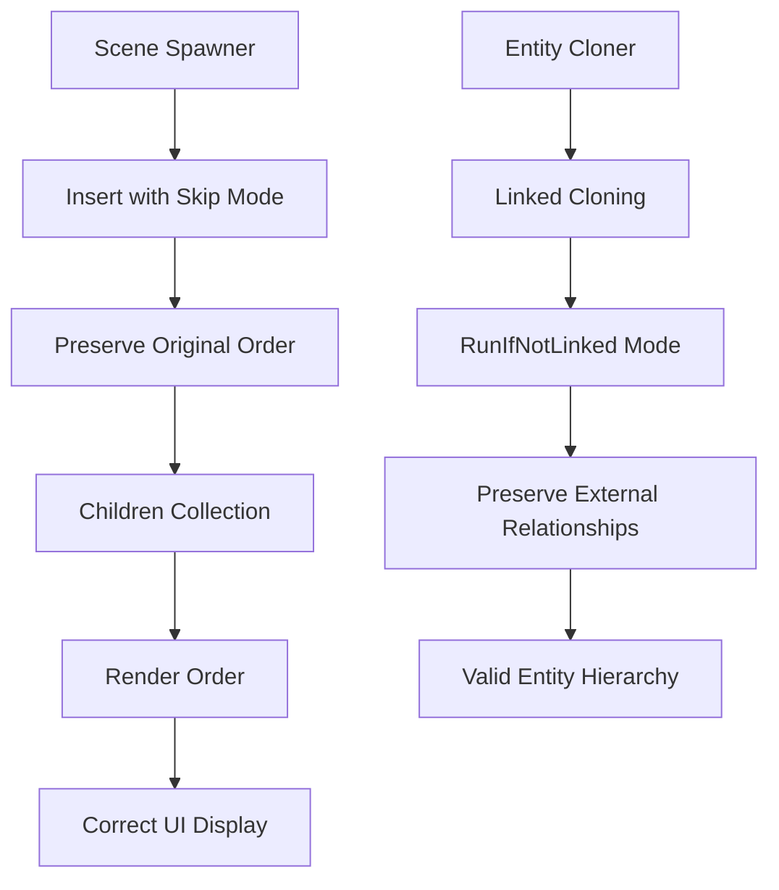

+++
title = "Pull Request"
date = "2025-03-07T09:33:28"
draft = false
template = "pull_request_page.html"
+++

+++
title = "Pull Request"
date = "2025-03-07T06:33:25"
draft = false
template = "pull_request_page.html"
+++

# #17858 Preserve spawned RelationshipTarget order and other improvements

## Basic Information
- **Title**: Preserve spawned RelationshipTarget order and other improvements
- **PR Link**: https://github.com/bevyengine/bevy/pull/17858
- **Author**: cart
- **Status**: MERGED

## Description

Fixes #17720

### Objective

Spawning RelationshipTargets from scenes fails to preserve ordering (e.g., `Children` ending up in arbitrary order) due to archetype-order spawning pushing elements to collections. Need to preserve original ordering without expensive fixups.

### Solution

Introduce `RelationshipInsertHookMode` to control relationship processing during insertion:
1. `Run`: Default behavior
2. `Skip`: Bypass hooks (used when spawning mapped collections)
3. `RunIfNotLinked`: Only process unlinked relationships (for recursive cloning)

Additional improvements:
- Split `SourceComponent` from `ComponentCloneCtx` for better access control
- Remove `RefCell` wrapper around clone queue
- Enable entity reservation during cloning
- Rename `EntityCloner::recursive` to `linked_cloning`
- Remove temporary `EntityCloneBehavior::RelationshipTarget`

## The Story of Preserving Relationships

### The Problem of Orderly Parenting

Imagine building a game level with carefully ordered child entities - maybe UI elements that must render in sequence, or puzzle pieces that follow specific activation order. When loading this scene, Bevy's entity spawning would unexpectedly scramble the child order due to its archetype-based processing. This happened because relationship targets like `Children` were being populated through standard insertion hooks that appended entities in spawn order rather than preserving the original hierarchy.

The core challenge lay in the tension between efficient batch processing and maintaining semantic ordering. Archetype-order spawning offered cache-friendly performance benefits but destroyed the meaningful sequence encoded in relationships. Developers needed a way to spawn pre-ordered collections without sacrificing the engine's optimization strategies.

### Journey Through Hook Control

The solution emerged through careful control of relationship processing hooks. Early prototypes considered:
1. **Hierarchy-order spawning** - Complex with multiple hierarchies and incompatible with future optimizations
2. **Post-hoc deduplication** - Expensive second passes through potentially large collections
3. **Direct collection cloning** - Blocked by duplicate entries from relationship hooks

The breakthrough came with the realization that relationship hooks could be temporarily disabled during strategic insertions. This required introducing a new control mechanism - `RelationshipInsertHookMode` - that would let developers specify when to bypass the normal hook flow.

Implementing this required delicate surgery in Bevy's entity cloning system. The team:
- Created new insertion variants (`insert_with_relationship_insert_hook_mode`)
- Refactored cloning context to enable entity reservation
- Introduced conditional hook execution in relationship processing

```rust
// Key addition in entity cloning logic
builder.override_clone_behavior_with_id(component, ComponentCloneBehavior::reflect());
builder.linked_cloning(true); // Formerly 'recursive'
```

### Technical Ballet of Component Cloning

The implementation achieved its goals through several coordinated changes:

1. **Separation of Concerns**  
   Splitting `SourceComponent` from `ComponentCloneCtx` allowed concurrent read/write access:
   ```rust
   pub struct SourceComponent<'a> {
       ptr: Ptr<'a>,
       info: &'a ComponentInfo,
   }
   
   pub struct ComponentCloneCtx<'a> {
       mapper: &'a mut EntityMapper,
       // Removed RefCell wrapper
       clone_queue: VecDeque<(Entity, Box<dyn Bundle>)>,
   }
   ```

2. **Hook Mode Propagation**  
   The new insertion mode flows through critical pathways:
   ```rust
   pub enum RelationshipInsertHookMode {
       Run,
       Skip,
       RunIfNotLinked,
   }
   
   // Usage in scene spawning
   world.entity_mut(entity).insert_with_relationship_insert_hook_mode(
       bundle,
       RelationshipInsertHookMode::Skip,
   );
   ```

3. **Order-Preserving Cloning**  
   Entity reservation during cloning ensures mapped relationships maintain order:
   ```rust
   let target = commands.spawn_empty().id();
   ctx.mapper().reserve(target);
   ```

### The Ripple Effects

These changes impacted multiple subsystems:

- **Scene System**: Now preserves child order when instantiating prefabs
- **Entity Cloning**: Maintains relationship integrity during deep copies
- **Reflection**: Handles component mapping during runtime bundle insertion

A critical insight was recognizing that relationship preservation required temporarily suspending the very mechanisms designed to maintain relationship consistency. The `Skip` mode acts like surgical tape - applied precisely where needed to prevent unwanted hook execution while letting the normal system handle other cases.

## Visual Representation



## Key Files Changed

### `crates/bevy_ecs/src/entity/clone_entities.rs`
**Purpose**: Refactor cloning context and implement new hook modes  
**Key Changes**:
```rust
// Before: Combined source access and cloning context
struct ComponentCloneCtx<'a> {
    source: Ptr<'a>,
    // ...
}

// After: Split components
struct SourceComponent<'a> {
    ptr: Ptr<'a>,
    info: &'a ComponentInfo,
}

struct ComponentCloneCtx<'a> {
    mapper: &'a mut EntityMapper,
    clone_queue: VecDeque<(Entity, Box<dyn Bundle>)>,
}
```

### `crates/bevy_ecs/src/relationship/mod.rs`
**Purpose**: Implement hook mode control  
**Key Addition**:
```rust
pub enum RelationshipInsertHookMode {
    Run,
    Skip,
    RunIfNotLinked,
}

impl EntityWorldMut<'_> {
    pub fn insert_with_relationship_insert_hook_mode(
        &mut self,
        bundle: impl Bundle,
        hook_mode: RelationshipInsertHookMode,
    ) {
        // Implementation handling hook mode
    }
}
```

### `crates/bevy_scene/src/scene_spawner.rs`
**Purpose**: Apply hook mode during scene instantiation  
**Critical Usage**:
```rust
fn spawn_entity(&mut self, entity: &Entity, world: &mut World) {
    world.entity_mut(entity).insert_with_relationship_insert_hook_mode(
        bundle,
        RelationshipInsertHookMode::Skip,
    );
}
```

## Further Reading

1. [Bevy ECS Relationships Documentation](https://bevyengine.org/learn/book/ecs-relationships/)
2. [Entity Component System Pattern](https://en.wikipedia.org/wiki/Entity_component_system)
3. [Rust Ownership and Borrowing](https://doc.rust-lang.org/book/ch04-02-references-and-borrowing.html)

This PR demonstrates sophisticated control of ECS lifecycle hooks while maintaining performance - a pattern applicable to any engine needing to balance automation with precise control.