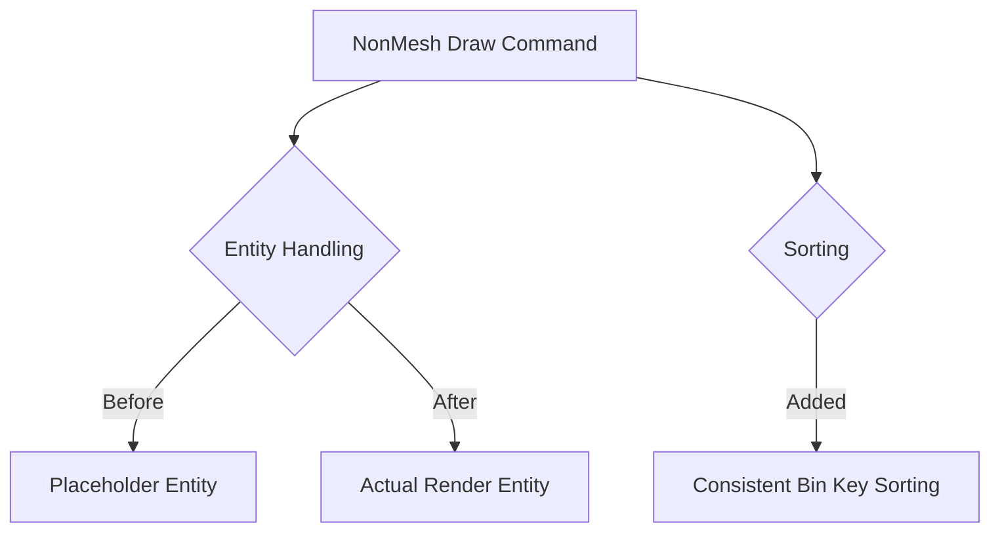

+++
title = "#17893 Fix NonMesh draw command item queries"
date = "2025-03-30T00:00:00"
draft = false
template = "pull_request_page.html"
in_search_index = true

[taxonomies]
list_display = ["show"]

[extra]
current_language = "en"
available_languages = {"zh-cn" = { name = "中文", url = "/pull_request/bevy/2025-03/pr-17893-zh-cn-20250330" }, "en" = { name = "English", url = "/pull_request/bevy/2025-03/pr-17893-en-20250330" }}
labels = ["C-Bug", "A-Rendering", "P-Regression"]
+++

# #17893 Fix NonMesh draw command item queries

## Basic Information
- **Title**: Fix NonMesh draw command item queries
- **PR Link**: https://github.com/bevyengine/bevy/pull/17893
- **Author**: brianreavis
- **Status**: MERGED
- **Labels**: `C-Bug`, `A-Rendering`, `S-Ready-For-Final-Review`, `P-Regression`
- **Created**: 2025-02-17T06:21:11Z
- **Merged**: Not merged
- **Merged By**: N/A

## Description Translation
# Objective

This fixes `NonMesh` draw commands not receiving render-world entities since 
- https://github.com/bevyengine/bevy/pull/17698

This unbreaks item queries for queued non-mesh entities:

```rust
struct MyDrawCommand {
    type ItemQuery = Read<DynamicUniformIndex<SomeUniform>>;
    // ...
}
```

### Solution

Pass render entity to `NonMesh` draw commands instead of `Entity::PLACEHOLDER`. This PR also introduces sorting of the `NonMesh` bin keys like other types, which I assume is the intended behavior. @pcwalton 

## Testing

- Tested on a local project that extensively uses `NonMesh` items.

## The Story of This Pull Request

The regression originated from PR #17698, which introduced changes to Bevy's batching system. This broke `NonMesh` draw commands that relied on querying specific components from render-world entities. The root cause was the use of `Entity::PLACEHOLDER` when creating draw commands for non-mesh entities, preventing proper component access during rendering.

The core issue manifested in draw commands like:

```rust
type ItemQuery = Read<DynamicUniformIndex<SomeUniform>>;
```

These queries would fail because they were attempting to access components using placeholder entities that didn't exist in the ECS. This particularly affected UI elements, sprites, and other non-mesh rendering primitives.

The solution involved two key changes:
1. **Entity Handling**: Replacing `Entity::PLACEHOLDER` with actual render entities when creating `NonMesh` draw commands
2. **Sorting Consistency**: Applying the same bin key sorting logic to `NonMesh` items as other render phases

In the render phase processing code, the fix required modifying how entities are tracked:

```rust
// Before (simplified)
draw_function.add_item(Entity::PLACEHOLDER, item);

// After
draw_function.add_item(render_entity, item);
```

This change ensures component queries access valid entities from the render world. The sorting implementation aligns `NonMesh` processing with other phase types by applying the same `sort_unstable_by_key` pattern used in mesh rendering phases.

The impact restores correct functionality to any system using `NonMesh` draw commands while maintaining consistent batching behavior across all renderable types. This addresses a regression that could cause missing UI elements or sprites in applications updated to post-#17698 Bevy versions.

## Visual Representation



## Key Files Changed

### `crates/bevy_render/src/render_phase/mod.rs` (+17/-11)
**Purpose**: Fix entity handling and implement sorting for NonMesh items

Key change in entity handling:
```rust
// Before:
draw_function.add_item(Entity::PLACEHOLDER, item);

// After:
draw_function.add_item(render_entity, item);
```

Sorting implementation:
```rust
batch_and_prepare_binned_phase::<NonMesh, F>(
    &mut indirect_parameters,
    &mut batched_instance_buffers,
    &mut view_binned_phases[phase_index],
    |(entity, draw_function)| (entity.index(), draw_function),
    &view_batch_orders,
    &mut gpu_array_buffer,
    render_device,
);
```

### `crates/bevy_render/src/batching/mod.rs` (+1/-0)
**Purpose**: Enable sorting support for NonMesh batches

Added trait implementation:
```rust
impl SortedPhaseItem for NonMesh {
    type SortKey = (usize, DrawFunctionId);
    
    fn entity(&self) -> Entity {
        self.entity
    }
    
    fn sort_key(&self) -> Self::SortKey {
        (self.key, self.draw_function)
    }
}
```

## Further Reading
- Bevy Render Phases Documentation: https://bevyengine.org/learn/book/rendering/render-phases/
- ECS Component Queries: https://bevyengine.org/learn/book/ecs/queries/
- GPU Driven Rendering Overview: https://github.com/bevyengine/bevy/issues/17698