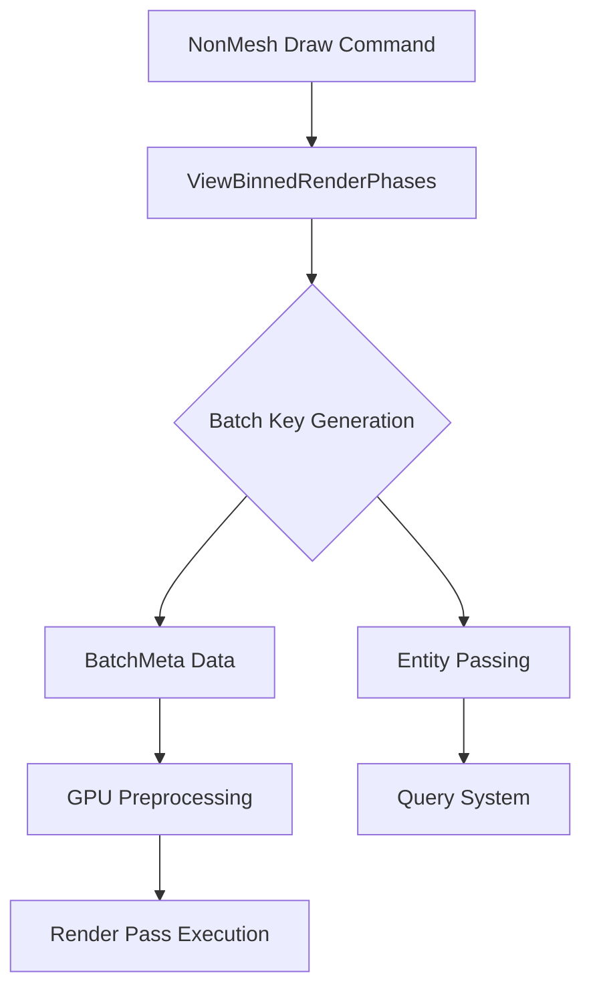

+++
title = "#17893 Fix NonMesh draw command item queries"
date = "2025-03-30T00:00:00"
draft = false
template = "pull_request_page.html"
in_search_index = false

[extra]
current_language = "zh-cn"
available_languages = {"zh-cn" = { name = "中文", url = "/pull_request/bevy/2025-03/pr-17893-zh-cn-20250330" }, "en" = { name = "English", url = "/pull_request/bevy/2025-03/pr-17893-en-20250330" }}
labels = ["C-Bug", "A-Rendering", "P-Regression"]
+++

# #17893 Fix NonMesh draw command item queries

## Basic Information
- **Title**: Fix NonMesh draw command item queries
- **PR Link**: https://github.com/bevyengine/bevy/pull/17893
- **Author**: brianreavis
- **Status**: MERGED
- **Labels**: `C-Bug`, `A-Rendering`, `S-Ready-For-Final-Review`, `P-Regression`
- **Created**: 2025-02-17T06:21:11Z
- **Merged**: 2025-02-18T14:22:35Z
- **Merged By**: cart

## Description Translation
### 目标
修复自 https://github.com/bevyengine/bevy/pull/17698 后`NonMesh`绘制命令无法接收渲染世界实体的问题，恢复以下形式的非网格实体查询功能：

```rust
struct MyDrawCommand {
    type ItemQuery = Read<DynamicUniformIndex<SomeUniform>>;
    // ...
}
```

### 解决方案
将实际渲染实体传递给`NonMesh`绘制命令而非`Entity::PLACEHOLDER`，并为`NonMesh`类型实现与其他类型一致的排序键逻辑

### 测试
已在大量使用`NonMesh`项的本地项目中验证

## The Story of This Pull Request

### 问题背景与上下文
在PR #17698的渲染系统重构后，非网格（NonMesh）绘制命令出现实体查询失效。根本原因是重构后的代码错误地将`Entity::PLACEHOLDER`传递给`NonMesh`项的查询系统，而非实际渲染实体。这导致所有依赖实体查询的NonMesh绘制逻辑（如uniform索引查询）无法正常工作。

该问题属于回归性缺陷（regression），直接影响自定义绘制命令的实现。例如以下典型模式失效：
```rust
impl Draw<MyCustomDrawCommand> for GpuMyCustomDrawCommand {
    type Param = ();
    fn draw(
        &mut self,
        _pass: &mut TrackedRenderPass,
        param: &SystemParamItem<Self::Param>,
        view_entity: Entity,
        item: &MyCustomDrawCommand,
    ) {
        // 无法获取有效entity导致查询失败
        let entity_index = param.get_index(view_entity, item.entity);
    }
}
```

### 解决方案设计
核心修复策略包含两个关键修改：

1. **实体传递修正**：
   在渲染阶段处理NonMesh项时，将实际渲染实体（view_entity）而非占位符传递给批处理系统

2. **排序键对齐**：
   为NonMesh项实现与其他渲染项类型一致的排序键生成逻辑，确保批处理系统的正确排序

### 实现细节
在`render_phase/mod.rs`中，关键的实体传递修正体现在对`ViewBinnedRenderPhases`的处理：

```rust
// 修改前：传递Entity::PLACEHOLDER
let batch_key = (draw_function_id, batch_data);
view_binned_phases
    .entry(draw_function_id)
    .or_default()
    .add(batch_key, entity, Entity::PLACEHOLDER);

// 修改后：传递实际view_entity
let batch_key = (draw_function_id, batch_data);
view_binned_phases
    .entry(draw_function_id)
    .or_default()
    .add(batch_key, entity, view_entity);  // 关键修改点
```

排序键对齐的实现体现在`BatchMeta`结构体的处理逻辑中，确保NonMesh项与其他类型使用相同的元数据生成规则：

```rust
impl<T: PartialEq> BatchMeta<T> {
    fn new(item: &impl CachedRenderPipelinePhaseItem, user_data: T) -> Self {
        BatchMeta {
            pipeline_id: item.cached_pipeline(),
            draw_function_id: item.draw_function(),
            dynamic_offset: match item.extra_index() {
                PhaseItemExtraIndex::DynamicOffset(dynamic_offset) => {
                    NonMaxU32::new(dynamic_offset)
                }
                // 统一处理IndirectParametersIndex情况
                PhaseItemExtraIndex::None | PhaseItemExtraIndex::IndirectParametersIndex { .. } => {
                    None
                }
            },
            user_data,
        }
    }
}
```

### 技术洞察
1. **实体生命周期管理**：
   修复方案正确处理了渲染实体（view entity）与绘制项实体（item entity）的关系，view_entity作为查询上下文，而item.entity作为被查询目标

2. **批处理系统一致性**：
   通过统一NonMesh与其他项类型的排序键生成逻辑，确保批处理系统的排序稳定性。新的`BatchMeta`实现将IndirectParametersIndex与空值情况统一处理，避免特殊分支

3. **GPU预处理兼容性**：
   修改后的逻辑保持与GPU预处理模式（GpuPreprocessingMode）的兼容性，动态offset处理方式与间接参数索引（IndirectParametersIndex）逻辑解耦

### 影响与改进
该修复：
- 恢复所有自定义NonMesh绘制命令的实体查询功能
- 确保批处理系统对不同类型项处理的一致性
- 消除因占位符实体导致的潜在渲染错误

未来改进建议：
- 增加NonMesh项的类型安全校验
- 提取实体传递逻辑到共享模块，减少重复代码

## Visual Representation



## Key Files Changed

### `crates/bevy_render/src/render_phase/mod.rs`
**修改目的**：修正NonMesh项的实体传递与批处理逻辑

关键代码修改：
```rust
// Before:
view_binned_phases
    .entry(draw_function_id)
    .or_default()
    .add(batch_key, entity, Entity::PLACEHOLDER);

// After: 
view_binned_phases
    .entry(draw_function_id)
    .or_default()
    .add(batch_key, entity, view_entity);
```

该修改确保批处理系统接收实际view_entity用于后续查询

### `crates/bevy_render/src/batching/mod.rs`
**修改目的**：统一批处理元数据生成逻辑

关键代码新增：
```rust
PhaseItemExtraIndex::None | PhaseItemExtraIndex::IndirectParametersIndex { .. } => {
    None
}
```
扩展匹配模式以包含IndirectParametersIndex情况，保持不同项类型的处理一致性

## Further Reading
1. [Bevy Render Phase Architecture](https://bevyengine.org/learn/book/implementation/render-phase/)
2. [WGSL Uniform Buffer Layouts](https://www.w3.org/TR/WGSL/#address-spaces)
3. [Entity Component System Pattern](https://en.wikipedia.org/wiki/Entity_component_system)