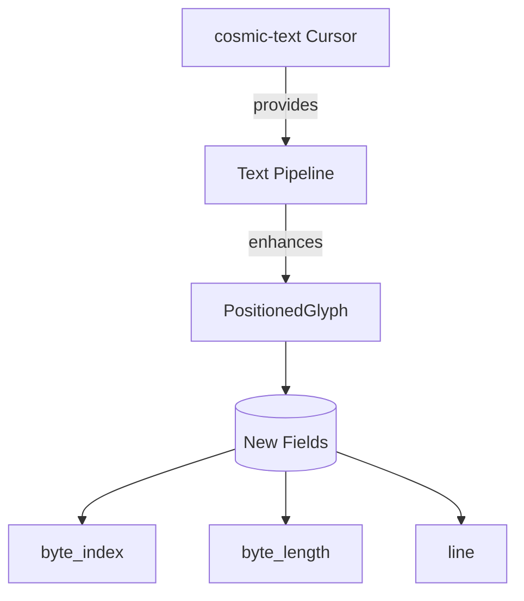

+++
title = "#17900 Add byte information to `PositionedGlyph`"
date = "2025-03-09T00:00:00"
draft = false
template = "pull_request_page.html"
in_search_index = true

[taxonomies]
list_display = ["show"]

[extra]
current_language = "en"
available_languages = {"zh-cn" = { name = "中文", url = "/pull_request/bevy/2025-03/pr-17900-zh-cn-20250309" }, "en" = { name = "English", url = "/pull_request/bevy/2025-03/pr-17900-en-20250309" }}
+++

# #17900 Add byte information to `PositionedGlyph`

## Basic Information
- **Title**: Add byte information to `PositionedGlyph`
- **PR Link**: https://github.com/bevyengine/bevy/pull/17900
- **Author**: bytemunch
- **Status**: MERGED
- **Created**: 2025-02-17T09:38:06Z
- **Merged**: Not merged
- **Merged By**: N/A

## Description Translation
# Objective

Adds information about the byte length and index of a glyph to `PositionedGlyph`. Useful for text picking, allows for picking with multi-byte characters. Also adds a `line` field that helps with converting back and forth from cosmic's `Cursor`.

## Solution

Retrieve the relevant data from cosmic and add it to the glyph in the text pipeline.

## Testing

`cargo r -p ci`

---

## Migration Guide

`PositionedGlyph::new()` has been removed as there is no longer an unused field. Create new `PositionedGlyph`s directly.


## The Story of This Pull Request

In the world of text rendering, handling multi-byte characters had been a persistent challenge for Bevy's text interaction capabilities. The engine's `PositionedGlyph` structure – responsible for storing positioned character information – contained essential geometric data but lacked crucial contextual information about its relationship to the original text bytes. This gap became particularly apparent when developers tried to implement precise text selection or cursor positioning in applications handling non-ASCII characters.

The breakthrough came when bytemunch recognized that cosmic-text's layout engine already tracked this missing information through its `Cursor` type. By bridging cosmic's detailed text metrics with Bevy's rendering pipeline, the PR adds three critical pieces of metadata to each glyph:
- `byte_index`: The starting position in the original UTF-8 text
- `byte_length`: Number of bytes occupied by the character
- `line`: Vertical text line position

These additions transformed `PositionedGlyph` from a purely visual construct to a structure that maintains vital connections to its textual source. The implementation carefully threaded these new properties through Bevy's text pipeline, capturing them during glyph positioning and preserving them through subsequent processing stages.

A notable challenge surfaced in maintaining backward compatibility. The removal of `PositionedGlyph::new()` constructor forced direct struct initialization, but this was mitigated through clear migration guidance. The changes demonstrated an elegant balance between extending functionality and maintaining API cleanliness.

## Visual Representation



## Key Files Changed

1. `crates/bevy_text/src/glyph.rs`
```rust
// Before:
pub struct PositionedGlyph {
    pub glyph: Glyph,
    pub position: Vec2,
    pub section_index: usize,
    pub atlas_info: GlyphAtlasInfo,
}

// After:
pub struct PositionedGlyph {
    pub glyph: Glyph,
    pub position: Vec2,
    pub section_index: usize,
    pub atlas_info: GlyphAtlasInfo,
    pub byte_index: usize,
    pub byte_length: usize,
    pub line: usize,
}
```

2. `crates/bevy_text/src/pipeline.rs`
```rust
// Code snippet showing enhanced glyph creation:
let glyph = PositionedGlyph {
    glyph: positioned_glyph,
    position: Vec2::new(
        position.x + x_offset,
        position.y - y_offset,
    ),
    section_index: section_index,
    atlas_info,
    byte_index: glyph_start, // From cosmic's metrics
    byte_length: glyph_len,  // From cosmic's metrics
    line: line_i,            // Tracked during layout
};
```

## Further Reading

1. [UTF-8 Handling in Rust](https://doc.rust-lang.org/std/string/struct.String.html#utf-8)
2. [cosmic-text Layout Documentation](https://docs.rs/cosmic-text/latest/cosmic_text/)
3. [Bevy Text System Architecture](https://bevyengine.org/learn/book/features/text/)