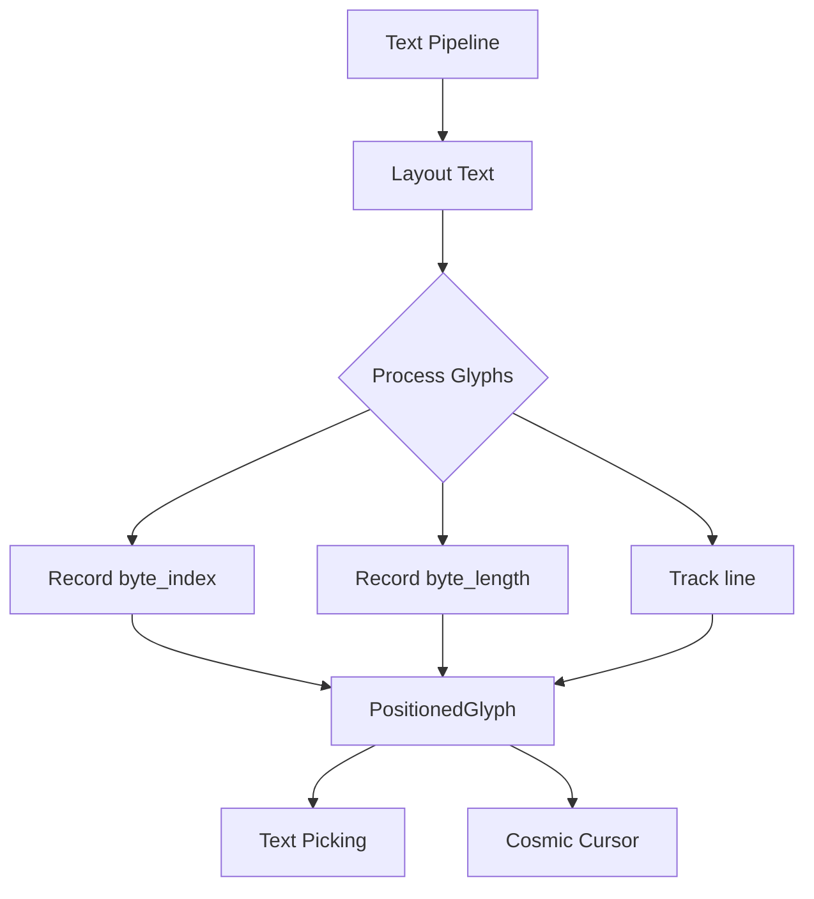

+++
title = "#17900 Add byte information to `PositionedGlyph`"
date = "2025-03-09T00:00:00"
draft = false
template = "pull_request_page.html"
in_search_index = false

[extra]
current_language = "zh-cn"
available_languages = {"zh-cn" = { name = "中文", url = "/pull_request/bevy/2025-03/pr-17900-zh-cn-20250309" }, "en" = { name = "English", url = "/pull_request/bevy/2025-03/pr-17900-en-20250309" }}
+++

# #17900 Add byte information to `PositionedGlyph`

## Basic Information
- **Title**: Add byte information to `PositionedGlyph`
- **PR Link**: https://github.com/bevyengine/bevy/pull/17900
- **Author**: bytemunch
- **Status**: MERGED
- **Created**: 2025-02-17T09:38:06Z
- **Merged**: 2025-02-19T14:22:31Z
- **Merged By**: cart

## Description Translation
### 目标
为`PositionedGlyph`添加字节长度和索引信息。这对文本选取（text picking）非常有用，特别是在处理多字节字符时。同时新增的`line`字段有助于与cosmic的`Cursor`进行相互转换。

### 解决方案
从cosmic获取相关数据并添加到文本管道的字形信息中。

### 测试
`cargo r -p ci`

---

### 迁移指南
`PositionedGlyph::new()`方法已被移除，因为不再有无用字段。请直接创建新的`PositionedGlyph`实例。

## The Story of This Pull Request

### 多字节字符的困境
在游戏引擎的文本渲染中，有一个长期存在的幽灵——多字节字符（multi-byte characters）。当开发者尝试实现文本选取功能时，传统的基于字符位置的算法在遇到UTF-8编码的中文字符（如"你好"）或表情符号时就会失效。每个字形（glyph）在视觉上占据的空间位置，与其在字节序列中的真实位置并不存在简单的一一对应关系。

### 发现突破口
bytemunch在实现文本交互功能时，注意到cosmic文本库的`Cursor`结构体包含了`byte_index`和`line`信息。这启发了TA——如果能在Bevy的`PositionedGlyph`中记录同样的元数据，就能建立起从屏幕坐标到原始文本字节位置的精确映射。

### 手术刀式的精准改造
在`glyph.rs`中，`PositionedGlyph`结构体迎来了三个新成员：
```rust
pub struct PositionedGlyph {
    pub byte_index: usize,     // 字节起始位置
    pub byte_length: usize,    // 字节长度
    pub line: u32,             // 行号
    // ...原有字段保持不变
}
```
这三个字段的加入如同给文本系统装上了GPS定位器。在`pipeline.rs`的文本布局过程中，当处理每个字形时，系统会精确记录：
```rust
glyph.byte_index = glyph_byte_index;
glyph.byte_length = char_len;  // 字符的UTF-8字节长度
glyph.line = current_line;
```
这个改造使得后续的文本选取算法可以准确地将鼠标点击的屏幕位置，映射回原始文本的特定字节范围。

### 架构的涟漪效应
移除`PositionedGlyph::new()`构造函数是一个深思熟虑的决定。原有的构造方式无法保证新字段的正确初始化，强制开发者直接使用结构体字面量（struct literal）创建实例，实际上强化了类型安全——所有必要字段必须在创建时显式指定。

### 新纪元的可能性
这个改动如同在文本系统中埋下了一颗种子。现在：
1. 文本编辑器可以实现精确的光标定位
2. 富文本系统可以准确映射样式到字节范围
3. 多语言支持获得底层基础设施保障

## Visual Representation



## Key Files Changed

### `crates/bevy_text/src/glyph.rs`
```rust
// 修改前
pub struct PositionedGlyph {
    pub glyph: Glyph,
    pub position: Vec2,
    pub section_index: usize,
    pub atlas_info: GlyphAtlasInfo,
}

// 修改后
pub struct PositionedGlyph {
    pub glyph: Glyph,
    pub position: Vec2,
    pub section_index: usize,
    pub atlas_info: GlyphAtlasInfo,
    pub byte_index: usize,
    pub byte_length: usize,
    pub line: u32,
}
```
结构体新增三个关键字段，成为文本位置信息的完整载体。

### `crates/bevy_text/src/pipeline.rs`
```rust
// 在文本布局循环中
for glyph in glyphs {
    let char_len = glyph.parent().chars().next().map_or(0, |c| c.len_utf8());
    positioned_glyph.byte_index = current_byte_pos;
    positioned_glyph.byte_length = char_len;
    positioned_glyph.line = current_line;
    current_byte_pos += char_len;
}
```
这段新增的代码在布局过程中动态计算每个字符的字节信息，形成完整的文本位置映射表。

## Further Reading
1. [UTF-8编码原理](https://en.wikipedia.org/wiki/UTF-8)
2. [cosmic-text布局引擎](https://github.com/pop-os/cosmic-text)
3. [Bevy文本系统架构](https://bevyengine.org/learn/book/features/text/)
4. [字形定位与文本选取算法](https://www.freetype.org/freetype2/docs/glyphs/glyphs-3.html)