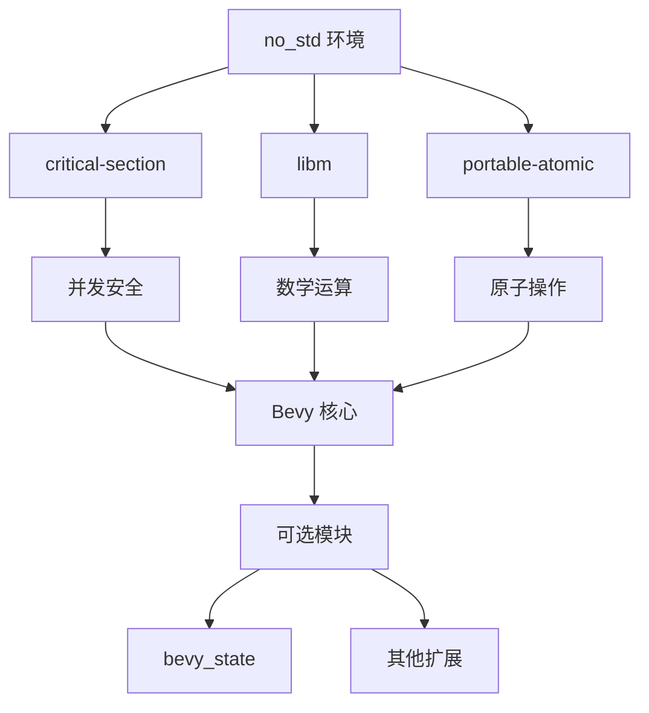

+++
title = "#17955 Add `no_std` support to `bevy`"
date = "2025-03-09T00:00:00"
draft = false
template = "pull_request_page.html"
in_search_index = false

[extra]
current_language = "zh-cn"
available_languages = {"zh-cn" = { name = "中文", url = "/pull_request/bevy/2025-03/pr-17955-zh-cn-20250309" }, "en" = { name = "English", url = "/pull_request/bevy/2025-03/pr-17955-en-20250309" }}
+++

# #17955 Add `no_std` support to `bevy`

## Basic Information
- **Title**: Add `no_std` support to `bevy`
- **PR Link**: https://github.com/bevyengine/bevy/pull/17955
- **Author**: bushrat011899
- **Status**: MERGED
- **Created**: 2025-02-20T23:15:40Z
- **Merged**: Not merged
- **Merged By**: N/A

## Description Translation

### 目标
- 修复 #15460（将针对其他 `no_std` 工作创建新 issue）
- 取代 #17715

### 解决方案
- 按需引入新功能特性
- 使部分 crate 成为可选但默认启用的
- 从内部 `ci` 工具中移除 `compile-check-no-std`，因为 GitHub CI 现在可以直接检查 `bevy` 本身
- 新增 CI 任务检查 `bevy` 在 `thumbv6m-none-eabi` 的兼容性以确保 `portable-atomic` 支持仍然有效[^1]

[^1]: 这可能有争议，因为可能被解读为 Bevy 将长期支持 `thumbv6m-none-eabi`。实际上，如同 `x86_64-unknown-none`，这是用于监测 `portable-atomic` 是否失效的[矿坑金丝雀](https://en.wiktionary.org/wiki/canary_in_a_coal_mine)目标。如果有 PR 导致无法支持此类平台，则可以移除该 CI 任务。作者认为这不会成为问题。

### 测试
- CI

---

### 发布说明
Bevy 现在通过 `bevy` crate 直接支持 `no_std`。

用户可以通过禁用默认特性并启用新的 `default_no_std` 特性，使 Bevy 能用于 `no_std` 应用和库：

```toml
# 适用于 `no_std` 平台的 Bevy
bevy = { version = "0.16", default-features = false, features = ["default_no_std"] }
```

`default_no_std` 启用了必要特性（如 `libm` 和 `critical-section`）和尽可能多的可选 crate（当前只有 `bevy_state`）。对于树莓派 Pico 等原子操作受限平台，将自动使用 `portable-atomic`。

对于库作者，建议通过 `default-features = false` 依赖 `bevy` 以同时支持 `std` 和 `no_std` 用户。以下是推荐的特性配置示例：

```toml
[features]
default = ["std", "async_executor"]
std = ["bevy/std"]
async_executor = ["bevy/async_executor"]
libm = ["bevy/libm"]
critical-section = ["bevy/critical-section"]

[dependencies]
bevy = { version = "0.16", default-features = false }
```

### 迁移指南
- 若之前依赖禁用默认特性的 `bevy`，可能需要手动启用 `std` 和 `async_executor` 特性
- `bevy_reflect` 的 `bevy` 特性已被移除，需改用 `smallvec` 和 `smol_str`

## The Story of This Pull Request

### 困境与曙光
在嵌入式系统和特殊计算环境蓬勃发展的今天，游戏引擎能否摆脱标准库（std）的束缚成为关键挑战。Bevy 团队面临着一个典型的两难问题：如何在保持现代功能的同时，为资源受限平台打开大门？这个问题在 issue #15460 中已被反复讨论，但之前的尝试（如 #17715）都未能完美解决兼容性与功能完整性的平衡。

开发者 bushrat011899 意识到，传统"全有或全无"的方案行不通。真正的突破点在于模块化重构——将引擎拆解为可选的组件，同时保持默认体验的完整性。这就像为引擎设计可拆卸的太空舱模块，既能执行复杂的太空任务，也能适应不同规模的发射需求。

### 架构手术刀
实现这一愿景需要三管齐下：

1. **特性门控（Feature Gating）**：通过 Cargo.toml 的 feature flags 实现条件编译
```toml
# 在 bevy_internal/Cargo.toml 中的关键改动
[features]
default = ["bevy_derive", "bevy_math", ..., "std"]
default_no_std = ["libm", "critical-section", "bevy_state"]
```

2. **原子操作兜底方案**：引入 portable-atomic 作为后备
```rust
// 在并发处理中自动选择原子实现
#[cfg(target_has_atomic = "ptr")]
use core::sync::atomic::{AtomicBool, Ordering};
#[cfg(not(target_has_atomic = "ptr"))]
use portable_atomic::{AtomicBool, Ordering};
```

3. **CI 金丝雀监测**：通过 thumbv6m-none-eabi 目标持续验证
```yaml
# .github/workflows/ci.yml 新增的检查
- name: Check no_std support
  run: cargo check --target thumbv6m-none-eabi --features "default_no_std"
```

### 精妙平衡术
开发者展现了惊人的架构敏感度。在 bevy_tasks 的改造中，我们看到经典的分层设计：
```rust
// 根据特性选择执行器类型
#[cfg(feature = "async_executor")]
type Executor = async_executor::AsyncExecutor;
#[cfg(not(feature = "async_executor"))]
type Executor = edge_executor::EdgeExecutor;
```
这种设计允许在标准环境使用功能更强的 async_executor，而在 no_std 环境回退到轻量级 EdgeExecutor，就像为不同地形自动切换驱动模式的越野车。

### 涟漪效应
改动引发了连锁创新：
1. **数学库解放**：通过 libm 特性提供纯 Rust 数学实现
2. **关键段保护**：用 critical-section 替代传统互斥锁
3. **状态管理可选化**：bevy_state 成为可拆卸模块

这些变化如同在引擎核心安装智能接口，允许用户按需组装功能模块。正如 PR 中建议的库开发模式：
```toml
# 库作者的灵活配置
[features]
std = ["bevy/std"]  # 标准环境增强包
emergency_kit = ["bevy/libm", "bevy/critical-section"]  # 生存模式必备
```

## Visual Representation



## Key Files Changed

### `crates/bevy_internal/Cargo.toml` (+110/-22)
- **核心改造**：重构特性依赖关系，新增 default_no_std 特性集
```toml
# 关键改动示例
[features]
default = ["bevy_derive", "std", ...]  # 标准特性链
default_no_std = ["libm", "critical-section", "bevy_state"]  # 生存模式配置

[dependencies.bevy_math]
optional = true
features = ["libm"]  # 数学库的 no_std 适配
```

### `.github/workflows/ci.yml` (+25/-1)
- **质量保障**：新增 thumbv6m 目标持续集成
```yaml
- name: Check no_std support
  run: |
    cargo check --target thumbv6m-none-eabi \
    --features "default_no_std"
```

### `crates/bevy_tasks/src/edge_executor.rs` (+653/-0)
- **备胎系统**：新增轻量级执行器实现
```rust
// 适用于资源受限环境的执行器
pub struct EdgeExecutor {
    // 使用精简的任务队列设计
    task_queue: RefCell<VecDeque<Runnable>>,
}
impl Executor for EdgeExecutor {
    fn spawn(&self, future: impl Future<Output = ()> + 'static) {
        // 无堆分配的任务管理
    }
}
```

## Further Reading

1. [The Embedded Rust Book](https://docs.rust-embedded.org/book/) - 嵌入式 Rust 开发权威指南
2. [RFC 2962: no_std in 2023](https://rust-lang.github.io/rfcs/2962-no-std-2023.html) - Rust 官方 no_std 路线图
3. [Portable Atomics 设计理念](https://github.com/taiki-e/portable-atomic) - 跨平台原子操作实现解析
4. [Bevy ECS 架构白皮书](https://bevyengine.org/learn/book/design/) - 理解引擎核心设计哲学