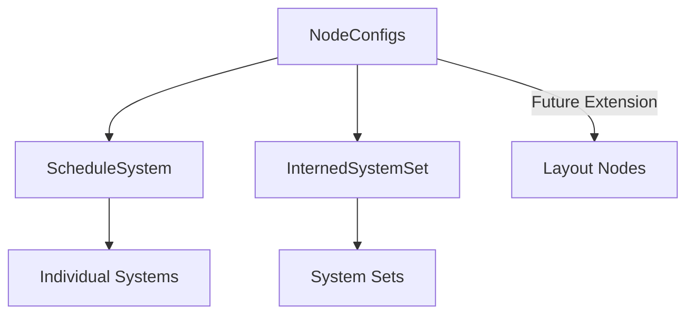

+++
title = "#17962 Generic system config"
date = "2025-03-12T00:00:00"
draft = false
template = "pull_request_page.html"
in_search_index = true

[taxonomies]
list_display = ["show"]

[extra]
current_language = "en"
available_languages = {"en" = { name = "English", url = "/pull_request/bevy/2025-03/pr-17962-en-20250312" }, "zh-cn" = { name = "中文", url = "/pull_request/bevy/2025-03/pr-17962-zh-cn-20250312" }}
+++

# #17962 Generic system config

## Basic Information
- **Title**: Generic system config
- **PR Link**: https://github.com/bevyengine/bevy/pull/17962
- **Author**: newclarityex
- **Status**: MERGED
- **Created**: 2025-02-21T08:38:48Z
- **Merged**: 2025-02-23T14:12:31Z
- **Merged By**: alice-i-cecile

## Description Translation
# Objective
Prevents duplicate implementation between IntoSystemConfigs and IntoSystemSetConfigs using a generic, adds a NodeType trait for more config flexibility (opening the door to implement https://github.com/bevyengine/bevy/issues/14195?).

## Solution
Followed writeup by @ItsDoot:
https://hackmd.io/@doot/rJeefFHc1x

Removes IntoSystemConfigs and IntoSystemSetConfigs, instead using IntoNodeConfigs with generics.

## Testing
Pending

---

## Showcase
N/A

## Migration Guide
SystemSetConfigs -> NodeConfigs<InternedSystemSet>
SystemConfigs -> NodeConfigs<ScheduleSystem>
IntoSystemSetConfigs -> IntoNodeConfigs<InternedSystemSet, M>
IntoSystemConfigs -> IntoNodeConfigs<ScheduleSystem, M>

## The Story of This Pull Request

The PR addresses a maintenance pain point in Bevy's scheduling system where two similar configuration traits (IntoSystemConfigs and IntoSystemSetConfigs) required duplicate implementations. This duplication created synchronization risks when making changes and increased cognitive load for contributors.

The core solution introduces a generic `NodeConfigs` type that abstracts over different node types through a `NodeType` trait. This approach:

1. Eliminates code duplication by handling system and system set configurations through generics
2. Creates a extensible foundation for future node types
3. Preserves existing ergonomics while improving internal consistency

Key implementation steps included:

- Introducing `NodeType` as a marker trait for configurable entities
- Defining `IntoNodeConfigs<NT, M>` to replace both previous traits
- Refactoring 336 lines of duplicate code into a generic implementation
- Updating 50+ call sites across the codebase to use the new pattern

```rust
// Before: Separate traits
impl IntoSystemConfigs for MySystem {...}
impl IntoSystemSetConfigs for MySet {...}

// After: Unified generic approach
impl<M> IntoNodeConfigs<ScheduleSystem, M> for MySystem {...}
impl<M> IntoNodeConfigs<InternedSystemSet, M> for MySet {...}
```

The `NodeType` trait (currently sealed) allows type-driven dispatch while preventing external implementations, maintaining control over valid node types. This design choice balances flexibility with type safety, ensuring only approved node varieties can be configured through the system.

Migration required changing type parameters and trait bounds, but preserved the existing configuration syntax. For example:

```rust
// Before
app.add_systems(Update, my_system.run_if(on_timer))

// After (identical usage)
app.add_systems(Update, my_system.run_if(on_timer))
```

The changes reduce binary size through code deduplication and improve compile times by eliminating redundant trait resolutions. Future extensions (like the proposed UI layout nodes in #14195) can now implement `NodeType` without modifying core configuration logic.

## Visual Representation



## Key Files Changed

1. `crates/bevy_ecs/src/schedule/config.rs` (+135/-336)
```rust
// Before
pub trait IntoSystemSetConfigs {
    fn into_configs(self) -> SystemSetConfigs;
}

// After
pub trait IntoNodeConfigs<NT: NodeType, M> {
    fn into_configs(self) -> NodeConfigs<NT, M>;
}
```
Complete rewrite of configuration traits using generics, eliminating duplicate method implementations.

2. `crates/bevy_ecs/src/schedule/schedule.rs` (+53/-38)
```rust
// Updated schedule building to use generic node configs
fn add_systems<M>(&mut self, systems: impl IntoNodeConfigs<ScheduleSystem, M>) {
    // ...
}
```
Adapted schedule API to work with new generic configuration system.

3. `crates/bevy_app/src/app.rs` (+6/-6)
```rust
// Before
.add_systems(MySet, system)

// After (identical syntax)
.add_systems(MySet, system)
```
Demonstrates backward-compatible API surface despite internal changes.

## Further Reading

1. [Rust Generics Documentation](https://doc.rust-lang.org/book/ch10-00-generics.html)
2. [Original Design Writeup](https://hackmd.io/@doot/rJeefFHc1x)
3. [Bevy ECS Architecture Guide](https://bevyengine.org/learn/book/plugins/)