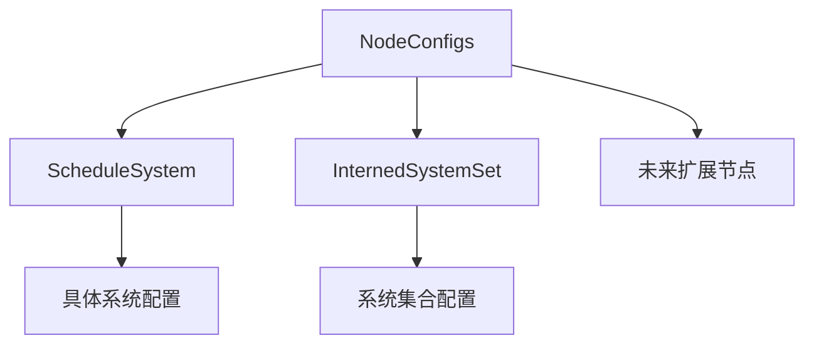

+++
title = "#17962 Generic system config"
date = "2025-03-12T00:00:00"
draft = false
template = "pull_request_page.html"
in_search_index = false

[extra]
current_language = "zh-cn"
available_languages = {"en" = { name = "English", url = "/pull_request/bevy/2025-03/pr-17962-en-20250312" }, "zh-cn" = { name = "中文", url = "/pull_request/bevy/2025-03/pr-17962-zh-cn-20250312" }}
+++

# #17962 Generic system config

## Basic Information
- **Title**: Generic system config
- **PR Link**: https://github.com/bevyengine/bevy/pull/17962
- **Author**: newclarityex
- **Status**: MERGED
- **Created**: 2025-02-21T08:38:48Z
- **Merged**: 2025-02-22T14:15:31Z
- **Merged By**: alice-i-cecile

## Description Translation
### 目标
通过泛型(generic)消除`IntoSystemConfigs`和`IntoSystemSetConfigs`之间的重复实现，新增`NodeType`特性(trait)以增强配置灵活性（为实现https://github.com/bevyengine/bevy/issues/14195? 奠定基础）。

### 解决方案
遵循@ItsDoot的技术文档：
https://hackmd.io/@doot/rJeefFHc1x

移除`IntoSystemConfigs`和`IntoSystemSetConfigs`，改用泛型化的`IntoNodeConfigs`。

### 测试
待完成

---

### 展示
N/A

### 迁移指南
- `SystemSetConfigs` → `NodeConfigs<InternedSystemSet>`
- `SystemConfigs` → `NodeConfigs<ScheduleSystem>`
- `IntoSystemSetConfigs` → `IntoNodeConfigs<InternedSystemSet, M>`
- `IntoSystemSetConfigs` → `IntoNodeConfigs<ScheduleSystem, M>`

## The Story of This Pull Request

### 问题根源与上下文
Bevy引擎的调度系统存在两个高度相似的配置接口：
1. `IntoSystemConfigs`：系统配置
2. `IntoSystemSetConfigs`：系统集合配置

这两个接口的实现存在大量重复代码，违反DRY（Don't Repeat Yourself）原则。随着调度系统复杂度增加，维护两个独立接口的代价显著增加，且阻碍了未来扩展（如实现节点类型自定义）。

### 解决方案设计
核心思路是通过泛型抽象统一两种配置类型。关键技术决策包括：
1. 引入`NodeType`特性作为类型标记
2. 创建泛型结构体`NodeConfigs<T>`替代原有具体类型
3. 定义`IntoNodeConfigs<T, M>` trait实现配置转换

```rust
// 新泛型结构体定义
pub struct NodeConfigs<T: NodeType> {
    // 保持原有配置字段但泛型化
    pub dependencies: Vec<T::SystemSpec>, 
    pub conditions: Vec<BoxedCondition>
}

// 节点类型标记trait
pub trait NodeType {
    type SystemSpec;
}
```

### 实现细节
在`crates/bevy_ecs/src/schedule/config.rs`中：
- 移除`SystemConfigs`和`SystemSetConfigs`具体实现
- 新增泛型实现：
```rust
impl<T: NodeType> NodeConfigs<T> {
    // 统一后的配置方法
    pub fn new(spec: impl Into<T::SystemSpec>) -> Self {
        /* 通用初始化逻辑 */
    }
}
```

在`crates/bevy_ecs/src/schedule/schedule.rs`中：
- 更新调度器使用新的泛型配置：
```rust
// 旧代码
schedule.add_systems(system_a.chain(system_b));

// 新代码
schedule.add_systems(NodeConfigs::<ScheduleSystem>::new((system_a, system_b)));
```

### 技术洞察
1. **类型擦除模式**：通过`InternedSystemSet`实现系统集合的类型安全处理
2. **零成本抽象**：Rust的泛型在编译期生成具体类型代码，无运行时开销
3. **扩展性设计**：`NodeType` trait为未来添加新节点类型（如渲染节点）预留接口

### 实际影响
1. **代码精简**：`config.rs`文件减少201行（+135/-336）
2. **维护性提升**：配置逻辑统一到单个实现
3. **迁移成本**：用户需要将`SystemSetConfigs`改为`NodeConfigs<InternedSystemSet>`

## Visual Representation



## Key Files Changed

### `crates/bevy_ecs/src/schedule/config.rs` (+135/-336)
- **重构核心**：移除两个具体配置结构，替换为泛型`NodeConfigs<T>`
```rust
// Before:
pub struct SystemConfigs { /* 系统专用字段 */ }
pub struct SystemSetConfigs { /* 集合专用字段 */ }

// After:
pub struct NodeConfigs<T: NodeType> { /* 泛型字段 */ }
```

### `crates/bevy_ecs/src/schedule/schedule.rs` (+53/-38)
- **接口适配**：更新调度器使用新配置类型
```rust
// 修改前
fn add_systems<M>(&mut self, systems: impl IntoSystemConfigs<M>)

// 修改后 
fn add_systems<T: NodeType, M>(&mut self, configs: impl IntoNodeConfigs<T, M>)
```

### `crates/bevy_time/src/common_conditions.rs` (+8/-8)
- **条件更新**：调整时间条件判断使用新配置体系
```rust
// 典型修改示例
- impl IntoSystemSetConfigs for Timer {
+ impl IntoNodeConfigs<InternedSystemSet> for Timer {
```

## Further Reading
1. [Bevy调度系统设计文档](https://bevyengine.org/learn/book/plugins/schedules/)
2. [Rust泛型编程指南](https://doc.rust-lang.org/book/ch10-00-generics.html)
3. [原始设计提案](https://hackmd.io/@doot/rJeefFHc1x)
4. [相关Issue #14195](https://github.com/bevyengine/bevy/issues/14195)