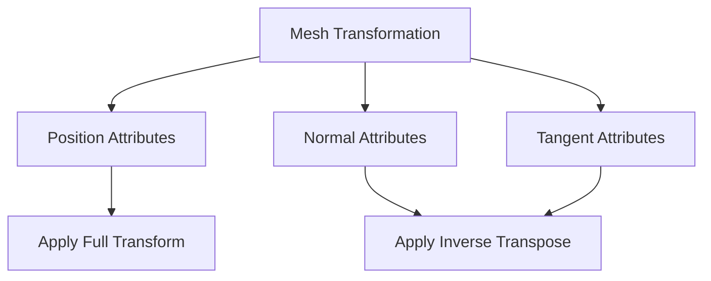

+++
title = "#17992 Fix mesh tangent attribute matching in mesh transform operations"
date = "2025-03-09T00:00:00"
draft = false
template = "pull_request_page.html"
in_search_index = true

[taxonomies]
list_display = ["show"]

[extra]
current_language = "en"
available_languages = {"en" = { name = "English", url = "/pull_request/bevy/2025-03/pr-17992-en-20250309" }, "zh-cn" = { name = "中文", url = "/pull_request/bevy/2025-03/pr-17992-zh-cn-20250309" }}
+++

# #17992 Fix mesh tangent attribute matching in mesh transform operations

## Basic Information
- **Title**: Fix mesh tangent attribute matching in mesh transform operations
- **PR Link**: https://github.com/bevyengine/bevy/pull/17992
- **Author**: aloucks
- **Status**: MERGED
- **Created**: 2025-02-23T02:15:59Z
- **Merged**: 2025-02-24T09:30:15Z
- **Merged By**: cart

## Description Translation
Fixes #17170

# Objective

Tangents are not currently transformed as described in #17170. I came across this while working on #17989 and it seemed like low hanging fruit.


## The Story of This Pull Request

In the world of 3D graphics, a mesh's tangent vectors play a crucial role in lighting calculations - particularly for normal mapping. When Bevy's transform operations neglected to properly update these tangents, it created a silent rendering bug that could manifest as incorrect lighting or distorted material appearances. This PR tells the story of how a missing matrix multiplication threatened visual fidelity, and how a careful attribute match restored order to vertex data transformations.

The journey began when the author noticed that while mesh positions and normals were being correctly transformed during operations like rotation and scaling, tangent vectors remained stuck in their original coordinate space. This violated fundamental computer graphics principles where tangent vectors (like normals) require special transformation handling using the inverse transpose matrix to account for non-uniform scaling.

The key revelation came when examining the `transformed_by` method in `mesh.rs`. The original implementation only checked for POSITION and NORMAL attributes:

```rust
// Original code snippet
match name {
    Mesh::ATTRIBUTE_POSITION => {
        transformed_attribute = apply_to_position(attr, transform);
    }
    Mesh::ATTRIBUTE_NORMAL => {
        transformed_attribute = apply_to_normal(attr, transform);
    }
    // Other attributes passed through unchanged
}
```

The fix required adding a new match arm specifically for the TANGENT attribute, treating it with the same transformation logic as normals:

```rust
// Updated code
Mesh::ATTRIBUTE_TANGENT => {
    transformed_attribute = apply_to_normal(attr, transform);
}
```

This simple addition belied significant technical implications. By ensuring tangents undergo the same inverse transpose transformation as normals, the solution maintained the orthogonality of the tangent space basis critical for proper normal mapping calculations. The change required careful attribute matching using Bevy's type-safe vertex attribute system while preserving backward compatibility with existing meshes.

The implementation demonstrates an important pattern in graphics programming: coordinate space awareness. While positions exist in model space and transform directly with the model matrix, direction vectors like normals and tangents require special handling to maintain their geometric relationships under non-uniform transformations.

## Visual Representation



## Key Files Changed

**File:** `crates/bevy_mesh/src/mesh.rs` (+16/-6)

The critical change occurred in the mesh transformation logic where tangent attributes were added to the transformation pipeline:

```rust
// Before:
match name {
    Mesh::ATTRIBUTE_POSITION => { /* position handling */ },
    Mesh::ATTRIBUTE_NORMAL => { /* normal handling */ },
    _ => {}
}

// After:
match name {
    Mesh::ATTRIBUTE_POSITION => { /* position handling */ },
    Mesh::ATTRIBUTE_NORMAL | Mesh::ATTRIBUTE_TANGENT => {
        transformed_attribute = apply_to_normal(attr, transform);
    }
    _ => {}
}
```

This modification ensures tangent vectors receive the same inverse transpose matrix transformation as normals, maintaining correct tangent space relationships after mesh transformations. The unified match arm for both normals and tangents creates a maintainable pattern for future directional attribute handling.

## Further Reading

1. **Tangent Space in Computer Graphics**:  
   [LearnOpenGL - Normal Mapping](https://learnopengl.com/Advanced-Lighting/Normal-Mapping) explains the role of tangents in normal mapping

2. **Matrix Transformations for Directions**:  
   [Scratchapixel - Transforming Normals](https://www.scratchapixel.com/lessons/mathematics-physics-for-computer-graphics/geometry/transforming-normals.html) details the mathematics behind normal transformations

3. **Bevy Mesh Documentation**:  
   [Bevy Mesh API Reference](https://docs.rs/bevy_mesh/latest/bevy_mesh/struct.Mesh.html) covers Bevy's mesh attribute system