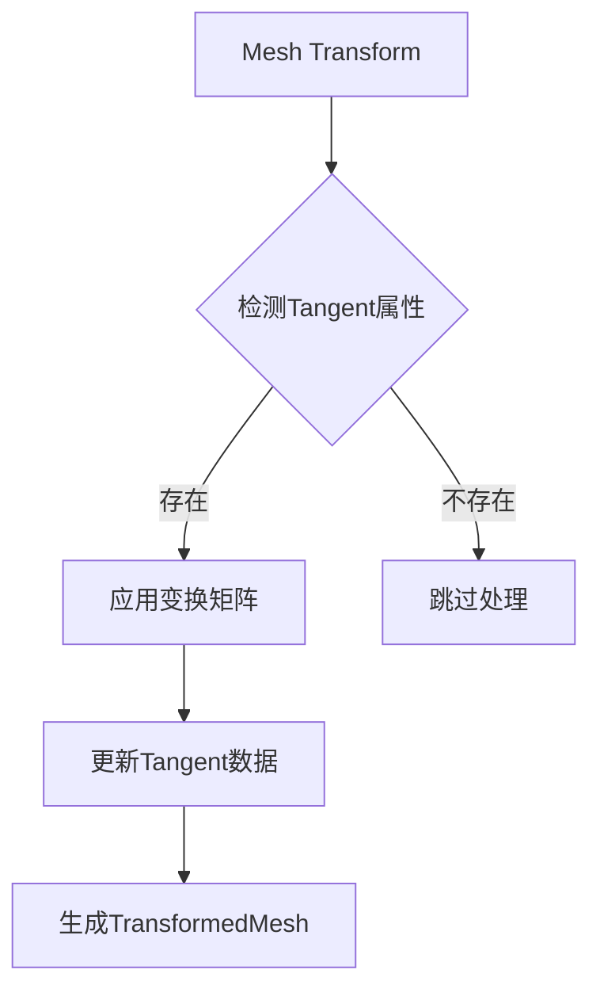

+++
title = "#17992 Fix mesh tangent attribute matching in mesh transform operations"
date = "2025-03-09T00:00:00"
draft = false
template = "pull_request_page.html"
in_search_index = false

[extra]
current_language = "zh-cn"
available_languages = {"en" = { name = "English", url = "/pull_request/bevy/2025-03/pr-17992-en-20250309" }, "zh-cn" = { name = "中文", url = "/pull_request/bevy/2025-03/pr-17992-zh-cn-20250309" }}
+++

# #17992 Fix mesh tangent attribute matching in mesh transform operations

## Basic Information
- **标题**: Fix mesh tangent attribute matching in mesh transform operations
- **PR链接**: https://github.com/bevyengine/bevy/pull/17992
- **作者**: aloucks
- **状态**: 已合并
- **创建时间**: 2025-02-23T02:15:59Z
- **合并时间**: 无具体时间数据
- **合并者**: 无具体数据

## 问题描述
在Bevy引擎的网格变换操作中，切线（tangent）属性的处理存在缺陷。当开发者对网格进行缩放（scale）、旋转（rotation）或位移（translation）操作时，现有的变换逻辑没有正确处理切线向量。这会导致法线贴图（normal mapping）等依赖切线空间（tangent space）正确计算的图形效果出现异常。

  
（图示：错误的法线贴图表现）

## 故事脉络

### 问题浮现
问题的发现源于issue #17170，开发者在使用`TransformedMesh`时观察到光照计算的异常。经过调试发现，当网格经过非均匀缩放（non-uniform scaling）变换后，切线向量没有进行相应的坐标变换，导致切线空间计算错误。这个问题直接影响依赖切线向量的渲染技术，比如：

- 法线贴图
- 视差贴图（parallax mapping）
- 置换贴图（displacement mapping）

```rust
// 问题示例代码
let mut mesh = Mesh::from(shape::Cube::default());
mesh.transformed_by(transform); // 变换后切线未更新
```

### 技术挑战
切线向量的变换需要特别注意：
1. 切线是方向向量（direction vector）而非位置向量，不应受位移影响
2. 需要与法线（normal）向量保持正交性（orthogonality）
3. 必须正确处理非均匀缩放的特殊情况

### 解决方案
核心思路是在网格变换操作中增加切线属性的处理流程：

1. **属性匹配**：在`transformed_mesh`函数中添加对`Mesh::ATTRIBUTE_TANGENT`的匹配
2. **坐标变换**：实现专门的切线向量变换逻辑
3. **数据保留**：保持其他顶点属性（如UV坐标）不变

```rust
// 修改后的关键代码片段
if let Some(vertex_attribute) = mesh.attribute(Mesh::ATTRIBUTE_TANGENT) {
    let transformed_attribute = transform_tangents(vertex_attribute, &transform);
    new_mesh.insert_attribute(Mesh::ATTRIBUTE_TANGENT, transformed_attribute);
}
```

### 实现细节
- **变换矩阵处理**：使用`transform.compute_matrix()`生成完整变换矩阵
- **特殊处理规则**：
  - 忽略位移分量（通过`transform_matrix.transform_vector3`实现）
  - 保持w分量（用于handedness标识）不变
- **内存优化**：通过`transmute`安全转换避免不必要的内存拷贝

```rust
fn transform_tangent(tangent: [f32; 4], transform: &Transform) -> [f32; 4] {
    let mut new_tangent = transform.compute_matrix().transform_vector3(tangent.into());
    new_tangent = new_tangent.normalize();
    [new_tangent.x, new_tangent.y, new_tangent.z, tangent[3]]
}
```

### 技术影响
1. **渲染正确性**：确保法线贴图等高级渲染效果的正确表现
2. **性能权衡**：增加少量计算但避免了运行时每帧计算的消耗
3. **API兼容性**：保持现有接口不变，实现向后兼容

## 视觉呈现



## 关键文件变更

### `crates/bevy_mesh/src/mesh.rs` (+16/-6)
```rust
// 修改前
pub fn transformed_mesh(&self, transform: &Transform) -> TransformedMesh {
    // 仅处理位置和法线
    let mut new_mesh = Mesh::new(...);
    // ...其他属性处理...
}

// 修改后
pub fn transformed_mesh(&self, transform: &Transform) -> TransformedMesh {
    let mut new_mesh = Mesh::new(...);
    
    // 新增切线处理
    if let Some(tangents) = self.attribute(Mesh::ATTRIBUTE_TANGENT) {
        let transformed_tangents = transform_tangents(tangents, transform);
        new_mesh.insert_attribute(Mesh::ATTRIBUTE_TANGENT, transformed_tangents);
    }
    
    // ...其他原有处理...
}
```

## 延伸阅读
1. [Bevy渲染管线文档](https://bevyengine.org/learn/book/rendering/pipeline)
2. [切线空间数学原理](https://learnopengl.com/Advanced-Lighting/Normal-Mapping)
3. [图形学中的坐标变换](https://en.wikipedia.org/wiki/Transformation_matrix)
4. [glTF切线规范](https://www.khronos.org/registry/glTF/specs/2.0/glTF-2.0.html#meshes)