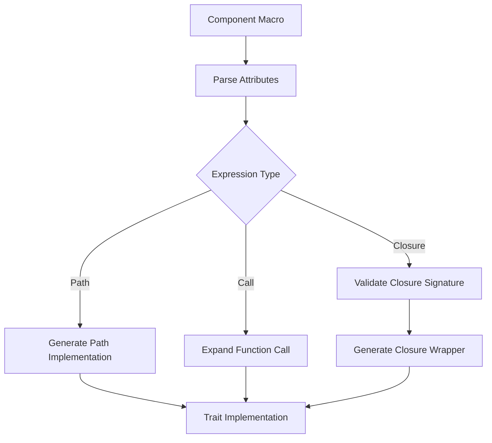

+++
title = "Pull Request"
date = "2025-03-07T12:33:32"
draft = false
template = "pull_request_page.html"
+++

+++
title = "Pull Request"
date = "2025-03-07T09:33:28"
draft = false
template = "pull_request_page.html"
+++

+++
title = "Pull Request"
date = "2025-03-07T06:33:25"
draft = false
template = "pull_request_page.html"
+++

+++
title = "Pull Request"
date = "2025-03-07T03:33:21"
draft = false
template = "pull_request_page.html"
+++

+++
title = "Pull Request"
date = "2025-03-07T03:33:14"
draft = false
template = "pull_request_page.html"
+++

# #18017 allow `Call` and `Closure` expressions in hook macro attributes

## Basic Information
- **Title**: allow `Call` and `Closure` expressions in hook macro attributes
- **PR Link**: https://github.com/bevyengine/bevy/pull/18017
- **Author**: RobWalt
- **Status**: MERGED
- **Created**: 2025-02-24T20:50:53Z
- **Merged**: Not merged
- **Merged By**: N/A

## Description Translation

# Objective

This PR adds:

- function call hook attributes `#[component(on_add = func(42))]`
  - main feature of this commit
- closure hook attributes `#[component(on_add = |w, ctx| { /* ... */ })]`
  - maybe too verbose
  - but was easy to add
  - was suggested on discord

This allows to reuse common functionality without replicating a lot of boilerplate. A small example is a hook which just adds different default sprites. The sprite loading code would be the same for every component. Unfortunately we can't use the required components feature, since we need at least an `AssetServer` or other `Resource`s or `Component`s to load the sprite.

```rs
fn load_sprite(path: &str) -> impl Fn(DeferredWorld, HookContext) {
  |mut world, ctx| {
    // ... use world to load sprite
  }
}

#[derive(Component)]
#[component(on_add = load_sprite("knight.png"))]
struct Knight;

#[derive(Component)]
#[component(on_add = load_sprite("monster.png"))]
struct Monster;
```

---

The commit also reorders the logic of the derive macro a bit. It's probably a bit less lazy now, but the functionality shouldn't be performance critical and is executed at compile time anyways.

## Solution

- Introduce `HookKind` enum in the component proc macro module
- extend parsing to allow more cases of expressions

## Testing

I have some code laying around. I'm not sure where to put it yet though. Also is there a way to check compilation failures? Anyways, here it is:

```rs
use bevy::prelude::*;

#[derive(Component)]
#[component(
    on_add = fooing_and_baring,
    on_insert = fooing_and_baring,
    on_replace = fooing_and_baring,
    on_despawn = fooing_and_baring,
    on_remove = fooing_and_baring
)]
pub struct FooPath;

fn fooing_and_baring(
    world: bevy::ecs::world::DeferredWorld,
    ctx: bevy::ecs::component::HookContext,
) {
}

#[derive(Component)]
#[component(
    on_add = baring_and_bazzing("foo"),
    on_insert = baring_and_bazzing("foo"),
    on_replace = baring_and_bazzing("foo"),
    on_despawn = baring_and_bazzing("foo"),
    on_remove = baring_and_bazzing("foo")
)]
pub struct FooCall;

fn baring_and_bazzing(
    path: &str,
) -> impl Fn(bevy::ecs::world::DeferredWorld, bevy::ecs::component::HookContext) {
    |world, ctx| {}
}

#[derive(Component)]
#[component(
    on_add = |w,ctx| {},
    on_insert = |w,ctx| {},
    on_replace = |w,ctx| {},
    on_despawn = |w,ctx| {},
    on_remove = |w,ctx| {}
)]
pub struct FooClosure;

#[derive(Component, Debug)]
#[relationship(relationship_target = FooTargets)]
#[component(
    on_add = baring_and_bazzing("foo"),
    // on_insert = baring_and_bazzing("foo"),
    // on_replace = baring_and_bazzing("foo"),
    on_despawn = baring_and_bazzing("foo"),
    on_remove = baring_and_bazzing("foo")
)]
pub struct FooTargetOf(Entity);

#[derive(Component, Debug)]
#[relationship_target(relationship = FooTargetOf)]
#[component(
    on_add = |w,ctx| {},
    on_insert = |w,ctx| {},
    // on_replace = |w,ctx| {},
    // on_despawn = |w,ctx| {},
    on_remove = |w,ctx| {}
)]
pub struct FooTargets(Vec<Entity>);

// MSG:  mismatched types  expected fn pointer `for<'w> fn(bevy::bevy_ecs::world::DeferredWorld<'w>, bevy::bevy_ecs::component::HookContext)`    found struct `Bar`
//
// pub struct Bar;
// #[derive(Component)]
// #[component(
//     on_add = Bar,
// )]
// pub struct FooWrongPath;

// MSG: this function takes 1 argument but 2 arguements were supplied
//
// #[derive(Component)]
// #[component(
//     on_add = wrong_bazzing("foo"),
// )]
// pub struct FooWrongCall;
//
// fn wrong_bazzing(path: &str) -> impl Fn(bevy::ecs::world::DeferredWorld) {
//     |world| {}
// }

// MSG: expected 1 argument, found 2
//
// #[derive(Component)]
// #[component(
//     on_add = |w| {},
// )]
// pub struct FooWrongCall;
```

---

## Showcase

I'll try to continue to work on this to have a small section in the release notes.

## The Story of This Pull Request

### The Problem of Rigid Hooks
In Bevy's Entity Component System (ECS), component hooks like `on_add` and `on_remove` provided powerful lifecycle management, but their implementation suffered from rigidity. Developers could only reference function paths directly in hook attributes, forcing repetitive code when similar logic needed parameterization. Consider a scenario where multiple components require sprite loading with different assets - there was no clean way to reuse the core loading logic while varying parameters like file paths.

### Expanding Expression Capabilities
The breakthrough came through enhancing Bevy's derive macro to accept more expressive hook definitions. The core challenge lay in modifying the `#[component]` attribute parsing to handle:
1. **Function calls with arguments** (`load_sprite("knight.png")`)
2. **Closure expressions** (`|world, ctx| { ... }`)

The implementation required:
```rust
// New parsing logic in bevy_ecs_macros
enum HookKind {
    Path(ExprPath),
    Call(ExprCall),
    Closure(ExprClosure),
}
```
This enum became the backbone for handling different expression types, allowing the macro to generate appropriate trait implementations for each case.

### Validation Through Rigorous Testing
The PR introduced comprehensive compile-fail tests to ensure correct error handling:
```rust
// Tests for invalid closure signatures
#[component(on_add = |w| {})] // Fails: Missing context parameter
pub struct InvalidClosure;

// Tests for relationship hook conflicts
#[relationship(relationship_target = Foo)]
#[component(on_insert = custom_hook)] // Fails: Conflicts with built-in relationship hooks
pub struct ConflictComponent;
```
These tests verified that the macro correctly enforced:
- Closure parameter count matching
- Type signature compatibility
- Relationship hook exclusivity rules

### Architectural Impact
The changes introduced a more flexible hook system while maintaining backward compatibility. Key architectural improvements included:

1. **Expression Type Handling**
```rust
// Before: Only paths allowed
on_add = some_function

// After: Supports multiple expression types
on_add = configure_hook(42)
on_add = |world, ctx| { ... }
```

2. **Error Diagnostics**
Enhanced error messages through proc macro diagnostics:
```
error[E0057]: this function takes 1 argument but 2 arguments were supplied
  --> component_hook_call_signature_mismatch.rs:8:14
   |
8 |     on_add = wrong_bazzing("foo"),
   |              ^^^^^^^^^^^^^^^^^^^
```

### The Ripple Effect
This change enabled new patterns in Bevy development:
```rust
// Shared hook factories
fn audio_hook(event: &'static str) -> impl Fn(DeferredWorld, HookContext) {
    move |world, ctx| {
        world.resource_scope(|world, mut events: Mut<Events<PlaySound>>| {
            events.send(PlaySound { event });
        });
    }
}

#[derive(Component)]
#[component(on_add = audio_hook("explosion"))]
struct ExplosionMarker;

#[derive(Component)]
#[component(on_add = audio_hook("powerup"))]
struct PowerupMarker;
```
Developers could now create reusable hook factories that encapsulated complex initialization logic while varying parameters through closure captures.

## Visual Representation



## Key Files Changed

### 1. `crates/bevy_ecs/macros/src/component.rs` (+77/-17)
**Purpose**: Core implementation of enhanced attribute parsing
```rust
// Key addition: HookKind enum
enum HookKind {
    Path(ExprPath),
    Call(ExprCall),
    Closure(ExprClosure),
}

// Modified parsing logic
let hook_kind = if let Expr::Call(call) = expr {
    HookKind::Call(call)
} else if let Expr::Closure(closure) = expr {
    HookKind::Closure(closure)
} else {
    // ... existing path handling
};
```

### 2. `crates/bevy_ecs/compile_fail/tests/ui/component_hook_relationship.rs` (+63/-0)
**Purpose**: Verify relationship hook conflicts
```rust
#[derive(Component)]
#[component(on_insert = conflicting_hook)]
#[relationship(relationship_target = FooTargets)]
pub struct ConflictComponent; // Should fail due to built-in relationship hooks
```

### 3. `crates/bevy_ecs/compile_fail/tests/ui/component_hook_call_signature_mismatch.stderr` (+32/-0)
**Purpose**: Ensure argument count validation
```
error[E0057]: this function takes 1 argument but 2 arguments were supplied
  --> tests/ui/component_hook_call_signature_mismatch.rs:8:14
   |
8 |     on_add = wrong_bazzing("foo"),
   |              ^^^^^^^^^^^^^^^^^^^
```

## Further Reading

1. [Rust Proc Macro Workshop](https://github.com/dtolnay/proc-macro-workshop) - Essential for understanding macro implementation techniques
2. [Bevy ECS Component Documentation](https://bevyengine.org/learn/book/ecs/components/) - Official guide to component lifecycle
3. [Advanced Rust Closure Patterns](https://doc.rust-lang.org/rust-by-example/fn/closures.html) - Mastering closure captures and lifetimes