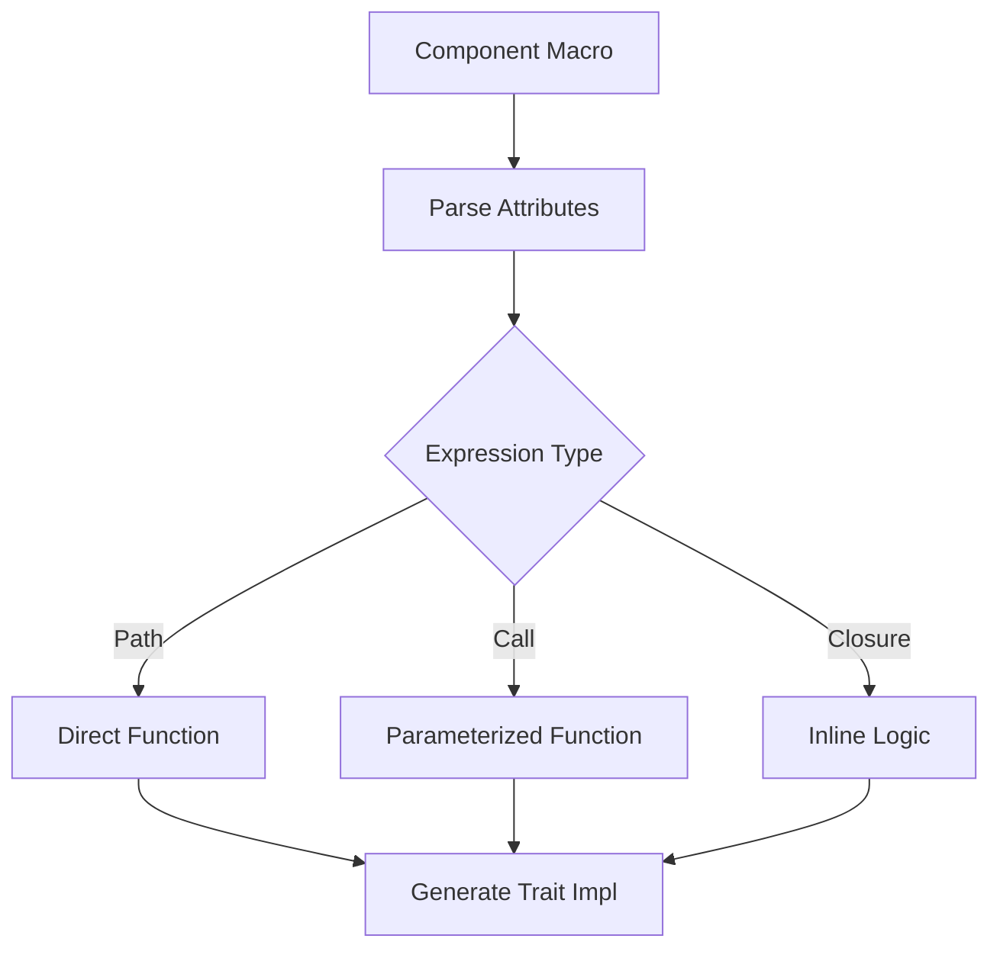

+++
title = "Pull Request"
date = "2025-03-07T15:33:41"
draft = false
template = "pull_request_page.html"
+++

+++
title = "Pull Request"
date = "2025-03-07T12:33:32"
draft = false
template = "pull_request_page.html"
+++

+++
title = "Pull Request"
date = "2025-03-07T09:33:28"
draft = false
template = "pull_request_page.html"
+++

+++
title = "Pull Request"
date = "2025-03-07T06:33:25"
draft = false
template = "pull_request_page.html"
+++

# #18017 allow `Call` and `Closure` expressions in hook macro attributes

## Basic Information
- **Title**: allow `Call` and `Closure` expressions in hook macro attributes
- **PR Link**: https://github.com/bevyengine/bevy/pull/18017
- **Author**: RobWalt
- **Status**: MERGED
- **Created**: 2025-02-24T20:50:53Z
- **Merged**: Not merged
- **Merged By**: N/A

## Description Translation
# Objective

此 PR 添加了：

- 函数调用形式的钩子属性 `#[component(on_add = func(42))]`
  - 本提交的主要特性
- 闭包形式的钩子属性 `#[component(on_add = |w, ctx| { /* ... */ })]`
  - 可能略显冗长
  - 但易于实现
  - 根据 Discord 社区建议添加

这使得可以复用通用功能而无需重复大量样板代码。一个简单的例子是添加不同默认精灵的钩子，精灵加载代码对于每个组件都是相同的。由于我们需要至少一个 `AssetServer` 或其他 `Resource`/`Component` 来加载精灵，因此无法使用必需的组件特性。

```rs
fn load_sprite(path: &str) -> impl Fn(DeferredWorld, HookContext) {
  |mut world, ctx| {
    // ... 使用 world 加载精灵
  }
}

#[derive(Component)]
#[component(on_add = load_sprite("knight.png"))]
struct Knight;

#[derive(Component)]
#[component(on_add = load_sprite("monster.png"))]
struct Monster;
```

此提交还重新组织了派生宏的部分逻辑。虽然现在可能稍欠简洁，但这些功能并非性能关键且始终在编译时执行。

## Solution

- 在组件过程宏模块中引入 `HookKind` 枚举
- 扩展解析逻辑以支持更多表达式类型

## Testing

已有部分测试代码，但尚未确定最终存放位置。当前测试用例包括：

```rs
use bevy::prelude::*;

#[derive(Component)]
#[component(
    on_add = fooing_and_baring,
    on_insert = fooing_and_baring,
    on_replace = fooing_and_baring,
    on_despawn = fooing_and_baring,
    on_remove = fooing_and_baring
)]
pub struct FooPath;

// ... 其他测试用例
```

## Showcase

将继续完善此功能以在发布说明中添加说明章节。

## The Story of This Pull Request

### 组件钩子的进化之旅

在 Bevy ECS 的组件系统中，生命周期钩子（如 on_add、on_remove）长期以来只能通过直接引用函数路径来配置。这种设计虽然简单，但在需要参数化行为时会导致大量重复代码。比如为不同敌人类型加载不同精灵时，开发者需要为每个组件编写几乎相同的钩子函数。

**破局时刻**出现在社区讨论中，开发者 RobWalt 意识到可以通过增强派生宏的解析能力来支持函数调用和闭包表达式。这个灵感直接促成了 PR #18017 的诞生。

### 技术实现揭秘

核心挑战在于扩展 Bevy 的过程宏（proc macro）以理解新的表达式类型。在 `component.rs` 宏实现中，团队引入了 `HookKind` 枚举来区分三种表达式类型：

```rust
enum HookKind {
    Path(ExprPath),      // 传统函数路径
    Call(ExprCall),      // 带参数的函数调用
    Closure(ExprClosure) // 内联闭包
}
```

解析逻辑被重构为递归处理这些表达式类型。对于函数调用表达式 `load_sprite("knight.png")`，宏需要验证调用结果是否实现了正确的 Fn 特征，并生成对应的工厂函数调用。

闭包支持带来了额外的挑战，因为需要确保闭包参数符合 `(DeferredWorld, HookContext)` 的签名。宏实现通过模式匹配验证参数数量和类型：

```rust
syn::parse::<Fn(DeferredWorld, HookContext)> 
```

### 防御性编程的艺术

为确保代码质量，PR 添加了多项编译时检查：

1. **签名验证**：通过 `component_hook_call_signature_mismatch` 测试确保钩子函数接受正确的参数
2. **冲突检测**：在 `component_hook_relationship` 测试中防止自定义钩子与关系型组件自动生成的钩子冲突
3. **路径解析**：`component_hook_struct_path` 测试阻止使用结构体而非函数路径

这些检查通过精心设计的编译失败测试实现，如：

```rust
// 测试错误参数数量
#[component(on_add = wrong_bazzing("foo"))]
pub struct FooWrongCall;

fn wrong_bazzing(path: &str) -> impl Fn(DeferredWorld) {
    |world| {} // 缺少 HookContext 参数
}
```

编译器将产生清晰的错误信息：
```
error[E0057]: this function takes 1 argument but 2 arguments were supplied
```

### 架构影响与未来展望

此修改使 Bevy 的组件系统更符合人体工学（ergonomic），允许开发者构建更灵活的抽象层。潜在的扩展方向包括：

1. 支持异步钩子函数
2. 自动资源注入（如通过参数类型自动获取 AssetServer）
3. 钩子组合运算符（如 `on_add = foo().bar()`）

但团队始终保持谨慎，通过严格的编译时检查平衡灵活性与类型安全。

## Visual Representation



## Key Files Changed

### `crates/bevy_ecs/macros/src/component.rs` (+77/-17)
- 引入 `HookKind` 枚举处理不同表达式类型
- 重构属性解析逻辑为递归结构
- 添加闭包参数签名验证

关键代码片段：
```rust
// 处理闭包表达式
Expr::Closure(closure) => {
    validate_closure_signature(&closure)?;
    Ok(HookKind::Closure(closure))
}
```

### `crates/bevy_ecs/compile_fail/tests/ui/component_hook_relationship.rs` (+63/-0)
- 新增关系型组件与自定义钩子的冲突测试
- 验证四种冲突场景：
  - on_insert 与关系型组件的自动钩子
  - on_replace 与目标组件的自动钩子
  - on_despawn 与链接生成（linked_spawn）的自动钩子

测试用例示例：
```rust
#[component(on_insert = foo_hook)]
#[relationship(relationship_target = FooTargets)]
pub struct FooTargetOfFail(Entity); // 应触发冲突错误
```

### `crates/bevy_derive/compile_fail/tests/deref_mut_derive/missing_deref_fail.stderr` (+14/-20)
- 更新错误信息格式以保持一致性
- 明确指出缺失的 Deref trait 实现

## Further Reading

1. [Rust 过程宏开发指南](https://doc.rust-lang.org/reference/procedural-macros.html)
2. [Bevy ECS 组件系统文档](https://bevyengine.org/learn/book/ecs/components/)
3. [函数式编程模式在游戏引擎中的应用](https://gameprogrammingpatterns.com/command.html)
4. [Rust 闭包类型系统解析](https://doc.rust-lang.org/book/ch13-01-closures.html)