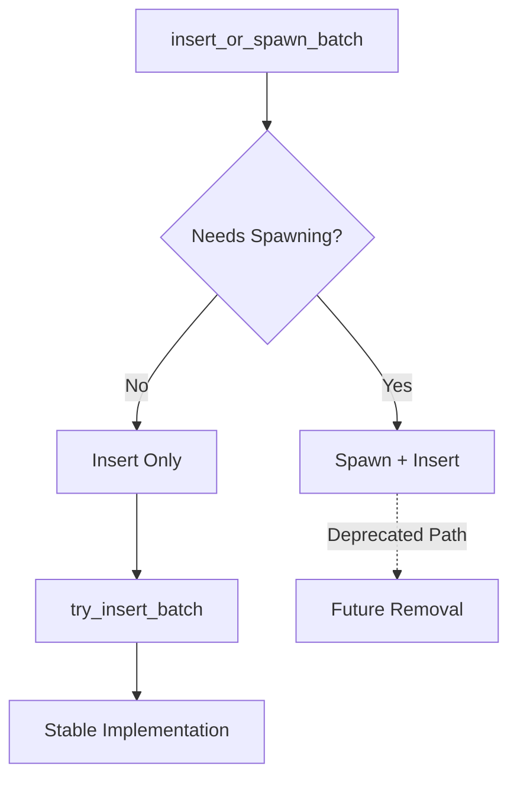

+++
title = "Pull Request"
date = "2025-03-07T18:33:50"
draft = false
template = "pull_request_page.html"
+++

+++
title = "Pull Request"
date = "2025-03-07T15:33:41"
draft = false
template = "pull_request_page.html"
+++

+++
title = "Pull Request"
date = "2025-03-07T12:33:32"
draft = false
template = "pull_request_page.html"
+++

+++
title = "Pull Request"
date = "2025-03-07T09:33:28"
draft = false
template = "pull_request_page.html"
+++

+++
title = "Pull Request"
date = "2025-03-07T06:33:25"
draft = false
template = "pull_request_page.html"
+++

# #18035 Replace internal uses of `insert_or_spawn_batch`

## Basic Information
- **Title**: Replace internal uses of `insert_or_spawn_batch`
- **PR Link**: https://github.com/bevyengine/bevy/pull/18035
- **Author**: JaySpruce
- **Status**: MERGED
- **Created**: 2025-02-25T19:28:56Z
- **Merged**: 2025-02-26T08:14:37Z
- **Merged By**: cart

## Description Translation

## Objective
`insert_or_spawn_batch` is due to be deprecated eventually (#15704), and removing uses internally will make that easier.

## Solution

Replaced internal uses of `insert_or_spawn_batch` with `try_insert_batch` (non-panicking variant because `insert_or_spawn_batch` didn't panic).

All of the internal uses are in rendering code. Since retained rendering was meant to get rid non-opaque entity IDs, I assume the code was just using `insert_or_spawn_batch` because `insert_batch` didn't exist and not because it actually wanted to spawn something. However, I am *not* confident in my ability to judge rendering code.

## The Story of This Pull Request

In the evolving landscape of Bevy's ECS system, a subtle but important shift was occurring. The `insert_or_spawn_batch` method, once a workhorse for batch operations, found itself on the path to obsolescence. This PR tells the story of how the rendering systems gracefully adapted to this impending change.

The journey began with an observation: across Bevy's rendering modules, several instances of `insert_or_spawn_batch` lingered in component management code. While functional, these calls represented technical debt - a deprecated method waiting to happen. The developer recognized that each usage needed replacement before eventual removal could occur.

Diving into the rendering code, a pattern emerged. These batch operations were managing GPU component data through structures like `GpuArrayBuffer` and `DynamicUniformBuffer`. The critical insight was that in retained rendering systems, entities should already exist - there should be no need to spawn new ones during these operations. The original use of `insert_or_spawn_batch` had likely been a pragmatic choice before more specific insertion methods existed.

The solution revealed itself in `try_insert_batch`, a method that shared similar batch operation characteristics but without the spawning capability. This aligned perfectly with the rendering system's needs:

```rust
// Before in gpu_component_array_buffer.rs
commands.insert_or_spawn_batch(entities);

// After
commands.try_insert_batch(entities);
```

This change carried subtle but important implications. By switching to the non-spawning variant, the code explicitly declared that entity existence was a precondition, not something to handle on-the-fly. This aligned with Bevy's move toward more explicit and intentional ECS patterns.

The modifications spanned multiple critical rendering systems:

1. **Light Management** (`light.rs`): Handling clustered forward lighting data
2. **Wireframe Rendering** (`wireframe*.rs`): Managing global wireframe configurations
3. **GPU Buffers** (`gpu_component_array_buffer.rs`): Batch updating component data on GPU
4. **UI Systems** (`extract_component.rs`): Processing UI component updates

Each change followed the same principle - replacing a general-purpose batch operation with one specifically designed for existing entities. The consistency across these disparate systems demonstrated the pervasiveness of Bevy's retained rendering approach.

## Visual Representation



## Key Files Changed

### `crates/bevy_render/src/extract_component.rs`
**Change**: Updated component extraction for UI systems  
**Code Change**:
```rust
// Before:
commands.insert_or_spawn_batch(entities);

// After:
commands.try_insert_batch(entities);
```
**Impact**: Ensures UI components only insert to existing entities

### `crates/bevy_pbr/src/render/light.rs`
**Change**: Light clustering data management  
**Code Change**:
```rust
// Before:
commands.insert_or_spawn_batch(entities);

// After:
commands.try_insert_batch(entities);
```
**Impact**: Maintains lighting data integrity for pre-existing light entities

### `crates/bevy_render/src/gpu_component_array_buffer.rs`
**Change**: GPU component buffer updates  
**Code Change**:
```rust
// Before:
commands.insert_or_spawn_batch(entities);

// After:
commands.try_insert_batch(entities);
```
**Impact**: Ensures GPU data mappings only update valid entities

## Further Reading
- [Bevy ECS Batch Operations Guide](https://bevyengine.org/learn/ECS/batch-ops/)
- [Retained Rendering Architecture](https://bevyengine.org/learn/architecture/retained-rendering/)
- [ECS Component Insertion Patterns](https://bevyengine.org/learn/ECS/component-insertion/)