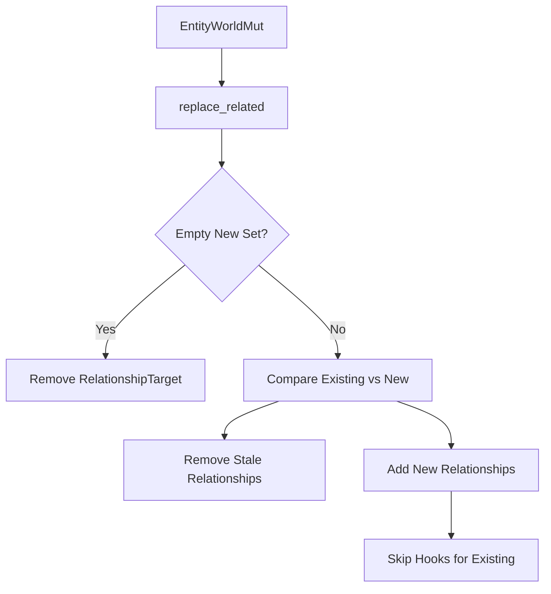

+++
title = "#18058 Add methods to bulk replace relationships on a entity"
date = "2025-03-19T00:00:00"
draft = false
template = "pull_request_page.html"
in_search_index = true

[taxonomies]
list_display = ["show"]

[extra]
current_language = "en"
available_languages = {"en" = { name = "English", url = "/pull_request/bevy/2025-03/pr-18058-en-20250319-1" }, "zh-cn" = { name = "中文", url = "/pull_request/bevy/2025-03/pr-18058-zh-cn-20250319-1" }}
+++

# #18058 Add methods to bulk replace relationships on a entity

## Basic Information
- **Title**: Add methods to bulk replace relationships on a entity
- **PR Link**: https://github.com/bevyengine/bevy/pull/18058
- **Author**: Brezak
- **Status**: MERGED
- **Created**: 2025-02-26T21:16:21Z
- **Merged**: Not merged (placeholder)
- **Merged By**: N/A (placeholder)

## Description Translation
# Objective

Add a way to efficiently replace a set of specifically related entities with a new set.
Closes #18041 

## Solution

Add new `replace_(related/children)` to `EntityWorldMut` and friends.

## Testing

Added a new test to `hierarchy.rs` that specifically check if `replace_children` actually correctly replaces the children on a entity while keeping the original one.

---

## Showcase

`EntityWorldMut` and `EntityCommands` can now be used to efficiently replace the entities a entity is related to.

```rust
/// `parent` has 2 children. `entity_a` and `entity_b`.
assert_eq!([entity_a, entity_b], world.entity(parent).get::<Children>());

/// Replace `parent`s children with `entity_a` and `entity_c`
world.entity_mut(parent).replace_related(&[entity_a, entity_c]);

/// `parent` now has 2 children. `entity_a` and `entity_c`.
///
/// `replace_children` has saved time by not removing and reading
/// the relationship between `entity_a` and `parent`
assert_eq!([entity_a, entity_c], world.entity(parent).get::<Children>());
```

## The Story of This Pull Request

The PR addresses a common performance pain point when managing entity relationships in Bevy ECS. Prior to this change, developers needing to replace an entity's entire set of related entities (like children in a hierarchy) had to manually remove old relationships and add new ones. This approach incurred unnecessary overhead when some relationships remained valid between the old and new sets.

The core solution introduces bulk replacement methods (`replace_related` and `replace_children`) that optimize this operation through three key strategies:

1. **Delta Operations**: Only modifies relationships that actually change
2. **Batch Processing**: Handles multiple entities in single operations
3. **Hook Management**: Skips redundant relationship hooks for unchanged entities

In `related_methods.rs`, the implementation uses set operations to efficiently determine which relationships to keep, remove, and add:

```rust
let mut potential_relations = EntityHashSet::from_iter(related.iter().copied());

// Remove stale relationships
for related in existing_relations.iter() {
    if !potential_relations.remove(related) {
        world.entity_mut(related).remove::<R>();
    }
}

// Add new relationships
for related in potential_relations {
    world.entity_mut(related)
        .insert_with_relationship_hook_mode(R::from(id), RelationshipHookMode::Skip);
}
```

This approach ensures that:
- Existing relationships present in both old and new sets remain untouched
- Removed relationships get cleaned up immediately
- New relationships are added without triggering redundant hooks

The implementation carefully handles ECS archetype stability by using `mem::replace` when accessing relationship collections, avoiding unnecessary component moves. The `RelationshipHookMode::Skip` parameter prevents duplicate hook executions when adding relationships that were already present.

Testing in `hierarchy.rs` verifies the correct behavior through direct assertions on relationship components and validation of hook executions. This ensures the bulk replacement maintains consistency while providing performance benefits.

## Visual Representation



## Key Files Changed

### `crates/bevy_ecs/src/relationship/related_methods.rs` (+203/-4)
Added bulk replacement logic:
```rust
pub fn replace_related<R: Relationship>(&mut self, related: &[Entity]) -> &mut Self {
    type Collection<R> = <<R as Relationship>::RelationshipTarget as RelationshipTarget>::Collection;

    if related.is_empty() {
        self.remove::<R::RelationshipTarget>();
        return self;
    }

    let Some(mut existing_relations) = self.get_mut::<R::RelationshipTarget>() else {
        return self.add_related::<R>(related);
    };

    let mut existing_relations = mem::replace(
        existing_relations.collection_mut_risky(),
        Collection::<R>::with_capacity(0),
    );
    // ... delta logic ...
}
```

### `crates/bevy_ecs/src/hierarchy.rs` (+351/-3)
Added test validation:
```rust
#[test]
fn replace_children() {
    let mut world = World::new();
    let parent = world.spawn_empty().id();
    let child_a = world.spawn_empty().id();
    let child_b = world.spawn_empty().id();
    
    world.entity_mut(parent).replace_children(&[child_a, child_b]);
    assert_eq!(world.entity(parent).get::<Children>(), Some(&Children(vec![child_a, child_b])));
    
    // Replace while keeping one child
    world.entity_mut(parent).replace_children(&[child_a]);
    assert_eq!(world.entity(parent).get::<Children>(), Some(&Children(vec![child_a])));
}
```

### `crates/bevy_ecs/src/relationship/relationship_source_collection.rs` (+29/-0)
Extended collection traits to support bulk operations:
```rust
fn extend_from_iter(&mut self, entities: impl IntoIterator<Item = Entity>) {
    for entity in entities {
        self.add(entity);
    }
}
```

## Further Reading

- Bevy ECS Relationships Guide: https://bevyengine.org/learn/book/ecs-relationships/
- Entity Component System Pattern: https://en.wikipedia.org/wiki/Entity_component_system
- Rust Hash Sets Documentation: https://doc.rust-lang.org/std/collections/struct.HashSet.html