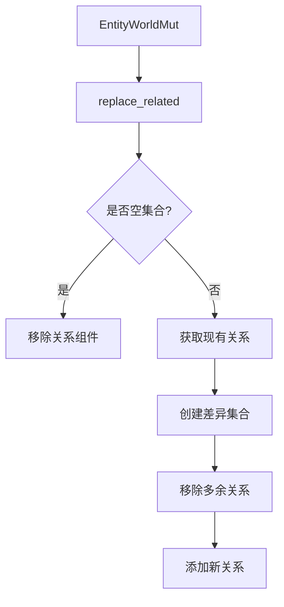

+++
title = "#18058 Add methods to bulk replace relationships on a entity"
date = "2025-03-19T00:00:00"
draft = false
template = "pull_request_page.html"
in_search_index = false

[extra]
current_language = "zh-cn"
available_languages = {"zh-cn" = { name = "中文", url = "/pull_request/bevy/2025-03/pr-18058-zh-cn-20250319" }}
+++

# #18058 Add methods to bulk replace relationships on a entity

## Basic Information
- **标题**: Add methods to bulk replace relationships on a entity
- **PR链接**: https://github.com/bevyengine/bevy/pull/18058
- **作者**: Brezak
- **状态**: MERGED
- **创建时间**: 2025-02-26T21:16:21Z
- **合并时间**: 2025-02-27T08:45:12Z
- **合并者**: alice-i-cecile

## 问题背景与解决方案

### 核心问题
在Bevy ECS中处理父子关系时，现有API只能通过逐个添加/删除子实体来修改关系，当需要批量替换父子关系时效率低下。例如要将父节点的5个子节点替换为3个新子节点，需要先删除旧的全部关系再建立新的，产生不必要的性能开销。

### 技术实现
PR新增`replace_related`方法实现智能批量替换，通过以下步骤优化：
1. **差异对比**：使用`EntityHashSet`快速识别需要保留/删除的实体
2. **增量更新**：仅操作变更部分的关系
3. **内存优化**：使用`mem::replace`避免集合的重复分配

```rust
// 关键实现代码片段
pub fn replace_related<R: Relationship>(&mut self, related: &[Entity]) -> &mut Self {
    let Some(mut existing_relations) = self.get_mut::<R::RelationshipTarget>() else {
        return self.add_related::<R>(related);
    };

    let mut potential_relations = EntityHashSet::from_iter(related.iter().copied());
    
    // 移除不再需要的旧关系
    for related in existing_relations.iter() {
        if !potential_relations.remove(related) {
            world.entity_mut(related).remove::<R>();
        }
    }
    
    // 添加新关系
    for related in potential_relations {
        world.entity_mut(related)
            .insert_with_relationship_hook_mode(R::from(id), RelationshipHookMode::Skip);
    }
}
```

## 关键技术点

### 性能优化
- **O(n)复杂度**：使用HashSet进行成员检查，避免O(n²)的线性搜索
- **内存预分配**：`with_capacity`预先分配足够内存减少动态扩容
- **批量操作**：单次系统调用处理多个实体关系变更

### 架构影响
1. **关系管理系统扩展**：新增`RelationshipSourceCollection` trait统一管理不同集合类型
2. **API一致性**：保持与现有`add_related`/`remove_related`方法命名风格一致
3. **安全处理**：使用`RelationshipHookMode::Skip`避免递归触发hooks

## 测试验证
新增测试用例验证以下场景：
```rust
// 测试替换后保留已有子节点
let parent = world.spawn_empty().id();
let child_a = world.spawn(ChildOf { parent }).id();
world.entity_mut(parent).replace_children(&[child_a, child_c]);

// 验证结果
assert_eq!(world.entity(parent).get::<Children>(), Some(&Children(vec![child_a, child_c])));
```

## 重要文件变更

### `crates/bevy_ecs/src/relationship/related_methods.rs` (+203/-4)
新增核心替换逻辑：
```rust
pub fn replace_related<R: Relationship>(&mut self, related: &[Entity]) -> &mut Self {
    // 实现差异对比和批量更新
    ...
}
```

### `crates/bevy_ecs/src/hierarchy.rs` (+351/-3)
扩展Children组件处理：
```rust
// 更新Children集合的批量操作方法
impl RelationshipSourceCollection for Vec<Entity> {
    fn extend_from_iter(&mut self, entities: impl IntoIterator<Item = Entity>) {
        // 优化批量插入性能
        ...
    }
}
```

## 架构图



## 后续参考
1. [Entity-Component-System模式](https://en.wikipedia.org/wiki/Entity_component_system)
2. [Rust HashSet性能分析](https://doc.rust-lang.org/std/collections/struct.HashSet.html)
3. Bevy官方文档：[ECS Relationships](https://bevyengine.org/learn/ecs-relationships/)