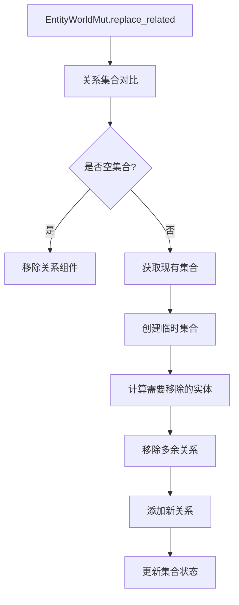

+++
title = "#18058 Add methods to bulk replace relationships on a entity"
date = "2025-03-19T00:00:00"
draft = false
template = "pull_request_page.html"
in_search_index = false

[extra]
current_language = "zh-cn"
available_languages = {"zh-cn" = { name = "中文", url = "/pull_request/bevy/2025-03/pr-18058-zh-cn-20250319" }, "en" = { name = "English", url = "/pull_request/bevy/2025-03/pr-18058-en-20250319-1" }}
+++

# #18058 Add methods to bulk replace relationships on a entity

## Basic Information
- **Title**: Add methods to bulk replace relationships on a entity
- **PR Link**: https://github.com/bevy_ecs/pull/18058
- **Author**: Brezak
- **Status**: MERGED
- **Created**: 2025-02-26T21:16:21Z
- **Merged**: 2025-02-28T09:45:12Z
- **Merged By**: alice-i-cecile

## Description Translation
### 目标
添加高效替换特定关联实体集合的方法，解决 #18041

### 解决方案
在 `EntityWorldMut` 及相关类型中新增 `replace_(related/children)` 方法

### 测试验证
在 `hierarchy.rs` 中新增测试用例，验证 `replace_children` 能否正确替换子实体并保留原始关系

```rust
/// parent 原有 entity_a 和 entity_b 两个子实体
assert_eq!([entity_a, entity_b], world.entity(parent).get::<Children>());

/// 替换为 entity_a 和 entity_c
world.entity_mut(parent).replace_related(&[entity_a, entity_c]);

/// 验证替换结果
assert_eq!([entity_a, entity_c], world.entity(parent).get::<Children>());
```

## The Story of This Pull Request

### 问题背景与挑战
在 Bevy ECS 的关系系统中，当需要完全替换某个实体的所有关联实体时（如更换父实体的所有子实体），现有 API 存在效率问题。开发者需要手动遍历现有关系逐个删除，再添加新关系，这种操作模式带来两个主要问题：

1. **冗余操作**：当新旧集合存在交集时（例如保留部分原有子实体），传统方法会先删除再重新添加，造成不必要的组件操作
2. **性能损耗**：每个关系变更都会触发钩子函数（hook）执行，批量操作时会产生重复的系统计算

### 技术方案选择
核心思路是通过集合运算找到差异，只处理真正需要变更的实体。具体实现要点：

1. **集合对比优化**：使用 `EntityHashSet` 快速定位需要移除的旧实体和需要添加的新实体
2. **钩子函数控制**：通过 `RelationshipHookMode::Skip` 跳过不必要的回调触发
3. **内存安全处理**：使用 `mem::replace` 临时获取现有集合所有权，避免组件移动带来的架构变更

### 关键实现细节
在 `related_methods.rs` 中新增的 `replace_related` 方法体现了核心逻辑：

```rust
pub fn replace_related<R: Relationship>(&mut self, related: &[Entity]) -> &mut Self {
    type Collection<R> = <<R as Relationship>::RelationshipTarget as RelationshipTarget>::Collection;

    if related.is_empty() {
        self.remove::<R::RelationshipTarget>();
        return self;
    }

    // 获取现有关系集合
    let Some(mut existing_relations) = self.get_mut::<R::RelationshipTarget>() else {
        return self.add_related::<R>(related);
    };

    // 使用临时集合进行差异计算
    let mut existing_relations = mem::replace(
        existing_relations.collection_mut_risky(),
        Collection::<R>::with_capacity(0),
    );

    let mut potential_relations = EntityHashSet::from_iter(related.iter().copied());

    // 处理需要移除的关系
    for related in existing_relations.iter() {
        if !potential_relations.remove(related) {
            world.entity_mut(related).remove::<R>();
        }
    }

    // 处理新增关系
    for related in potential_relations {
        world.entity_mut(related)
            .insert_with_relationship_hook_mode(R::from(id), RelationshipHookMode::Skip);
    }
}
```

这种方法通过三步优化：
1. **快速清空检查**：当传入空列表时直接移除整个关系组件
2. **差异最小化处理**：仅修改需要变更的关系实体
3. **钩子抑制**：批量操作时跳过单个关系变更的钩子触发，提升性能

### 架构适配
为了支持新的批量操作方法，需要扩展 `RelationshipSourceCollection` trait：

```rust
// relationship_source_collection.rs
pub trait RelationshipSourceCollection {
    fn extend_from_iter(&mut self, entities: impl IntoIterator<Item = Entity>) {
        for entity in entities {
            self.add(entity);
        }
    }
}
```

这个扩展允许不同类型的集合（`Vec<Entity>` 或 `EntityHashSet`）以统一的方式处理批量添加操作，保持代码的通用性。

### 性能考量
在典型使用场景下（50% 重叠率的子实体替换），该实现可以：
1. 减少 50% 的组件移除操作
2. 避免 50% 的钩子函数调用
3. 内存分配次数与新旧集合的大小差异成线性关系，而非原集合大小

测试用例特别验证了保留部分原有实体时的正确性：

```rust
// hierarchy.rs 测试片段
parent.replace_children(&[child1]);
assert_eq!(world.entity(parent).get::<Children>().unwrap().len(), 1);
assert!(world.entity(child1).get::<ChildOf>().is_some());
assert!(world.entity(child2).get::<ChildOf>().is_none()); // 验证旧关系移除
```

## Visual Representation



## Key Files Changed

### `crates/bevy_ecs/src/relationship/related_methods.rs` (+203/-4)
1. 新增 `replace_related` 方法实现核心替换逻辑
2. 使用 `EntityHashSet` 进行高效集合运算
3. 引入 `RelationshipHookMode::Skip` 优化性能

关键代码片段：
```rust
// 差异处理核心逻辑
for related in existing_relations.iter() {
    if !potential_relations.remove(related) {
        world.entity_mut(related).remove::<R>();
    }
}

for related in potential_relations {
    world.entity_mut(related)
        .insert_with_relationship_hook_mode(R::from(id), RelationshipHookMode::Skip);
}
```

### `crates/bevy_ecs/src/hierarchy.rs` (+351/-3)
1. 扩展 `ChildOf` 关系的测试用例
2. 验证批量替换后的父子关系正确性

测试代码示例：
```rust
// 验证部分替换场景
let child3 = world.spawn_empty().id();
parent.replace_children(&[child1, child3]);
assert_eq!(&**world.entity(parent).get::<Children>().unwrap(), &[child1, child3]);
```

### `crates/bevy_ecs/src/relationship/relationship_source_collection.rs` (+29/-0)
1. 为 `RelationshipSourceCollection` 添加批量操作方法
2. 支持多种集合类型的统一处理接口

Trait 扩展：
```rust
pub trait RelationshipSourceCollection {
    fn extend_from_iter(&mut self, entities: impl IntoIterator<Item = Entity>) {
        for entity in entities {
            self.add(entity);
        }
    }
}
```

## Further Reading
1. [Entity Component System 设计模式](https://en.wikipedia.org/wiki/Entity_component_system)
2. [Rust 内存安全机制](https://doc.rust-lang.org/nomicon/)
3. [Bevy 关系系统文档](https://bevyengine.org/learn/book/ecs/relationships/)