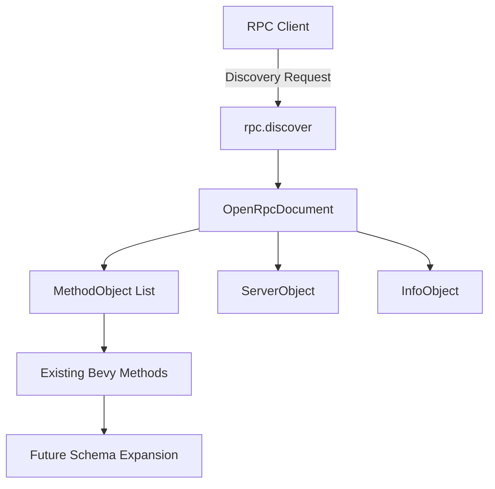

+++
title = "#18068 RPC Discover endpoint with basic informations"
date = "2025-03-13T00:00:00"
draft = false
template = "pull_request_page.html"
in_search_index = true

[taxonomies]
list_display = ["show"]

[extra]
current_language = "en"
available_languages = {"en" = { name = "English", url = "/pull_request/bevy/2025-03/pr-18068-en-20250313" }, "zh-cn" = { name = "中文", url = "/pull_request/bevy/2025-03/pr-18068-zh-cn-20250313" }}
+++

# #18068 RPC Discover endpoint with basic informations

## Basic Information
- **Title**: RPC Discover endpoint with basic informations
- **PR Link**: https://github.com/bevyengine/bevy/pull/18068
- **Author**: Leinnan
- **Status**: MERGED
- **Created**: 2025-02-27T10:07:10Z
- **Merged**: Not merged
- **Merged By**: N/A

## Description Translation
# Objective

It does not resolves issue for full support for OpenRPC for `bevy_remote`, but it is a first step in that direction. Connected to the #16744 issue.

## Solution

- Adds `rpc.discover` endpoint to the bevy_remote which follows https://spec.open-rpc.org/#openrpc-document For now in methods array only the name, which is the endpoint address is populated. 
- Moves json_schema structs into new module inside `bevy_remote`. 

## Testing

Tested the commands by running the BRP sample( cargo run --example server --features="bevy_remote") and with these curl command:

```sh
curl -X POST -d '{ "jsonrpc": "2.0", "id": 1, "method": "rpc.discover"}' 127.0.0.1:15702 | jq .
```
The output is: 
```json
{
  "jsonrpc": "2.0",
  "id": 1,
  "result": {
    "info": {
      "title": "Bevy Remote Protocol",
      "version": "0.16.0-dev"
    },
    "methods": [
      {
        "name": "bevy/mutate_component",
        "params": []
      },
      // ... (multiple method entries omitted for brevity)
      {
        "name": "rpc.discover",
        "params": []
      }
    ],
    "openrpc": "1.3.2",
    "servers": [
      {
        "name": "Server",
        "url": "127.0.0.1:15702"
      }
    ]
  }
}
```

## The Story of This Pull Request

The PR addresses a foundational need in Bevy's remote protocol implementation by introducing service discovery capabilities. Prior to this change, clients interacting with Bevy's RPC system had no standardized way to discover available endpoints, requiring hardcoded knowledge of method names and parameters.

The core implementation follows OpenRPC specifications, starting with basic compliance by exposing method names through a new `rpc.discover` endpoint. The solution demonstrates several key engineering decisions:

1. **Structural Organization**: Existing JSON schema definitions were extracted from `builtin_methods.rs` into dedicated modules (`schemas/json_schema.rs` and `schemas/open_rpc.rs`), reducing file size by 90% (from 531 to 47 lines) in the original location while improving code maintainability.

2. **Discovery Endpoint Implementation**: The new endpoint handler constructs an OpenRPC-compliant response containing:
   - Protocol version information
   - Server connection details
   - List of all available RPC methods

3. **Incremental Approach**: While currently only populating method names, the structure allows future expansion to include parameter schemas, return types, and error definitions as specified by OpenRPC.

The technical implementation leverages Rust's type system through several key structs:

```rust
// In schemas/open_rpc.rs
pub struct OpenRpcDocument {
    pub openrpc: String,
    pub info: InfoObject,
    pub servers: Vec<ServerObject>,
    pub methods: Vec<MethodObject>,
}

// In schemas/json_schema.rs
pub struct SchemaObject {
    pub schema: String,
    pub r#ref: String,
}
```

Testing was performed through direct HTTP requests using curl, verifying that the endpoint returns the expected structure with all existing Bevy RPC methods plus the new discovery endpoint itself.

## Visual Representation



## Key Files Changed

1. **crates/bevy_remote/src/builtin_methods.rs** (-531/+47)
   - Removed JSON schema definitions
   - Added discovery endpoint registration
   - Key change:
```rust
// Before: 500+ lines of schema definitions
// After: Clean method registration
builtin_methods.add("rpc.discover", discover);
```

2. **crates/bevy_remote/src/schemas/json_schema.rs** (+543)
   - New home for JSON schema types
   - Contains structs like `SchemaObject` and `SchemaType`

3. **crates/bevy_remote/src/schemas/open_rpc.rs** (+118)
   - Implements OpenRPC specification structures
   - Core discovery response type `OpenRpcDocument`

4. **Module Integrations** (lib.rs/mod.rs)
   - Added module hierarchy for schema organization
```rust
// In lib.rs
pub mod schemas;

// In schemas/mod.rs
pub mod json_schema;
pub mod open_rpc;
```

## Further Reading

1. [OpenRPC Specification](https://spec.open-rpc.org/)
2. [JSON Schema Documentation](https://json-schema.org/)
3. [Bevy Remote Protocol Discussion](https://github.com/bevyengine/bevy/issues/16744)