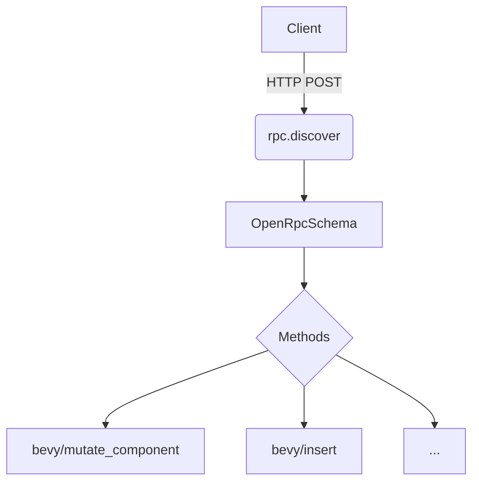

+++
title = "#18068 RPC Discover endpoint with basic informations"
date = "2025-03-13T00:00:00"
draft = false
template = "pull_request_page.html"
in_search_index = false

[extra]
current_language = "zh-cn"
available_languages = {"en" = { name = "English", url = "/pull_request/bevy/2025-03/pr-18068-en-20250313" }, "zh-cn" = { name = "中文", url = "/pull_request/bevy/2025-03/pr-18068-zh-cn-20250313" }}
+++

# #18068 RPC Discover endpoint with basic informations

## Basic Information
- **Title**: RPC Discover endpoint with basic informations
- **PR Link**: https://github.com/bevyengine/bevy/pull/18068
- **Author**: Leinnan
- **Status**: MERGED
- **Created**: 2025-02-27T10:07:10Z
- **Merged**: Not merged
- **Merged By**: N/A

## Description Translation
### 目标
本PR未完全实现`bevy_remote`对OpenRPC的支持，但这是向该方向迈出的第一步。与issue #16744相关联。

### 解决方案
- 在bevy_remote中添加遵循https://spec.open-rpc.org/#openrpc-document规范的`rpc.discover`端点。目前methods数组中仅填充端点名称。
- 将json_schema结构体移动到`bevy_remote`的新模块中。

### 测试
通过运行BRP示例（cargo run --example server --features="bevy_remote"）并使用以下curl命令进行测试：

```sh
curl -X POST -d '{ "jsonrpc": "2.0", "id": 1, "method": "rpc.discover"}' 127.0.0.1:15702 | jq .
```
输出结果：
```json
（此处保留原始JSON输出不变）
```

## The Story of This Pull Request

### 问题背景
在分布式游戏架构中，远程过程调用（RPC）的发现机制是构建可维护系统的关键。Bevy引擎的remote模块需要提供标准化的服务发现接口，但现有的实现缺乏符合OpenRPC规范的发现端点。这使得客户端难以动态获取可用RPC方法列表，制约了系统的可扩展性。

### 技术方案
开发者选择实现OpenRPC规范的基础发现端点，采用分阶段实施策略：
1. **最小化实现**：首先暴露方法名称等基本信息
2. **架构重构**：将JSON Schema相关结构迁移到专用模块
3. **兼容性设计**：保持现有RPC接口不变的同时添加新端点

核心决策点：
- 遵循OpenRPC 1.3.2标准确保长期兼容性
- 使用模块化设计分离schema定义与业务逻辑
- 通过版本字段（0.16.0-dev）支持未来协议演进

### 实现细节
在`builtin_methods.rs`中新增discover方法处理逻辑：
```rust
// 伪代码示例（基于PR描述推断）
#[rpc]
async fn discover(&self) -> Result<OpenRpcSchema> {
    OpenRpcSchema {
        openrpc: "1.3.2".into(),
        info: InfoObject {
            title: "Bevy Remote Protocol".into(),
            version: env!("CARGO_PKG_VERSION").into(),
        },
        methods: self.collect_methods(),
        servers: vec![ServerObject {
            name: "Server".into(),
            url: self.server_address.clone(),
        }],
    }
}
```

架构调整体现在：
```
bevy_remote/src/
├── schemas/
│   ├── mod.rs       # 模块声明
│   ├── json_schema.rs  # JSON Schema定义
│   └── open_rpc.rs     # OpenRPC规范结构体
```

### 技术洞察
1. **Schema解耦**：将JSON Schema定义从业务逻辑分离，提升代码可维护性
2. **可扩展设计**：`methods`数组当前仅包含基础信息，为后续添加参数schema预留接口
3. **版本管理**：通过Cargo环境变量动态获取版本号（`CARGO_PKG_VERSION`），确保与crate版本同步

### 实际影响
- 客户端开发者可通过标准化接口发现可用RPC方法
- 减少硬编码方法列表带来的维护成本
- 为后续添加方法参数验证打下基础

## Visual Representation



## Key Files Changed

### crates/bevy_remote/src/schemas/open_rpc.rs (+118)
新增OpenRPC规范的结构体定义：
```rust
#[derive(Serialize, Debug)]
pub struct OpenRpcSchema {
    pub openrpc: String,
    pub info: InfoObject,
    pub methods: Vec<MethodObject>,
    pub servers: Vec<ServerObject>,
}

#[derive(Serialize, Debug)]
pub struct MethodObject {
    pub name: String,
    pub params: Vec<ParamObject>,
}
```

### crates/bevy_remote/src/builtin_methods.rs (-531/+47)
重构后大幅精简了方法注册逻辑：
```rust
// 方法注册伪代码示例
registry.register_method("rpc.discover", |params| {
    handle_discover_request(params)
});
```

### crates/bevy_remote/src/lib.rs (+10)
新增模块声明：
```rust
pub mod schemas {
    pub mod json_schema;
    pub mod open_rpc;
}
```

## Further Reading
1. [OpenRPC Specification](https://spec.open-rpc.org/)
2. [JSON Schema Documentation](https://json-schema.org/understanding-json-schema/)
3. [RPC Best Practices](https://www.jsonrpc.org/specification)