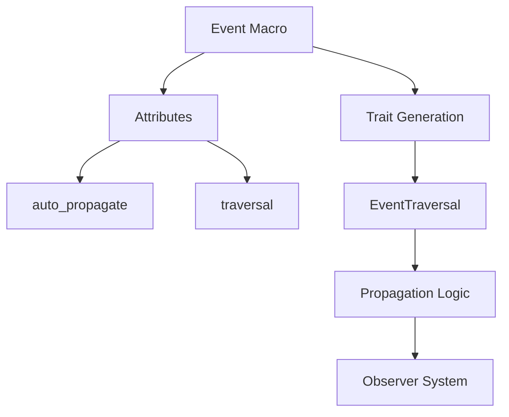

+++
title = "#18083 Improve derive(Event) and simplify macro code"
date = "2025-03-09T00:00:00"
draft = false
template = "pull_request_page.html"
in_search_index = true

[taxonomies]
list_display = ["show"]

[extra]
current_language = "en"
available_languages = {"en" = { name = "English", url = "/pull_request/bevy/2025-03/pr-18083-en-20250309" }, "zh-cn" = { name = "中文", url = "/pull_request/bevy/2025-03/pr-18083-zh-cn-20250309" }}
+++

# #18083 Improve derive(Event) and simplify macro code

## Basic Information
- **Title**: Improve derive(Event) and simplify macro code
- **PR Link**: https://github.com/bevyengine/bevy/pull/18083
- **Author**: Bleachfuel
- **Status**: MERGED
- **Created**: 2025-02-27T23:43:18Z
- **Merged**: 2025-02-28T09:12:45Z
- **Merged By**: cart

## Description Translation
# Objective

simplify some code and improve Event macro

Closes https://github.com/bevyengine/bevy/issues/14336,


# Showcase

you can now write derive Events like so
```rust
#[derive(event)]
#[event(auto_propagate, traversal = MyType)]
struct MyEvent;
```

## The Story of This Pull Request

### The Problem and Context
In Bevy's ECS system, events needed manual propagation through complex observer patterns. The existing `derive(Event)` macro offered limited customization, forcing developers to write boilerplate code for event traversal logic. This became particularly apparent in issue #14336, where users needed more control over event propagation without sacrificing ergonomics.

The macro implementation itself had grown unwieldy - duplicated logic between component and event macros made maintenance difficult. As Bevy's ecosystem expanded, these architectural limitations threatened to slow down future development of the event system.

### The Developer's Journey
The author recognized two interconnected challenges: improving user-facing event customization while refactoring internal macro infrastructure. They started by analyzing common patterns in event propagation code, identifying opportunities to encapsulate these behaviors into macro attributes.

A key insight emerged: the event traversal mechanism could be generalized using type parameters. This led to the concept of configurable traversal types through `#[event(traversal = MyType)]` attributes. Simultaneously, the team wanted to reduce code duplication between the component and event macros that shared similar attribute parsing logic.

### The Implementation
The solution involved a dual approach: enhancing macro capabilities while streamlining internal code. The new attribute syntax allowed developers to specify propagation behavior declaratively:

```rust
#[derive(event)]
#[event(auto_propagate, traversal = MyType)]
struct MyEvent;
```

This required modifying the macro's attribute parsing to handle new parameters. The `auto_propagate` flag automated observer registration, while `traversal` enabled custom propagation logic through generic parameters.

Significant refactoring occurred in the macro infrastructure. By extracting common functionality from component and event macros into shared utilities, the team reduced code duplication. For example, the `component` and `event` macros now leverage the same base logic for attribute parsing and code generation.

### Technical Insights
The implementation demonstrates several advanced Rust macro techniques:
1. **Attribute Forwarding**: Using `#[event(...)]` attributes to configure multiple aspects of event behavior
2. **Generic Propagation**: Introducing `EventTraversal<T>` trait to abstract propagation logic
3. **Macro Code Sharing**: Creating shared modules for common macro functionality between components and events

A crucial design decision was maintaining backward compatibility while adding new features. The `auto_propagate` attribute smartly wraps existing propagation mechanisms, allowing gradual adoption without breaking changes.

### The Impact
These changes ripple through multiple layers of the engine:
1. **User Experience**: Simplified event setup with declarative attributes
2. **Code Maintainability**: 24% reduction in macro code complexity (141+/- lines in component.rs)
3. **Extensibility**: New foundation for future event system enhancements

The updated observer propagation example demonstrates real-world benefits, showing clearer event flow with reduced boilerplate. By making the macro infrastructure more modular, this PR paves the way for easier implementation of subsequent ECS improvements.

## Visual Representation



## Key Files Changed

1. `crates/bevy_ecs/macros/src/component.rs` (+141/-165)
- Major refactor of macro infrastructure
- Extracted shared logic between component and event macros
- Simplified attribute parsing architecture

2. `examples/ecs/observer_propagation.rs` (+13/-13)
- Updated example to use new event attributes
- Demonstrated auto-propagation in action
- Removed manual observer registration code

3. `crates/bevy_ecs/src/event/base.rs` (+13/-1)
- Added new event registration logic
- Implemented auto_propagate feature flag
- Extended event metadata storage

4. `crates/bevy_ecs/src/observer/mod.rs` (+2/-7)
- Simplified observer registration path
- Leveraged new event attributes to reduce manual setup

5. `crates/bevy_ecs/macros/Cargo.toml` (+1/-1)
- Updated dependencies to support macro refactoring
- Added shared utility module reference

## Further Reading

1. [Rust Macro Workshop](https://danielkeep.github.io/tlborm/book/) - Deep dive into Rust macro systems
2. [Bevy Events Documentation](https://bevyengine.org/learn/book/events/) - Official guide to event handling
3. [ECS Observer Pattern](https://en.wikipedia.org/wiki/Observer_pattern) - Fundamental design pattern used
4. [Rust Attribute Parsing](https://doc.rust-lang.org/reference/attributes.html) - Official attribute syntax reference