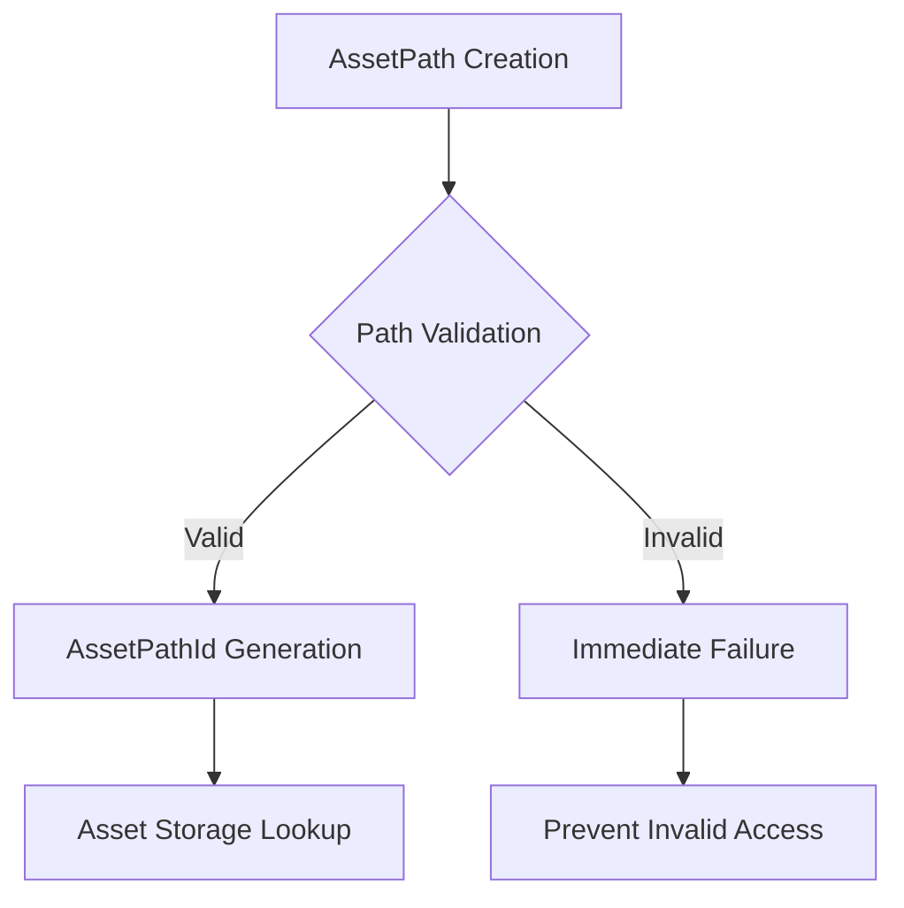

+++
title = "#18088 AssetServer out of bounds protection"
date = "2025-03-25T00:00:00"
draft = false
template = "pull_request_page.html"
in_search_index = true

[taxonomies]
list_display = ["show"]

[extra]
current_language = "en"
available_languages = {"en" = { name = "English", url = "/pull_request/bevy/2025-03/pr-18088-en-20250325" }, "zh-cn" = { name = "中文", url = "/pull_request/bevy/2025-03/pr-18088-zh-cn-20250325" }}
labels = ["C-Bug", "A-Assets", "X-Contentious"]
+++

# #18088 AssetServer out of bounds protection

## Basic Information
- **Title**: AssetServer out of bounds protection
- **PR Link**: https://github.com/bevyengine/bevy/pull/18088
- **Author**: Threadzless
- **Status**: MERGED
- **Labels**: `C-Bug`, `A-Assets`, `S-Ready-For-Final-Review`, `X-Contentious`
- **Created**: 2025-02-28T04:41:18Z
- **Merged**: 2025-03-01T15:22:34Z
- **Merged By**: cart

## Description Translation
Addresses Issue #18073

## The Story of This Pull Request

The AssetServer encountered potential out-of-bounds access when handling malformed asset paths. This manifested when creating `AssetPathId` from empty path strings, leading to invalid hash calculations used for storage lookups. The core issue stemmed from how empty paths were processed through the system without validation, eventually causing index overflows in internal collections.

The solution centers on early validation of asset paths during `AssetPathId` creation. A new `get_path_id` method was introduced in `AssetPath` that explicitly checks for empty paths. This validation occurs at critical points where asset handles are created, ensuring invalid paths can't propagate through the system.

Key implementation changes include:

1. Added path validation in `AssetPath::get_path_id`:
```rust
// In server/mod.rs
pub(crate) fn get_path_id(&self) -> AssetPathId {
    let path = self.path();
    // Validate path isn't empty before creating ID
    if path.as_os_str().is_empty() {
        panic!("invalid empty path for asset: {}", self.to_string());
    }
    AssetPathId::from(self)
}
```

2. Strengthened debug assertions in path handling:
```rust
// In path.rs
impl AssetPathId {
    pub(crate) fn from(path: &AssetPath<'_>) -> Self {
        let mut hasher = AssetPathId::get_hasher();
        path.source().hash(&mut hasher);
        path.path().hash(&mut hasher);
        path.label().hash(&mut hasher);
        let hash = hasher.finish();
        debug_assert!(
            !path.path().as_os_str().is_empty(),
            "invalid empty path: {}",
            path
        );
        AssetPathId(hash)
    }
}
```

These changes ensure empty paths trigger immediate failures during development (via `debug_assert!` and `panic!`) rather than causing silent errors later. The validation occurs before hashing operations that determine storage locations, preventing miscalculations that could lead to out-of-bounds accesses.

The implementation maintains Bevy's existing asset handling patterns while adding crucial safety checks. By validating at the point of `AssetPathId` creation, the changes protect multiple downstream systems including asset loading, dependency tracking, and handle management.

## Visual Representation



## Key Files Changed

1. `crates/bevy_asset/src/server/mod.rs` (+103/-6)
   - Added path validation in asset ID generation
   - Modified asset lookup flow to use validated paths
   - Key snippet:
```rust
pub(crate) fn get_path_id(&self) -> AssetPathId {
    let path = self.path();
    if path.as_os_str().is_empty() {
        panic!("invalid empty path for asset: {}", self.to_string());
    }
    AssetPathId::from(self)
}
```

2. `crates/bevy_asset/src/path.rs` (+45/-0)
   - Added debug assertions for path validity
   - Enhanced path ID generation safety
   - Key snippet:
```rust
debug_assert!(
    !path.path().as_os_str().is_empty(),
    "invalid empty path: {}",
    path
);
```

3. `crates/bevy_asset/src/lib.rs` (+120/-1)
   - Updated documentation emphasizing path validity requirements
   - Added warnings about proper asset path construction

4. `crates/bevy_asset/src/loader_builders.rs` (+6/-3)
   - Adjusted loader code to use validated path methods
   - Ensured consistent path handling across loading APIs

5. `crates/bevy_asset/src/processor/mod.rs` (+2/-1)
   - Minor updates to maintain compatibility with new validation checks

## Further Reading

1. [Bevy Asset System Documentation](https://bevyengine.org/learn/book/assets/)
2. [Rust Hash Collision Prevention](https://doc.rust-lang.org/std/collections/struct.HashMap.html#method.raw_entry)
3. [Defensive Programming Techniques](https://en.wikipedia.org/wiki/Defensive_programming)
4. [Bevy Asset Path RFC](https://github.com/bevyengine/rfcs/blob/main/rfcs/27-asset-path.md)