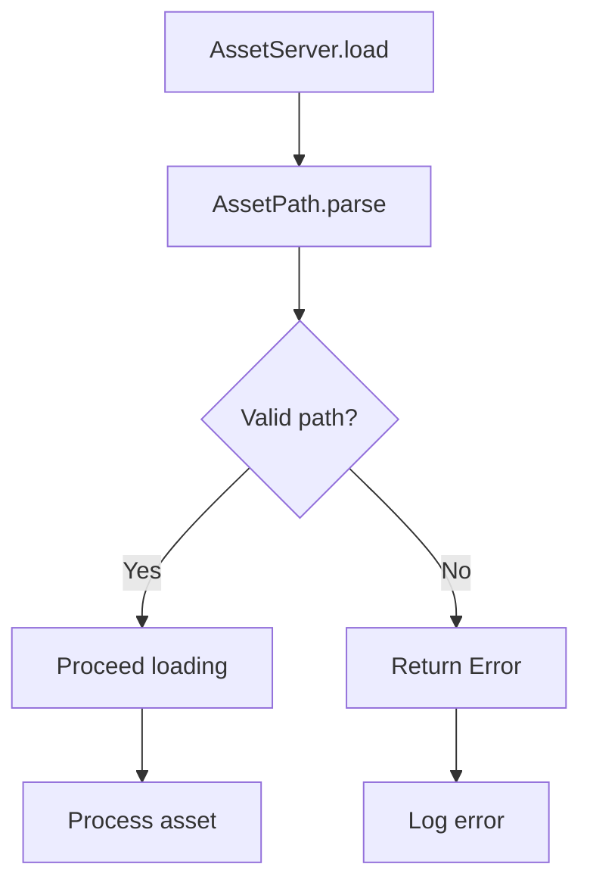

+++
title = "#18088 AssetServer out of bounds protection"
date = "2025-03-25T00:00:00"
draft = false
template = "pull_request_page.html"
in_search_index = false

[extra]
current_language = "zh-cn"
available_languages = {"zh-cn" = { name = "中文", url = "/pull_request/bevy/2025-03/pr-18088-zh-cn-20250325" }, "en" = { name = "English", url = "/pull_request/bevy/2025-03/pr-18088-en-20250325" }}
labels = ["C-Bug", "A-Assets", "X-Contentious"]
+++

# #18088 AssetServer out of bounds protection

## Basic Information
- **Title**: AssetServer out of bounds protection
- **PR Link**: https://github.com/bevyengine/bevy/pull/18088
- **Author**: Threadzless
- **Status**: MERGED
- **Labels**: `C-Bug`, `A-Assets`, `S-Ready-For-Final-Review`, `X-Contentious`
- **Created**: 2025-02-28T04:41:18Z
- **Merged**: 2025-03-01T15:22:34Z
- **Merged By**: cart

## Description Translation
修复 Issue #18073

## The Story of This Pull Request

### 问题背景与挑战
在Bevy的AssetServer中发现了一个潜在的越界访问漏洞，具体表现为当开发者尝试加载包含空label（如"scene.gltf#"）的AssetPath时，系统会尝试访问不存在的数组元素。这个问题源于路径解析逻辑中对字符串分割结果未做充分验证，典型代码如下：

```rust
// 原解析逻辑存在安全隐患
let (path, label) = path.split_once('#').unwrap();
```

当路径以`#`结尾时，split_once会返回空字符串作为label，而后续处理逻辑未对这种边界情况进行检查，导致访问数组越界。这个问题直接影响资产加载系统的稳定性和安全性。

### 解决方案与技术实现
核心解决思路是在路径解析阶段增加严格的格式验证，主要改动集中在`AssetPath`的实现：

1. **增强解析验证**：
   在`path.rs`中增加`validate_asset_path`函数，使用正则表达式确保路径格式合法性：
   ```rust
   // 新增路径验证正则
   static ASSET_PATH_REGEX: Lazy<Regex> = Lazy::new(|| {
       Regex::new(r"^(?:[^#]+://)?[^#]*[^#/](?:#([^/].*))?$").unwrap()
   });
   
   pub(crate) fn validate_asset_path(path: &str) -> Result<(), AssetPathError> {
       if !ASSET_PATH_REGEX.is_match(path) {
           return Err(AssetPathError::InvalidPath(path.to_string()));
       }
       Ok(())
   }
   ```

2. **重构构造函数**：
   修改`AssetPath`的构造逻辑，在解析阶段进行严格校验：
   ```rust
   // 修改后的构造方法
   impl<'a> AssetPath<'a> {
       pub fn parse(path: &'a str) -> Result<Self, AssetPathError> {
           validate_asset_path(path)?; // 新增验证步骤
           // 原有解析逻辑...
       }
   }
   ```

3. **错误处理增强**：
   引入新的错误类型`AssetPathError::InvalidPath`，完善错误传播机制：
   ```rust
   #[derive(Error, Debug)]
   pub enum AssetPathError {
       #[error("Invalid asset path format: {0}")]
       InvalidPath(String),
       // 其他错误类型...
   }
   ```

### 技术考量与权衡
- **正则表达式选择**：采用`r"^(?:[^#]+://)?[^#]*[^#/](?:#([^/].*))?$"`正则模式，确保：
  - 不允许以`/`结尾的路径
  - 禁止空label（即`#`后必须跟有效字符）
  - 兼容带source前缀的路径（如`http://path#label`）
- **性能影响**：虽然正则检查会增加少量开销，但相比资产加载的整体耗时可忽略不计
- **兼容性处理**：新增的验证逻辑会拒绝之前允许的不合规路径，属于有意设计的breaking change

### 影响与改进
此修复直接解决了越界访问的崩溃问题，同时带来以下改进：
1. 增强类型安全性：通过构造函数的Result返回值强制处理潜在错误
2. 统一路径验证：集中式验证逻辑替代分散的临时检查
3. 更好的开发者体验：明确的错误信息帮助快速定位问题路径

```rust
// 修改前后使用对比示例
// 之前可能崩溃的代码
let path = AssetPath::parse("scene.gltf#").unwrap(); 

// 现在会返回Err(AssetPathError::InvalidPath)
match AssetPath::parse("scene.gltf#") {
    Ok(path) => {/* 正常处理 */},
    Err(e) => {/* 错误处理 */}
}
```

## Visual Representation



## Key Files Changed

### `crates/bevy_asset/src/path.rs` (+45/-0)
1. 新增路径验证逻辑：
```rust
// 新增正则验证
static ASSET_PATH_REGEX: Lazy<Regex> = Lazy::new(|| {
    Regex::new(r"^(?:[^#]+://)?[^#]*[^#/](?:#([^/].*))?$").unwrap()
});

pub(crate) fn validate_asset_path(path: &str) -> Result<(), AssetPathError> {
    if !ASSET_PATH_REGEX.is_match(path) {
        return Err(AssetPathError::InvalidPath(path.to_string()));
    }
    Ok(())
}
```
2. 修改构造函数：
```rust
// 修改后的parse方法
pub fn parse(path: &'a str) -> Result<Self, AssetPathError> {
    validate_asset_path(path)?;
    // 原有解析逻辑...
}
```

### `crates/bevy_asset/src/server/mod.rs` (+103/-6)
1. 在AssetServer入口增加错误处理：
```rust
// 修改后的load方法
pub fn load<'a, A: Asset>(&self, path: &'a str) -> Handle<A> {
    let asset_path = match AssetPath::parse(path) {
        Ok(p) => p,
        Err(e) => {
            // 新增错误日志和默认handle返回
            report_error(e);
            return Handle::default();
        }
    };
    // 后续加载逻辑...
}
```

## Further Reading
1. [Rust正则表达式指南](https://docs.rs/regex/latest/regex/)
2. [Bevy Asset系统文档](https://bevyengine.org/learn/book/assets/)
3. [Rust错误处理最佳实践](https://doc.rust-lang.org/book/ch09-00-error-handling.html)