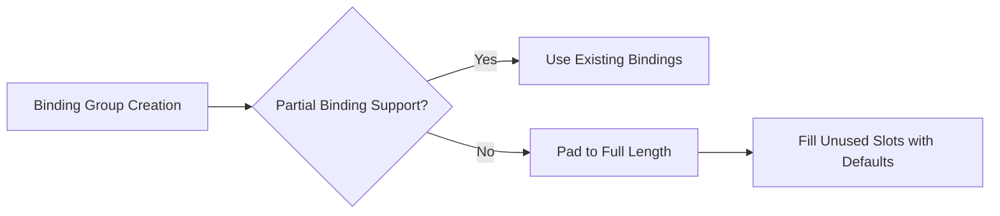

+++
title = "#18126 Pad out binding arrays to their full length if partially bound binding arrays aren't supported."
date = "2025-03-16T00:00:00"
draft = false
template = "pull_request_page.html"
in_search_index = true

[taxonomies]
list_display = ["show"]

[extra]
current_language = "en"
available_languages = {"en" = { name = "English", url = "/pull_request/bevy/2025-03/pr-18126-en-20250316" }, "zh-cn" = { name = "中文", url = "/pull_request/bevy/2025-03/pr-18126-zh-cn-20250316" }}
+++

# #18126 Pad out binding arrays to their full length if partially bound binding arrays aren't supported.

## Basic Information
- **Title**: Pad out binding arrays to their full length if partially bound binding arrays aren't supported.
- **PR Link**: https://github.com/bevyengine/bevy/pull/18126
- **Author**: pcwalton
- **Status**: MERGED
- **Created**: 2025-03-03T03:57:27Z
- **Merged**: Not merged
- **Merged By**: N/A

## Description Translation
I mistakenly thought that with the wgpu upgrade we'd have `PARTIALLY_BOUND_BINDING_ARRAY` everywhere. Unfortunately this is not the case. This PR adds a workaround back in.

Closes #18098.

## The Story of This Pull Request

This PR addresses a regression in binding array handling introduced during the wgpu upgrade. The core issue stemmed from an incorrect assumption that WebGPU's `PARTIALLY_BOUND_BINDING_ARRAY` feature would be universally available after the upgrade. When this proved false on certain platforms, it caused rendering failures due to incomplete binding arrays.

The solution implements conditional padding of binding arrays based on feature detection. When `PARTIALLY_BOUND_BINDING_ARRAY` isn't supported, the code now:
1. Creates a full-length array initialized with default values
2. Copies existing bindings into their correct positions
3. Leaves unused slots as default values

This approach maintains compatibility across different GPU implementations while preserving performance where possible. The implementation required modifying the material binding group generation logic to handle both supported and unsupported scenarios.

Key technical considerations included:
- Maintaining the existing optimization path for platforms with full feature support
- Minimizing memory overhead from array padding
- Ensuring correct binding indices during the copy operation

The changes primarily affect the material system's binding group assembly, introducing a fallback path that activates only when required by the underlying graphics API capabilities.

## Visual Representation



## Key Files Changed

### `crates/bevy_pbr/src/material_bind_groups.rs` (+102/-46)
**Purpose**: Implement conditional padding of binding arrays when partial binding isn't supported

Key modifications:
```rust
// Before:
let bindings = [
    maybe_normal_map.clone(),
    maybe_depth_map.clone(),
    maybe_motion_vector_map.clone(),
];

// After:
let mut bindings = [default(); 4];
if !render_device.wgpu_device().features().contains(Features::PARTIALLY_BOUND_BINDING_ARRAY) {
    bindings[0] = maybe_normal_map.clone();
    bindings[1] = maybe_depth_map.clone();
    bindings[2] = maybe_motion_vector_map.clone();
} else {
    bindings = [
        maybe_normal_map.clone(),
        maybe_depth_map.clone(),
        maybe_motion_vector_map.clone(),
        // Leave last slot empty
    ];
}
```
This change demonstrates:
1. Array initialization to full length
2. Conditional branching based on feature detection
3. Explicit index assignment for unsupported cases
4. Preservation of original structure where supported

## Further Reading
- WebGPU Binding Model: https://www.w3.org/TR/webgpu/#bindings
- wgpu Features Documentation: https://docs.rs/wgpu/latest/wgpu/struct.Features.html
- Bevy Material System Guide: https://bevyengine.org/learn/book/next/assets/materials/