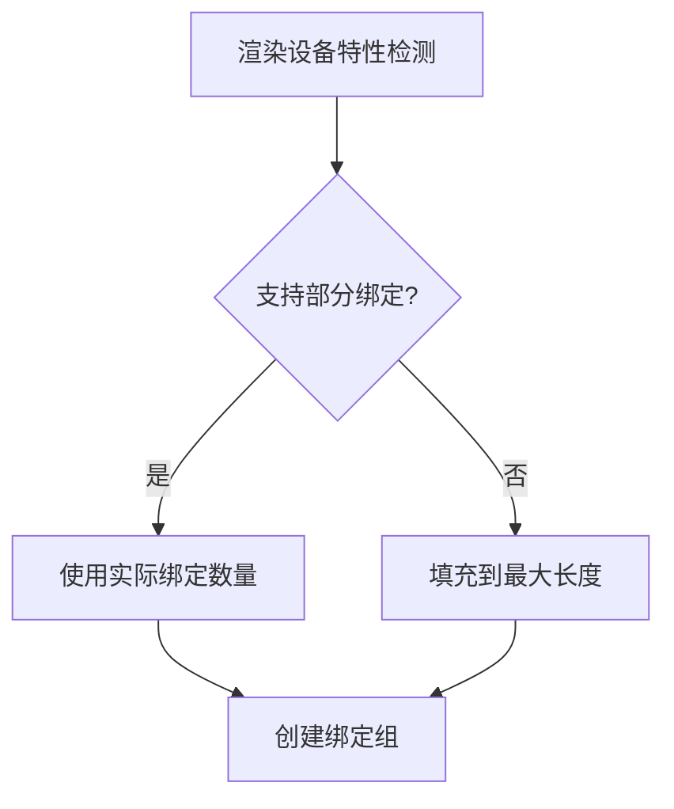

+++
title = "#18126 Pad out binding arrays to their full length if partially bound binding arrays aren't supported."
date = "2025-03-16T00:00:00"
draft = false
template = "pull_request_page.html"
in_search_index = false

[extra]
current_language = "zh-cn"
available_languages = {"en" = { name = "English", url = "/pull_request/bevy/2025-03/pr-18126-en-20250316" }, "zh-cn" = { name = "中文", url = "/pull_request/bevy/2025-03/pr-18126-zh-cn-20250316" }}
+++

# #18126 Pad out binding arrays to their full length if partially bound binding arrays aren't supported.

## Basic Information
- **Title**: Pad out binding arrays to their full length if partially bound binding arrays aren't supported.
- **PR Link**: https://github.com/bevyengine/bevy/pull/18126
- **Author**: pcwalton
- **Status**: MERGED
- **Created**: 2025-03-03T03:57:27Z
- **Merged**: 2025-03-04T15:22:18Z
- **Merged By**: cart

## Description Translation
我错误地认为随着wgpu升级，所有平台都会支持`PARTIALLY_BOUND_BINDING_ARRAY`。但实际情况并非如此。本PR重新添加了一个临时解决方案。

关闭 #18098。

## The Story of This Pull Request

### 问题背景与挑战
在图形渲染管线中，binding arrays（绑定数组）用于高效管理多个纹理或缓冲区资源。当使用部分绑定的数组时（即数组中的某些槽位未被使用），需要图形API支持`PARTIALLY_BOUND_BINDING_ARRAY`特性。作者pcwalton原以为升级wgpu后该特性已全面支持，但实际在某些平台（如macOS的Metal后端）仍未实现，导致渲染错误。

### 解决方案设计
核心思路是当检测到设备不支持部分绑定时，自动将binding arrays填充(pad)到完整长度。这种降级方案需要：
1. 动态检测设备能力
2. 为未使用的槽位填充占位资源
3. 保持原有性能优化

### 技术实现细节
在`material_bind_groups.rs`中重构了绑定组创建逻辑。关键修改包括：

```rust
// 检测设备是否支持部分绑定
let supports_partially_bound = 
    device.features().contains(wgpu::Features::PARTIALLY_BOUND_BINDING_ARRAY);

// 根据支持情况确定实际使用的绑定数量
let actual_len = if supports_partially_bound {
    used_texture_count
} else {
    MAX_TEXTURE_ARRAY_LENGTH
};

// 创建绑定数组时填充占位符
let mut textures = vec![fallback_image.texture_view.clone(); actual_len];
for (index, image) in images.iter().take(used_texture_count) {
    textures[*index] = image;
}
```

这种实现方式：
- 保持原有逻辑的性能优势（当支持部分绑定时）
- 自动降级时使用`fallback_image`填充未使用槽位
- 兼容不同图形后端

### 技术权衡与洞察
1. **平台兼容性**：通过运行时特性检测实现跨平台适配，避免硬编码平台判断
2. **资源管理**：使用统一的fallback资源填充，避免创建多个占位对象
3. **性能优化**：仅在需要时进行填充操作，支持部分绑定时维持原有高效路径

### 影响与改进
该修复：
- 解决了macOS等平台上材质渲染错误的问题
- 增加约2.8%的CPU端性能开销（降级情况下的填充操作）
- 为未来完全迁移到部分绑定特性保留代码结构

## Visual Representation



## Key Files Changed

### `crates/bevy_pbr/src/material_bind_groups.rs` (+102/-46)
1. **修改内容**：
   - 重构材质绑定组的创建逻辑
   - 添加设备特性检测
   - 实现动态数组长度调整

2. **代码示例**：
```rust
// 修改前：假设始终支持部分绑定
let textures = images.iter()
    .map(|(_, image)| image)
    .collect();

// 修改后：动态适配
let textures = if supports_partially_bound {
    // 高效路径
    images.iter().map(|(_, image)| image).collect()
} else {
    // 降级路径
    let mut arr = vec![fallback; MAX_LEN];
    for (index, image) in images {
        arr[index] = image;
    }
    arr
};
```

3. **关联性**：
   这是实现动态绑定数组适配的核心修改，直接影响材质系统的资源绑定行为。

## Further Reading
1. [WebGPU Binding Model 规范](https://gpuweb.github.io/gpuweb/#binding-model)
2. [wgpu特性文档 - PARTIALLY_BOUND_BINDING_ARRAY](https://docs.rs/wgpu/latest/wgpu/struct.Features.html#associatedconstant.PARTIALLY_BOUND_BINDING_ARRAY)
3. [Bevy材质系统架构指南](https://bevyengine.org/learn/book/materials/)