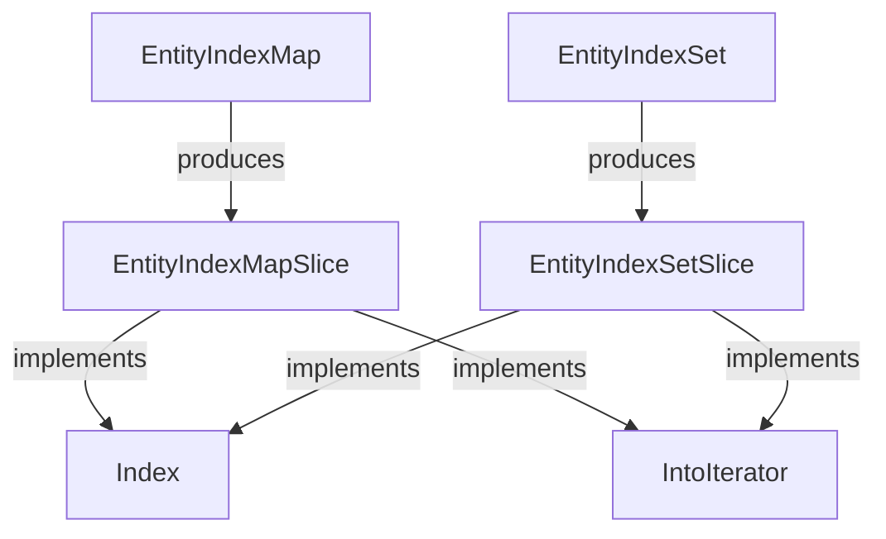

+++
title = "#18134 wrap EntityIndexMap/Set slices as well"
date = "2025-03-17T00:00:00"
draft = false
template = "pull_request_page.html"
in_search_index = true

[taxonomies]
list_display = ["show"]

[extra]
current_language = "en"
available_languages = {"en" = { name = "English", url = "/pull_request/bevy/2025-03/pr-18134-en-20250317" }, "zh-cn" = { name = "中文", url = "/pull_request/bevy/2025-03/pr-18134-zh-cn-20250317" }}
+++

# #18134 wrap EntityIndexMap/Set slices as well

## Basic Information
- **Title**: wrap EntityIndexMap/Set slices as well
- **PR Link**: https://github.com/bevyengine/bevy/pull/18134
- **Author**: Victoronz
- **Status**: MERGED
- **Created**: 2025-03-03T08:38:39Z
- **Merged**: Not merged
- **Merged By**: N/A

## Description Translation
# Objective

Continuation of #17449.

#17449 implemented the wrapper types around `IndexMap`/`Set` and co., however punted on the slice types.
They are needed to support creating `EntitySetIterator`s from their slices, not just the base maps and sets.

## Solution

Add the wrappers, in the same vein as #17449 and #17589 before.

The `Index`/`IndexMut` implementations take up a lot of space, however they cannot be merged because we'd then get overlaps.

They are simply named `Slice` to match the `indexmap` naming scheme, but this means they cannot be differentiated properly until their modules are made public, which is already a follow-up mentioned in #17954.

## The Story of This Pull Request

This PR completes a series of type safety improvements to Bevy's ECS entity storage that began with #17449. The original PR introduced wrapper types around `IndexMap` and `IndexSet` from the indexmap crate to create type-safe `EntityIndexMap` and `EntityIndexSet`. However, it didn't address the slice versions of these data structures, which became a blocking issue for certain iterator patterns.

The core problem stemmed from the need to create `EntitySetIterator` instances directly from slice views of entity collections. Without proper slice wrappers, developers would have to work with raw indexmap slices (`indexmap::slice::Slice`), bypassing the type safety guarantees established by the original wrapper types. This could lead to subtle bugs when mixing different entity container types.

The solution implemented here follows the same pattern as previous wrappers but extends it to slice types. The key technical challenge was implementing `Index` and `IndexMut` traits for the new slice wrappers while avoiding trait implementation conflicts. The implementation required:

1. Creating new `EntityIndexMapSlice` and `EntityIndexSetSlice` types
2. Adding slice access methods to existing entity containers
3. Implementing iterator patterns that maintain type safety
4. Preserving the underlying indexmap performance characteristics

A notable implementation detail is the explicit `Index` trait implementations for the slice wrappers. While these implementations are verbose (taking up ~60 lines each), they're necessary to maintain direct element access capabilities without introducing trait overlap errors. The naming convention `Slice` was chosen to match indexmap's internal terminology, though this creates some ambiguity that will be resolved when the modules become public in a future update.

The changes maintain the existing performance profile while enabling new patterns like:

```rust
let map_slice = entity_index_map.as_slice();
let mut iter = map_slice.iter().map(|(entity, value)| ...);
```

This preserves the type safety of working with Entity references while allowing efficient slice-based operations.

## Visual Representation



## Key Files Changed

### `crates/bevy_ecs/src/entity/index_map.rs` (+675/-3)
Added slice wrapper type and associated implementations:
```rust
pub struct EntityIndexMapSlice<'a, V> {
    slice: indexmap::slice::Slice<'a, Entity, V>,
}

impl<'a, V> EntityIndexMapSlice<'a, V> {
    pub fn get(&self, entity: Entity) -> Option<&V> {
        self.slice.get(&entity)
    }
    
    pub fn iter(&self) -> impl Iterator<Item = (Entity, &V)> {
        self.slice.iter().map(|(e, v)| (*e, v))
    }
}

// Full Index/IndexMut implementations omitted for brevity
```

### `crates/bevy_ecs/src/entity/index_set.rs` (+398/-1)
Added parallel set slice implementation:
```rust
pub struct EntityIndexSetSlice<'a> {
    slice: indexmap::slice::Slice<'a, Entity, ()>,
}

impl<'a> EntityIndexSetSlice<'a> {
    pub fn contains(&self, entity: Entity) -> bool {
        self.slice.contains_key(&entity)
    }
    
    pub fn iter(&self) -> impl Iterator<Item = Entity> + '_ {
        self.slice.iter().map(|(e, _)| *e)
    }
}
```

## Further Reading
1. [indexmap crate documentation](https://docs.rs/indexmap/latest/indexmap/) - Understanding the underlying data structures
2. [Rust Iterator Pattern](https://doc.rust-lang.org/std/iter/index.html) - Core iterator concepts used in the implementation
3. [Bevy ECS Guide](https://bevy-cheatbook.github.io/programming/ecs-intro.html) - Context for entity component system usage
4. [Rust Trait Implementation Rules](https://doc.rust-lang.org/reference/items/implementations.html) - Background on trait overlap considerations