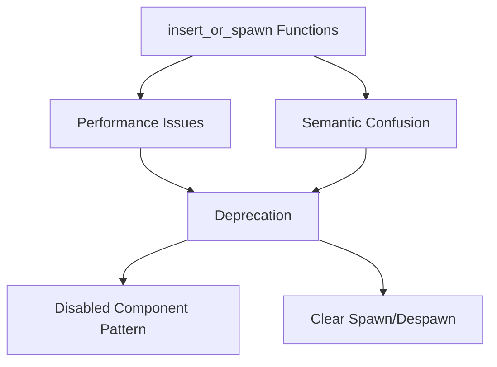

+++
title = "Pull Request"
date = "2025-03-07T18:33:50"
draft = false
template = "pull_request_page.html"
+++

+++
title = "Pull Request"
date = "2025-03-07T15:33:41"
draft = false
template = "pull_request_page.html"
+++

+++
title = "Pull Request"
date = "2025-03-07T12:33:32"
draft = false
template = "pull_request_page.html"
+++

+++
title = "Pull Request"
date = "2025-03-07T09:33:28"
draft = false
template = "pull_request_page.html"
+++

+++
title = "Pull Request"
date = "2025-03-07T06:33:25"
draft = false
template = "pull_request_page.html"
+++

# #18147 Deprecate `insert_or_spawn` function family

## Basic Information
- **Title**: Deprecate `insert_or_spawn` function family
- **PR Link**: https://github.com/bevyengine/bevy/pull/18147
- **Author**: ElliottjPierce
- **Status**: MERGED
- **Created**: 2025-03-03T23:37:24Z
- **Merged**: Not merged
- **Merged By**: N/A

## Description Translation
# Objective

Based on #18054, this PR builds on #18035 to deprecate:
- `Commands::insert_or_spawn_batch`
- `Entities::alloc_at_without_replacement`
- `Entities::alloc_at`
- `World::insert_or_spawn_batch`
- `World::insert_or_spawn_batch_with_caller`

## Testing

Just deprecation, so no new tests. Note that as of writing #18035 is still under testing and review.

## Open Questions

- [x] Should `entity::AllocAtWithoutReplacement` be deprecated? It is internal and only used in `Entities::alloc_at_without_replacement`.  **EDIT:** Now deprecated.

## Migration Guide

The following functions have been deprecated:
- `Commands::insert_or_spawn_batch`
- `World::insert_or_spawn_batch`
- `World::insert_or_spawn_batch_with_caller`

These functions, when used incorrectly, can cause major performance problems and are generally viewed as anti-patterns and foot guns. These are planned to be removed altogether in 0.17.

Instead of these functions consider doing one of the following:

Option A) Instead of despawing entities and re-spawning them at a particular id, insert the new `Disabled` component without despawning the entity, and use `try_insert_batch` or `insert_batch` and remove `Disabled` instead of re-spawning it.

Option B) Instead of giving special meaning to an entity id, simply use `spawn_batch` and ensure entity references are valid when despawning.

## The Story of This Pull Request

In the evolving world of Bevy's Entity Component System (ECS), we occasionally encounter patterns that initially seem convenient but later reveal hidden costs. This PR tells the story of recognizing such a pattern in entity management and taking proactive steps to prevent future performance pitfalls.

The journey began with the realization that the `insert_or_spawn` family of functions created a dangerous temptation. These methods allowed developers to either insert components into existing entities or spawn new ones at specific IDs if they didn't exist. While this seemed helpful for entity reuse, it masked two critical issues:

1. **Performance Traps**: The pattern encouraged keeping entity IDs alive through despawning and respawning, which could lead to:
   ```rust
   // Problematic usage pattern
   commands.insert_or_spawn_batch((0..1000).map(|_| (ComponentA, ComponentB)));
   ```
   This approach risked creating fragmented entity storage and breaking spatial memory layouts crucial for ECS performance.

2. **Semantic Confusion**: By blurring the line between entity creation and modification, these methods made code harder to reason about and opened doors to subtle bugs.

The Bevy team's solution came through two complementary approaches revealed in the migration guide. First, introducing the `Disabled` component pattern for temporary entity deactivation:
```rust
// New recommended pattern (Option A)
commands.entity(some_entity)
    .insert(Disabled)
    // ... later ...
    .remove::<Disabled>();
```

Second, advocating for proper entity lifecycle management through clear spawn/despawn boundaries (Option B). Both approaches preserve cache efficiency while making entity state transitions explicit.

The implementation strategy focused on gradual deprecation rather than immediate removal. Developers added clear warnings through Rust's deprecation attributes while maintaining backward compatibility:
```rust
#[deprecated(
    since = "0.16.0",
    note = "This method is considered an anti-pattern and will be removed in 0.17. Prefer using `spawn_batch` or inserting the `Disabled` component."
)]
pub fn insert_or_spawn_batch(&mut self, bundles: impl Iterator<Item = impl Bundle>) {
    // ... existing implementation ...
}
```

This approach balanced immediate developer education with a migration runway. The changes touched multiple layers of the ECS architecture:
- Command system interfaces
- World entity allocation internals
- Core library exports

By deprecating related internal types like `entity::AllocAtWithoutReplacement`, the team ensured the entire problematic pattern was marked for removal, not just its public-facing APIs.

## Visual Representation



## Key Files Changed

1. **crates/bevy_ecs/src/system/commands/mod.rs**
```rust
#[deprecated(
    since = "0.16.0",
    note = "This method is considered an anti-pattern..."
)]
pub fn insert_or_spawn_batch(&mut self, bundles: impl Iterator<Item = impl Bundle>) {
    self.queue.push(InsertOrSpawnBatch { bundles });
}
```
Added deprecation warnings to command API entry points.

2. **crates/bevy_ecs/src/entity/mod.rs**
```rust
#[deprecated(
    since = "0.16.0",
    note = "Prefer using explicit entity management..."
)]
pub fn alloc_at(&mut self, index: Index) -> Entity {
    self.alloc_at_without_replacement(index).entity
}
```
Marked low-level entity allocation methods as deprecated.

3. **crates/bevy_ecs/src/world/mod.rs**
```rust
#[deprecated(
    since = "0.16.0",
    note = "This method is considered an anti-pattern..."
)]
pub fn insert_or_spawn_batch<I: Iterator<Item = impl Bundle>>(&mut self, iter: I) {
    self.insert_or_spawn_batch_with_caller(iter, None);
}
```
Deprecated world-level batch operations to ensure consistency across APIs.

## Further Reading

1. [Bevy ECS Best Practices](https://bevyengine.org/learn/book/ECS-best-practices/)
2. [Entity Component System Pattern](https://en.wikipedia.org/wiki/Entity_component_system)
3. [Rust Deprecation Attributes](https://doc.rust-lang.org/reference/attributes/diagnostics.html#the-deprecated-attribute)
4. [Memory Layout Optimization in ECS](https://gamesfromwithin.com/data-oriented-design)