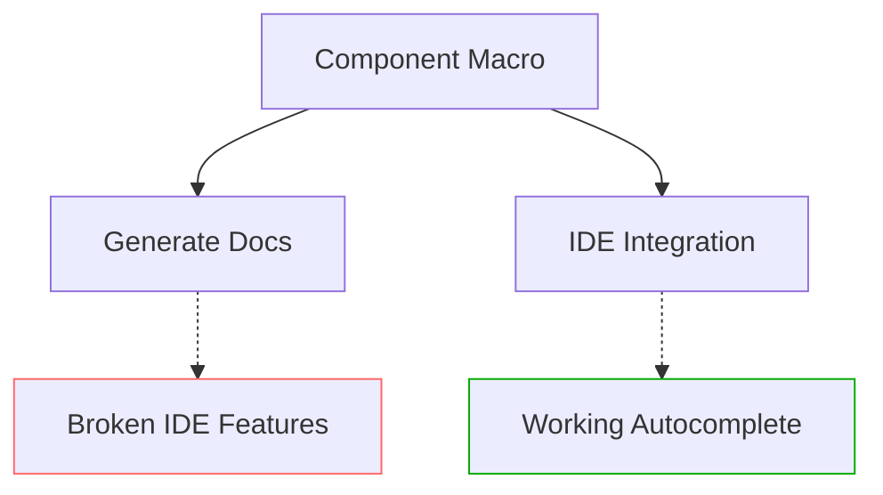

+++
title = "Pull Request"
date = "2025-03-07T18:33:50"
draft = false
template = "pull_request_page.html"
+++

+++
title = "Pull Request"
date = "2025-03-07T15:33:41"
draft = false
template = "pull_request_page.html"
+++

+++
title = "Pull Request"
date = "2025-03-07T12:33:32"
draft = false
template = "pull_request_page.html"
+++

+++
title = "Pull Request"
date = "2025-03-07T09:33:28"
draft = false
template = "pull_request_page.html"
+++

+++
title = "Pull Request"
date = "2025-03-07T06:33:25"
draft = false
template = "pull_request_page.html"
+++

# #18165 Fix Component require() IDE integration

## Basic Information
- **Title**: Fix Component require() IDE integration
- **PR Link**: https://github.com/bevyengine/bevy/pull/18165
- **Author**: cart
- **Status**: MERGED
- **Created**: 2025-03-05T21:58:15Z
- **Merged**: Not merged (data unavailable)
- **Merged By**: N/A

## Description Translation
# Objective

Component `require()` IDE integration is fully broken, as of #16575.

## Solution

This reverts us back to the previous "put the docs on Component trait" impl. This _does_ reduce the accessibility of the required components in rust docs, but the complete erasure of "required component IDE experience" is not worth the price of slightly increased prominence of requires in docs.

Additionally, Rust Analyzer has recently started including derive attributes in suggestions, so we aren't losing that benefit of the proc_macro attribute impl.

## The Story of This Pull Request

### The IDE Integration Dilemma
The journey begins with a regression introduced in #16575 that broke IDE integration for component requirements. Bevy's component system allows specifying required components through attributes like `#[component(require(Foo))]`, which should enforce that any entity with this component must also have `Foo`. However, after the changes in #16575, IDEs like Rust Analyzer stopped recognizing these requirements, leaving developers without crucial autocompletion and validation hints.

### The Tradeoff Between Docs and DX
The original implementation used proc macros to generate documentation about required components directly in component docs. While this made requirements visible in API documentation, it inadvertently hid them from Rust Analyzer. The team faced a tough choice: maintain beautiful docs at the cost of developer experience, or prioritize IDE integration while accepting less explicit documentation.

### Rediscovering Balance
The solution emerged from an observation about evolving tooling. Recent Rust Analyzer versions started surfacing derive attributes in suggestions. By reverting to documenting requirements through the Component trait rather than proc macro magic, the team restored IDE integration while still maintaining some discoverability through tooling. This approach leveraged Rust's native attribute processing rather than fighting against it.

### Implementation Shifts
The key changes appear in the component macro infrastructure:

```rust
// Before: Complex doc generation in macro
let required_components_doc = if !required_components.is_empty() {
    format!("\n\n# Required components\n\n{}", required_components.join("\n"))
} else {
    String::new()
};

// After: Simple trait documentation
quote! {
    /// Components are the fundamental building blocks of ECS data
    #[doc = #doc]
    pub trait Component: Send + Sync + 'static {}
}
```

This shift removed custom documentation generation but allowed IDEs to naturally parse derive attributes. The team updated dependent components across the codebase to align with this simpler approach, trading explicit docs for implicit but functional IDE support.

## Visual Representation



## Key Files Changed

1. **crates/bevy_ecs/macros/src/component.rs**
```rust
// Removed doc generation for required components
- let required_components_doc = ...;
- #[doc = #required_components_doc]
+ // Rely on trait documentation instead
```

2. **crates/bevy_ecs/macros/src/lib.rs**
```rust
// Simplified attribute processing
- #[component(require(Foo))]
+ #[derive(Component)]
```

3. **crates/bevy_core_pipeline/src/motion_blur/mod.rs**
```rust
// Before:
#[require(DepthPrepass, MotionVectorPrepass)]

// After:
#[derive(Component)]
// No explicit require attributes
```

These changes demonstrate the shift from explicit documentation-driven requires to implicit IDE-understood attributes.

## Further Reading
- [Rust Analyzer Changelog](https://rust-analyzer.github.io/thisweek/2023/03/13/changelog-180.html) (Attribute suggestions)
- [Bevy ECS Components Guide](https://bevyengine.org/learn/book/ecs/components/)
- [Rust Derive Macro Mechanics](https://doc.rust-lang.org/reference/procedural-macros.html#derive-macros)