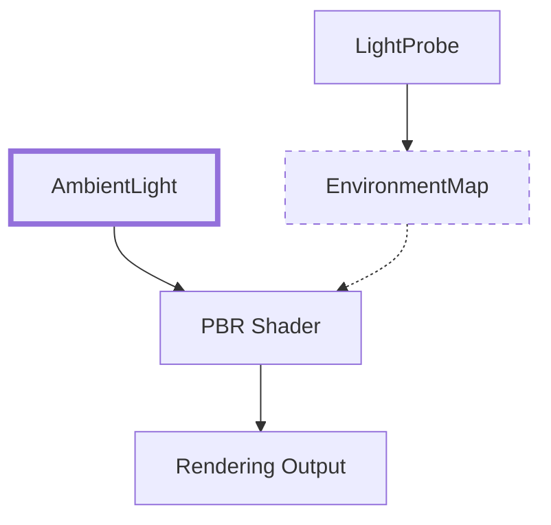

+++
title = "PR #18167"
date = "2025-03-06T00:00:00"
draft = false
template = "pull_request_page.html"
in_search_index = true

[taxonomies]
list_display = ["show"]

[extra]
current_language = "en"
available_languages = {"zh-cn" = { name = "中文", url = "/pull_request/bevy/2025-03/pr-18167-zh-cn-20250306-175358" }, "en" = { name = "English", url = "/pull_request/bevy/2025-03/pr-18167-en-20250306-175358" }}
+++

## Visual Representation

Key:
- Solid green: Restored components
- Dashed red: Temporarily removed components