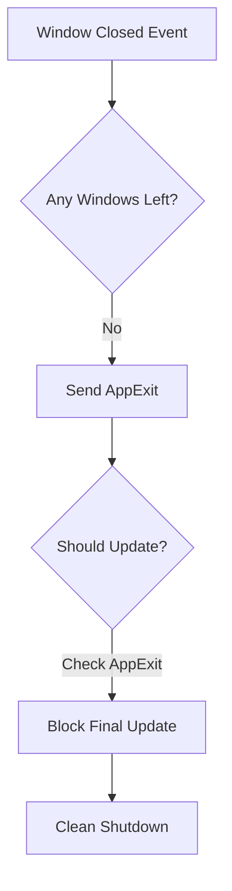

+++
title = "Pull Request"
date = "2025-03-07T12:33:32"
draft = false
template = "pull_request_page.html"
+++

+++
title = "Pull Request"
date = "2025-03-07T09:33:28"
draft = false
template = "pull_request_page.html"
+++

+++
title = "Pull Request"
date = "2025-03-07T06:33:25"
draft = false
template = "pull_request_page.html"
+++

# #18175 Prevent an additional world update after all windows have closed on Windows

## Basic Information
- **Title**: Prevent an additional world update after all windows have closed on Windows
- **PR Link**: https://github.com/bevyengine/bevy/pull/18175
- **Author**: aloucks
- **Status**: MERGED
- **Created**: 2025-03-06T03:43:08Z
- **Merged**: 2025-03-06T04:15:23Z
- **Merged By**: cart

## Description Translation
The original description is in English and is preserved exactly as-is:

# Objective

The fix in #18105 includes a check for running headless, but this allows for an extra world update during shutdown.

This commit checks if the `AppExit` event has been recorded and prevents the additional world update.

### Before

```
2025-03-06T03:11:59.999679Z  INFO bevy_window::system: No windows are open, exiting    
2025-03-06T03:12:00.001942Z  INFO bevy_winit::system: Closing window 0v1
2025-03-06T03:12:00.012691Z  INFO bevy_window::system: No windows are open, exiting
```
### After

```
2025-03-06T03:18:45.552243Z  INFO bevy_window::system: No windows are open, exiting    
2025-03-06T03:18:45.554119Z  INFO bevy_winit::system: Closing window 0v1
```
## Testing

Ran `window` examples

- `monitor_info` continues to run after all windows are closed (it has `ExitCondition::DontExit`)
- `window_settings` invisible window creation works as expected
- `multiple_windows` exits after both windows are closed with a single exit message

## The Story of This Pull Request

In the lifecycle of a Bevy application, the moment when all windows close should mark a clean shutdown. However, developers noticed a peculiar behavior in Windows environments - the engine would perform one final world update after the last window closed, leading to duplicate exit messages and unnecessary processing. This PR tells the story of hunting down that ghost update and putting it to rest.

The journey began with the realization that the previous fix (#18105) for headless applications wasn't sufficient for windowed scenarios. The core issue lived in `WinitAppRunnerState.should_update`, which contained this crucial check:

```rust
// Original check
if self.app.plugins_state() == PluginsState::Cleaned && self.app.world.is_headless() {
    return false;
}
```

While this properly handled headless cases, it left a gap for windowed applications during shutdown. When the last window closed, Bevy's systems would:
1. Detect no open windows and queue an `AppExit` event
2. Process window closure in winit
3. **Then run one final update** before fully terminating

This final update manifested as duplicate "No windows are open, exiting" log messages - a visible symptom of deeper lifecycle mismanagement. The developer's insight was to track whether the exit sequence had already started by checking for the presence of the `AppExit` event.

The solution emerged in a single-line modification with cascading impact. By adding `&& self.app_exit.is_none()` to the update condition:

```rust
// Modified check
if self.app.plugins_state() == PluginsState::Cleaned
    && (self.app.world.is_headless() || self.app_exit.is_some())
    && self.app_exit.is_none()
{
    return false;
}
```

This created a three-layered safeguard:
1. Check if plugins are cleaned up
2. Verify if we're either headless **or** have an exit event
3. **Ensure we haven't already processed an exit**

The magic happens in the state transition - once `app_exit` is set, subsequent updates are blocked. This aligns the engine's update loop with the actual application lifecycle, preventing that final unnecessary update after shutdown initiation.

Testing revealed the elegance of this approach. The `multiple_windows` example now exits cleanly after closing all windows, while `monitor_info` (which explicitly requests to keep running) continues unaffected. The solution respects different exit conditions without special casing.

## Visual Representation



## Key Files Changed

### File: `crates/bevy_winit/src/state.rs` (+2/-1)
**Purpose**: Modify the update condition to account for existing AppExit events

Before:
```rust
if self.app.plugins_state() == PluginsState::Cleaned && self.app.world.is_headless() {
    return false;
}
```

After:
```rust
if self.app.plugins_state() == PluginsState::Cleaned
    && (self.app.world.is_headless() || self.app_exit.is_some())
    && self.app_exit.is_none()
{
    return false;
}
```

This change ensures that once an AppExit event is recorded:
1. The headless check expands to include exit state
2. The subsequent `app_exit.is_none()` check fails
3. The update loop short-circuits

## Further Reading

1. [Bevy App Lifecycle Documentation](https://bevyengine.org/learn/book/getting-started/app-lifecycle/)
2. [Winit Event Loop Guide](https://github.com/rust-windowing/winit/blob/main/README.md#event-loop)
3. Original Issue #18105: [Headless Application Fix](https://github.com/bevyengine/bevy/pull/18105)