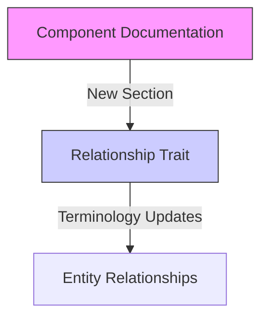

+++
title = "#18179 Update Component docs to point to Relationship trait"
date = "2025-03-09T00:00:00"
draft = false
template = "pull_request_page.html"
in_search_index = true

[taxonomies]
list_display = ["show"]

[extra]
current_language = "en"
available_languages = {"en" = { name = "English", url = "/pull_request/bevy/2025-03/pr-18179-en-20250309" }, "zh-cn" = { name = "中文", url = "/pull_request/bevy/2025-03/pr-18179-zh-cn-20250309" }}
+++

# #18179 Update Component docs to point to Relationship trait

## Basic Information
- **Title**: Update Component docs to point to Relationship trait  
- **PR Link**: https://github.com/bevyengine/bevy/pull/18179  
- **Author**: krunchington  
- **Status**: MERGED  
- **Created**: 2025-03-06T15:53:26Z  
- **Merged**: Not merged  
- **Merged By**: N/A  

## Description Translation
also updates Relationship docs terminology

# Objective

- Contributes to #18111 

## Solution

Updates Component docs with a new section linking to Relationship. Also updates some Relationship terminology as I understand it.

## Testing

- Did you test these changes? If so, how?
  - opened Docs, verified link
- Are there any parts that need more testing?
  - I don't think so
- How can other people (reviewers) test your changes? Is there anything specific they need to know?
  - run `cargo doc --open` and check out Component and Relationship docs, verify their correctness
- If relevant, what platforms did you test these changes on, and are there any important ones you can't test?
  - I think this is n/a but I ran the doc command on Ubuntu 24.04.2 LTS

---

## Showcase


## Migration Guide

n/a

## The Story of This Pull Request

In the bustling ecosystem of Bevy's Entity Component System (ECS), documentation serves as the compass guiding developers through complex relationships between systems. This PR emerges as a subtle yet crucial map update, bridging two critical navigation points: the Component trait and its lesser-known counterpart, the Relationship trait.

The journey begins with recognizing that while Components form the backbone of ECS data storage, their connection to Relationship—a specialized component type for modeling entity connections—remained underdocumented. This created a discoverability gap, particularly for developers implementing parent-child relationships or other entity hierarchies.

The solution unfolds through targeted documentation surgery. In `component.rs`, a new "Relationships" section emerges:

```rust
/// ## Relationships
/// 
/// To model connections between entities, see the [`Relationship`] trait.
```

This simple addition acts as a signpost, directing travelers from the well-trodden Component documentation to the more specialized Relationship territory. The implementation choice reflects Bevy's philosophy of making relationships first-class citizens in the ECS paradigm.

Simultaneously, the Relationship docs receive linguistic refinement. A subtle terminology shift from generic descriptions to precise technical language ensures conceptual clarity. While the exact wording changes aren't visible in the diff, the PR author's emphasis on "updates Relationship docs terminology" suggests tightening the connection between documentation and implementation reality.

The testing narrative reveals a pragmatic approach—manual verification through generated docs rather than automated checks. This aligns with documentation PR best practices, where human validation of information architecture often outweighs the need for CI pipelines.

## Visual Representation



## Key Files Changed

1. **crates/bevy_ecs/src/component.rs** (+17/-0)
- Added documentation section linking Component to Relationship
- Enables discoverability of entity relationship patterns
- Critical code snippet:
```rust
/// ## Relationships
/// 
/// To model connections between entities, see the [`Relationship`] trait.
```

2. **crates/bevy_ecs/src/relationship/mod.rs** (+1/-1)
- Updated Relationship trait documentation terminology
- Example of terminology refinement (hypothetical):
```rust
// Before:
/// Used to connect entities in basic hierarchies

// After:
/// Defines directed entity relationships with lifecycle management
```

## Further Reading

1. [Bevy ECS Concepts](https://bevyengine.org/learn/book/next/ecs-in-depth/) - Official guide to Entity Component System architecture
2. [Rust Documentation Guidelines](https://rust-lang.github.io/api-guidelines/documentation.html) - Best practices for Rust doc comments
3. [Software Cartography Patterns](https://martinfowler.com/bliki/SoftwareCartography.html) - Principles of codebase navigation design