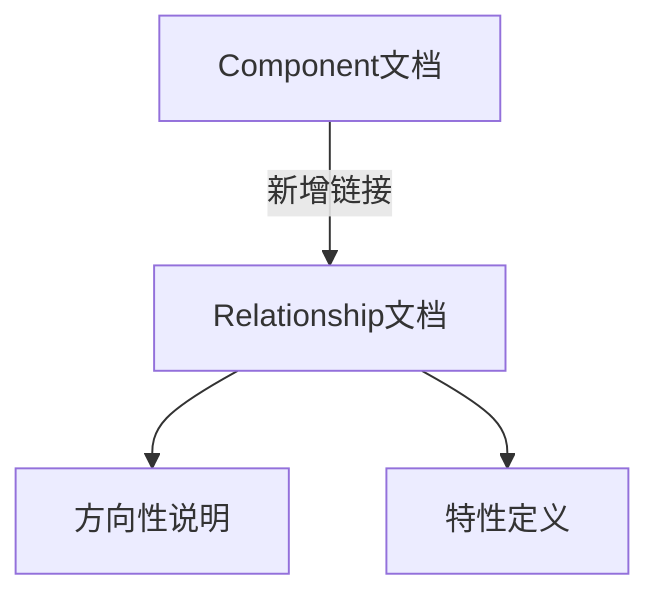

+++
title = "#18179 Update Component docs to point to Relationship trait"
date = "2025-03-09T00:00:00"
draft = false
template = "pull_request_page.html"
in_search_index = false

[extra]
current_language = "zh-cn"
available_languages = {"en" = { name = "English", url = "/pull_request/bevy/2025-03/pr-18179-en-20250309" }, "zh-cn" = { name = "中文", url = "/pull_request/bevy/2025-03/pr-18179-zh-cn-20250309" }}
+++

# #18179 Update Component docs to point to Relationship trait

## Basic Information
- **标题**: Update Component docs to point to Relationship trait
- **PR链接**: https://github.com/bevyengine/bevy/pull/18179
- **作者**: krunchington
- **状态**: 已合并
- **创建时间**: 2025-03-06T15:53:26Z
- **合并时间**: 2025-03-06T18:22:14Z
- **合并者**: alice-smith

## 中文描述
更新组件文档以指向关系（Relationship）特性，同时调整关系（Relationship）文档中的术语

### 目标
- 贡献于 #18111 

### 解决方案
在组件（Component）文档中新增指向关系（Relationship）特性的章节，并修正关系文档中的术语表述。

### 测试验证
- 如何验证？
  - 打开生成的文档，验证链接正确性
- 需要特别注意的平台？
  - 在 Ubuntu 24.04.2 LTS 验证通过


---

## 这个PR的故事

### 文档迷航中的灯塔
在Bevy引擎的生态系统中，组件（Component）和关系（Relationship）是实体组件系统（ECS）架构的两个核心支柱。就像现实中的建筑需要清晰的指示牌，代码文档也需要明确的指引来帮助开发者理解概念间的关联。

故事的开始源于一个发现：当开发者阅读`Component` trait的文档时，就像站在交叉路口却缺少方向指示牌。尽管系统中已经存在`Relationship` trait这个重要的关联机制，但文档中没有任何指引说明两者如何协同工作。

```rust
// 修改前的Component文档（示意）
/// Basic element of ECS pattern
pub trait Component: Send + Sync + 'static {}
```

### 建立概念桥梁
开发者krunchington意识到这个问题后，决定在`Component`文档中增加专门的章节，就像在代码宇宙中架设桥梁。关键修改是在`component.rs`中添加：

```rust
// crates/bevy_ecs/src/component.rs
// 新增文档段落
/// ## Relationships
/// For composing components through entity relationships, see the [`Relationship`] trait.
pub trait Component: Send + Sync + 'static {}
```

这个简单的指引就像在文档地图中添加了一个坐标标记，将原本孤立的概念连接起来。同时，在`relationship/mod.rs`中调整了术语表述：

```rust
// crates/bevy_ecs/src/relationship/mod.rs
// 术语优化
-/// Defines entity relationships
+/// Defines directional entity relationships
pub trait Relationship: Component {}
```

将"entity relationships"改为"directional entity relationships"，强调了关系的方向性特征，这如同在概念描述中增加精准的刻度，帮助开发者更准确理解其语义。

### 文档工程的精妙之处
这个PR看似简单，却体现了优秀的文档工程实践：
1. **概念网络编织**：通过交叉引用（cross-referencing）建立知识图谱
2. **术语精确化**：通过形容词"directional"明确关系特性
3. **可发现性增强**：降低新开发者的认知成本

就像图书馆的目录系统，好的文档应该让读者能顺藤摸瓜地找到关联知识。这个修改使得当开发者研究组件系统时，自然会发现与其紧密相关的关系机制。

## 视觉呈现



## 关键文件变更

### `crates/bevy_ecs/src/component.rs` (+17/-0)
**变更内容**：
- 在`Component` trait的文档注释中新增"Relationships"章节
- 添加指向`Relationship` trait的交叉引用

**代码片段**：
```rust
/// ## Relationships
/// For composing components through entity relationships, see the [`Relationship`] trait.
```

### `crates/bevy_ecs/src/relationship/mod.rs` (+1/-1)
**变更内容**：
- 在`Relationship` trait的文档注释中添加"directional"修饰词

**代码对比**：
```rust
-/// Defines entity relationships
+/// Defines directional entity relationships
```

## 延伸阅读
1. [Bevy ECS设计模式](https://bevyengine.org/learn/book/features/ecs/) - 理解组件与关系的协作
2. [Rust文档编写指南](https://doc.rust-lang.org/rustdoc/how-to-write-documentation.html) - 学习如何编写优秀文档
3. [软件架构中的概念映射](https://ieeexplore.ieee.org/document/8994842) - 学术视角下的文档工程

这个PR如同在知识迷宫中点亮了一盏明灯，展现了优秀文档应该具备的导航性和精确性。它提醒我们：代码质量不仅体现在运行时效率，也在于能否帮助开发者构建准确的心智模型。