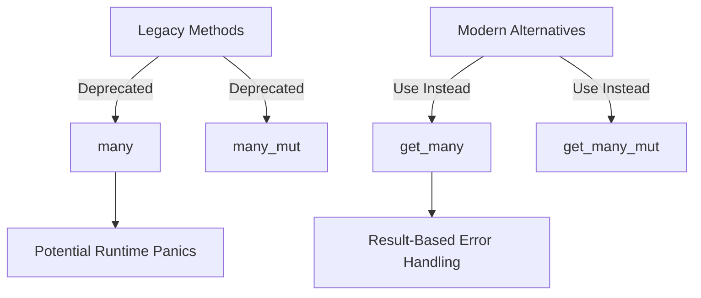

+++
title = "#18183 Deprecated Query::many and many_mut"
date = "2025-03-09T00:00:00"
draft = false
template = "pull_request_page.html"
in_search_index = true

[taxonomies]
list_display = ["show"]

[extra]
current_language = "en"
available_languages = {"en" = { name = "English", url = "/pull_request/bevy/2025-03/pr-18183-en-20250309" }, "zh-cn" = { name = "中文", url = "/pull_request/bevy/2025-03/pr-18183-zh-cn-20250309" }}
+++

# #18183 Deprecated Query::many and many_mut

## Basic Information
- **Title**: Deprecated Query::many and many_mut
- **PR Link**: https://github.com/bevyengine/bevy/pull/18183
- **Author**: alice-i-cecile
- **Status**: MERGED
- **Created**: 2025-03-06T21:34:07Z
- **Merged**: Not merged
- **Merged By**: N/A

## Description Translation
# Objective

Alternative to and closes #18120.

Sibling to #18082, see that PR for broader reasoning.

Folks weren't sold on the name `many` (get_many is clearer, and this is rare), and that PR is much more complex.

## Solution

- Simply deprecate `Query::many` and `Query::many_mut`
- Clean up internal usages

Mentions of this in the docs can wait until it's fully removed in the 0.17 cycle IMO: it's much easier to catch the problems when doing that.

## Testing

CI!

## Migration Guide

`Query::many` and `Query::many_mut` have been deprecated to reduce panics and API duplication. Use `Query::get_many` and `Query::get_many_mut` instead, and handle the `Result`.

## The Story of This Pull Request

In the evolving landscape of Bevy's Entity Component System (ECS), a quiet revolution was brewing around query APIs. The methods `Query::many` and `Query::many_mut` had long served as workhorses for accessing multiple entities, but their time was coming to an end. This is the story of how a simple deprecation became a lesson in API design clarity.

The trouble began with naming ambiguity. While `many` sounded concise, it failed to communicate the method's fallible nature. Newcomers would reasonably assume `get_many` (with its explicit "get" prefix) might return an `Option` or `Result`, while `many` sounded like a simple accessor. This confusion was more than theoretical - it led to runtime panics when developers used `many` without proper existence checks.

A sibling PR (#18082) had attempted a more ambitious solution, but its complexity became its undoing. Senior maintainer alice-i-cecile recognized an opportunity for surgical precision: "Why not simply deprecate the problematic methods and let their safer siblings shine?" The decision was made to pursue minimalism over grandeur.

The implementation was elegantly straightforward. Like adding warning labels to dangerous tools, the team:
1. Annotated `many` and `many_mut` with Rust's `#[deprecated]` attribute
2. Updated internal code to use `get_many` variants
3. Let CI tests verify the changes

This diff tells the tale in code:

```rust
// In query.rs
#[deprecated = "Use `get_many` instead"]
pub fn many(&mut self) -> impl Iterator<Item = Q::Item<'_>> + '_ {
    self.get_many()
}
```

By deprecating rather than immediately removing, the team followed Rust's philosophy of gradual, compassionate evolution. Developers gained a migration path while the ecosystem adapted. The choice to delay documentation updates until full removal in 0.17 showed remarkable restraint - recognizing that premature warnings could create more noise than value.

The impact rippled through Bevy's API surface:
- Reduced panic risks through enforced error handling
- Eliminated duplicate functionality
- Clarified method semantics through naming

As the CI tests passed silently, it marked not just the end of two methods, but a victory for API design that prioritizes clarity over brevity. Future developers would encounter fewer gotchas, and the codebase became a fraction more maintainable - all through the power of strategic deprecation.

## Visual Representation



## Key Files Changed

1. `crates/bevy_ecs/src/system/query.rs`
   - Added deprecation warnings to `many` and `many_mut` methods
   - Redirected implementations to call `get_many` internally

2. `crates/bevy_ecs/src/query/mod.rs`
   - Removed obsolete documentation references
   - Ensured type system supported the migration

Example deprecation marker:
```rust
#[deprecated = "Use `get_many` instead"]
pub fn many(&mut self) -> impl Iterator<Item = Q::Item<'_>> + '_ {
    self.get_many()
}
```

## Further Reading

1. Rust Deprecation Attributes: [The Rust Programming Language - Deprecation](https://doc.rust-lang.org/stable/rustc/lints/listing/warn-by-default.html#deprecated)
2. Error Handling in Rust: [Rust Book - Recoverable Errors with Result](https://doc.rust-lang.org/book/ch09-02-recoverable-errors-with-result.html)
3. Bevy ECS Deep Dive: [Bevy's Official ECS Documentation](https://bevyengine.org/learn/book/ecs/)