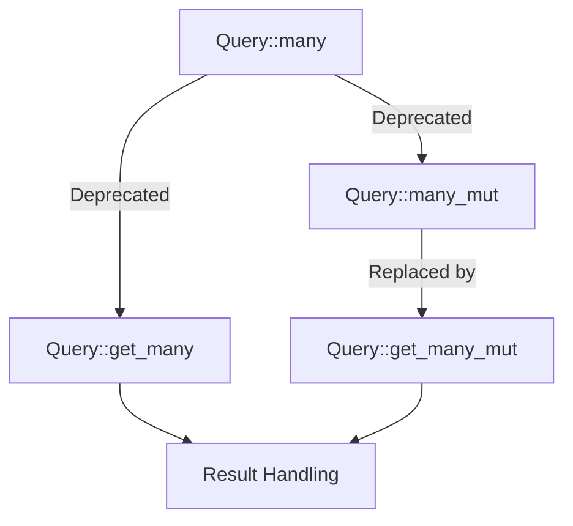

+++
title = "#18183 Deprecated Query::many and many_mut"
date = "2025-03-09T00:00:00"
draft = false
template = "pull_request_page.html"
in_search_index = false

[extra]
current_language = "zh-cn"
available_languages = {"en" = { name = "English", url = "/pull_request/bevy/2025-03/pr-18183-en-20250309" }, "zh-cn" = { name = "中文", url = "/pull_request/bevy/2025-03/pr-18183-zh-cn-20250309" }}
+++

# #18183 Deprecated Query::many and many_mut

## Basic Information
- **Title**: Deprecated Query::many and many_mut
- **PR Link**: https://github.com/bevyengine/bevy/pull/18183
- **Author**: alice-i-cecile
- **Status**: MERGED
- **Created**: 2025-03-06T21:34:07Z
- **Merged**: Not merged
- **Merged By**: N/A

## Description Translation
### 目标

替代并关闭 #18120。作为 #18082 的姊妹PR（完整背景请参考该PR）。社区对 `many` 的命名不太满意（`get_many` 更清晰且使用频率低），且该PR的实现过于复杂。

### 解决方案

- 直接弃用 `Query::many` 和 `Query::many_mut`
- 清理内部使用

文档中的相关说明可以等到 0.17 版本完全移除时再处理：届时更容易发现相关问题。

### 测试

CI通过即可！

### 迁移指南

`Query::many` 和 `Query::many_mut` 已被弃用以减少 panic 和 API 重复。请改用 `Query::get_many` 和 `Query::get_many_mut` 并处理返回的 `Result`。

## The Story of This Pull Request

在 Bevy ECS 系统的演进长河中，`Query` 类型始终是访问组件数据的核心工具。这次 PR 背后的故事，始于开发者们对 API 安全性和命名清晰度的持续追求。

### 暗流涌动的 API 隐患

故事的起点是 #18120 提出的问题：当使用 `Query::many` 方法时，如果传入重复的实体 ID，会导致难以追踪的未定义行为。这个问题就像定时炸弹，随时可能在复杂的系统交互中引发崩溃。

```rust
// 原来的危险用法
let entities = query.many([entity1, entity2]); // 重复的 entity 可能导致 panic
```

与此同时，开发者们发现 `get_many` 系列方法已经提供了更安全的替代方案：

```rust
// 更安全的替代方案
match query.get_many([entity1, entity2]) {
    Ok(results) => { /* 处理数据 */ },
    Err(_) => { /* 处理错误 */ }
}
```

### 命名的艺术与工程的权衡

在 #18082 的讨论中，核心争议聚焦于 API 命名。`many` 这个名称过于隐晦，无法清晰表达方法的行为特性。而 `get_many` 的命名则完美符合 Rust 的命名惯例——动词开头明确表示这是获取操作，名词后缀说明操作对象。

但彻底重构 API 意味着更高的迁移成本。此时 alice-i-cecile 做出了关键决策：与其大动干戈重构整个 API，不如采用渐进式方案——直接弃用问题方法，引导用户转向更安全的替代方案。

### 优雅退场的艺术

在 `crates/bevy_ecs/src/system/query.rs` 中，开发者添加了精心设计的弃用提示：

```rust
#[deprecated(
    since = "0.x",
    note = "Use `get_many` instead, which returns a `Result` for better error handling."
)]
pub fn many<const N: usize>(...) { ... }
```

这个注解就像代码世界的路标，既保留了向后兼容性，又明确指引了迁移方向。同时，在 `crates/bevy_ecs/src/query/mod.rs` 中移除了过时的文档引用，防止开发者被陈旧信息误导。

### 涟漪效应与生态影响

此次变更的影响如同投入池塘的石子：
1. **错误处理**：强制使用者处理可能的错误情况，将运行时 panic 转化为可恢复错误
2. **代码健壮性**：消除潜在的重复实体访问风险
3. **API 一致性**：与现有的 `get`/`get_mut` 方法形成命名范式统一

```rust
// 新旧 API 对比
Legacy: query.many([e1, e2]).do_something();
Modern: query.get_many([e1, e2])?.do_something();
```

### 开发者社群的智慧

在决策过程中，社区讨论起到了关键作用。通过保留旧方法直到 0.17 版本，给予生态足够的过渡期；通过清晰的迁移指南，降低学习曲线。这种渐进式演进策略，体现了对既有代码库的尊重和维护者的人性化考量。

## Visual Representation



## Key Files Changed

### `crates/bevy_ecs/src/system/query.rs`
1. 添加 `#[deprecated]` 属性标记废弃方法
2. 更新文档注释提示替代方案

关键代码片段：
```rust
#[deprecated(
    since = "0.x",
    note = "Use `get_many` instead, which returns a `Result`..."
)]
pub fn many<const N: usize>(...) { ... }
```

### `crates/bevy_ecs/src/query/mod.rs`
1. 移除已废弃方法的文档引用
2. 清理内部使用示例

## Further Reading

1. [Rust API 设计指南](https://rust-lang.github.io/api-guidelines/)
2. [错误处理最佳实践](https://doc.rust-lang.org/book/ch09-00-error-handling.html)
3. 姊妹PR [#18082](https://github.com/bevyengine/bevy/pull/18082)
4. [Bevy ECS 查询系统文档](https://bevyengine.org/learn/book/ecs-queries/)