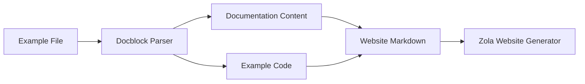

+++
title = "#18191 Split example file docblock and code when generating web examples markdown"
date = "2025-03-19T00:00:00"
draft = false
template = "pull_request_page.html"
in_search_index = true

[taxonomies]
list_display = ["show"]

[extra]
current_language = "en"
available_languages = {"en" = { name = "English", url = "/pull_request/bevy/2025-03/pr-18191-en-20250319" }, "zh-cn" = { name = "中文", url = "/pull_request/bevy/2025-03/pr-18191-zh-cn-20250319" }}
+++

# #18191 Split example file docblock and code when generating web examples markdown

## Basic Information
- **Title**: Split example file docblock and code when generating web examples markdown
- **PR Link**: https://github.com/bevyengine/bevy/pull/18191
- **Author**: doup
- **Status**: MERGED
- **Created**: 2025-03-07T11:30:12Z
- **Merged**: Not merged
- **Merged By**: N/A

## Description Translation
# Objective

Separate example explanation (file docblock) and the code so they can be layout differently in the website and we can give a higher importance to the explanation on the [website search tool](https://github.com/bevyengine/bevy-website/pull/1935). This would also allow us to improve the examples so they become even more like a cookbook.

## Solution

Update the `example-showcase` tool to extract the example file docblock and write it as the example markdown content. This allows us to access the explanation via `page.content` in Zola.

## Testing

I've checked that the output is correct after running the tool and it doesn't throw any error. I've also validated that the approach will work on the website.

## Showcase

This is a quick and dirty example of what we could do in the web examples after the change. When we implement the real thing we can put the explanation on a sidebar or explore other layout options.


## The Story of This Pull Request

The Bevy engine's example system faced a presentation challenge where example documentation and implementation code were intertwined in generated website content. This made it difficult to apply different styling treatments and prioritize explanatory text in search results. The existing implementation wrote entire example files directly into markdown, blending documentation comments (docblocks) with executable code.

The core solution modifies the example-showcase tool to parse and separate documentation from code before generating website content. This separation enables:
1. Independent styling of documentation and code sections
2. Direct access to clean documentation text for search indexing
3. Flexible content layouts in future website updates

The implementation introduces a two-phase parsing process in `tools/example-showcase/src/main.rs`:
```rust
fn parse_example_doc_and_code(example_path: &Path) -> (String, String) {
    let content = fs::read_to_string(example_path).unwrap();
    let re = Regex::new(r"(?s)^/\*!(.*?)\*/[\s\n]*(.*)").unwrap();
    
    if let Some(caps) = re.captures(&content) {
        let doc = caps[1].trim().to_string();
        let code = caps[2].trim().to_string();
        (doc, code)
    } else {
        (String::new(), content)
    }
}
```
This regex-based parser splits files into documentation blocks (using `/*! ... */` syntax) and remaining code. The website generation then uses these separated components:
```rust
fn write_web_example_markdown(
    content_folder: &Path,
    example_name: &str,
    doc: &str,
    code: &str,
    api: WebApi,
) {
    let mut content = String::new();
    content.push_str(&format!("# {}\n\n", example_name));
    content.push_str(doc);
    content.push_str("\n\n```rust\n");
    content.push_str(code);
    content.push_str("\n```\n");
    // Write to file...
}
```
Key technical decisions include:
- Using a non-greedy regex pattern (`?s` modifier) to handle multi-line comments
- Preserving original code formatting through direct inclusion in markdown code blocks
- Falling back to full file content when documentation blocks are missing
- Maintaining existing CI workflows through command-line argument compatibility

The changes impact Bevy's website generation pipeline by enabling structural improvements to example presentations. Future enhancements could build on this foundation to implement side-by-side documentation/code layouts or interactive code examples.

## Visual Representation



## Key Files Changed

### File: `tools/example-showcase/src/main.rs` (+25/-2)
1. **Modification**: Added docblock parsing logic and separated content generation
2. **Key Code Addition**:
```rust
// New parsing function
let (doc, code) = parse_example_doc_and_code(&example_path);

// Modified markdown generation
write_web_example_markdown(
    &content_folder,
    &example_name,
    &doc,
    &code,
    api,
);
```
3. **Relationship to PR**: Enables structural separation of documentation and code in generated website content

## Further Reading
- [Rust Documentation Comments](https://doc.rust-lang.org/rustdoc/how-to-write-documentation.html)
- [Zola Content Templates](https://www.getzola.org/documentation/content/templates/)
- [Regular Expressions for Code Parsing](https://cheatography.com/davechild/cheat-sheets/regular-expressions/)